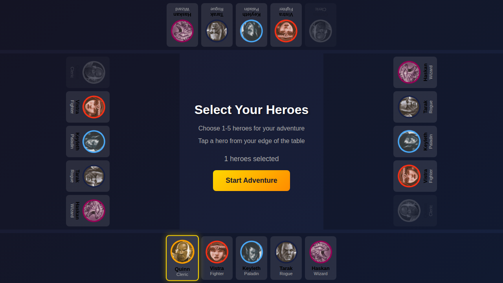
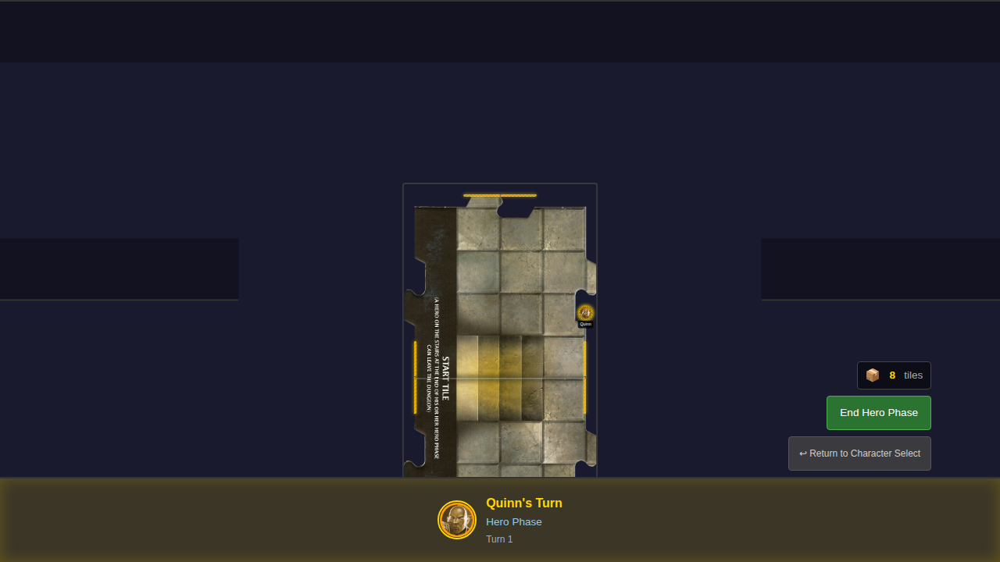

# 001 - Character Selection to Game Board

## User Story

**As a player**, I want to select my hero character and start the game so that I can begin my dungeon adventure.

## Test Flow

This test verifies the core startup flow from character selection to the game board:

1. View the character selection screen with all 5 heroes
2. Select a hero (Quinn the Cleric)
3. Start the game and see the game board with the hero token

## Screenshots

### Step 1: Initial Character Selection Screen

The player sees all 5 available heroes. No heroes are selected, and the "Start Adventure" button is disabled.

### Step 2: Hero Selected

After clicking on Quinn, the hero card shows a selection highlight. The start button is now enabled.

### Step 3: Game Board

After clicking "Start Adventure", the game transitions to the game board. The Start Tile is displayed with the hero token positioned on it.

## Verification Checklist

- [x] Character selection screen displays 5 hero cards
- [x] Each hero card shows the hero's name and class
- [x] Start button is disabled when no heroes are selected
- [x] Clicking a hero toggles its selection state
- [x] Selected heroes have visual indication (golden border)
- [x] Start button is enabled when at least 1 hero is selected
- [x] Clicking start transitions to the game board
- [x] Game board shows the Start Tile
- [x] Hero token is visible on the Start Tile
- [x] Turn indicator shows the first player's name

## Redux State Verification

The test also verifies Redux store state at each step:

1. **Initial**: `heroes.selectedHeroes` is empty
2. **After selection**: `heroes.selectedHeroes` contains Quinn
3. **Game board**: `game.currentScreen` is 'game-board' and `game.heroTokens` contains the hero position
