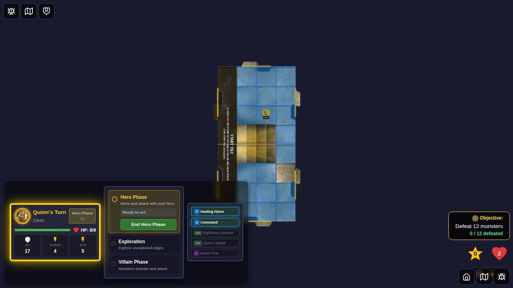
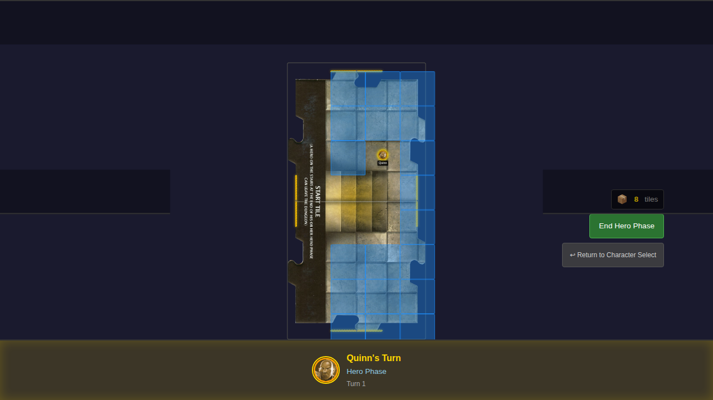
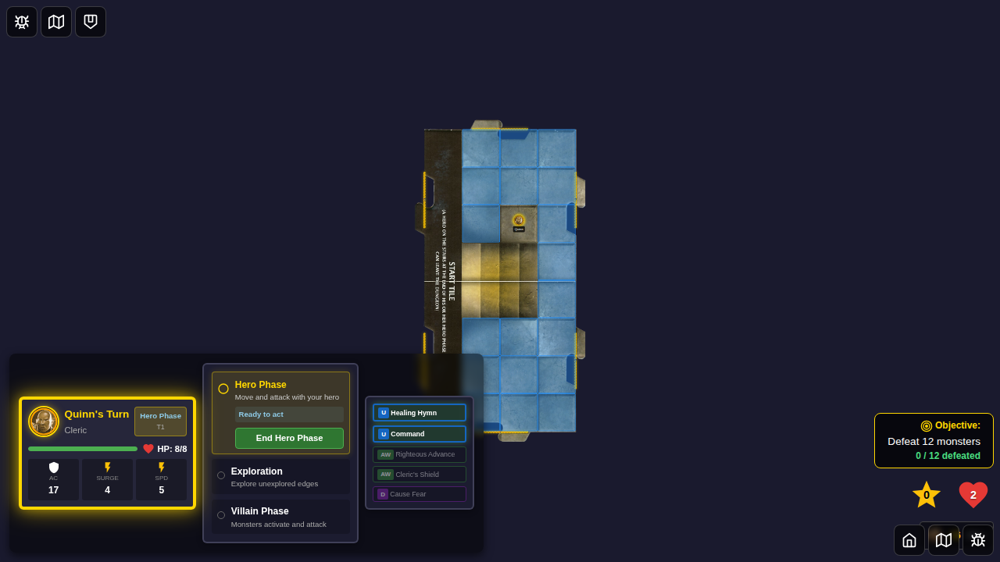
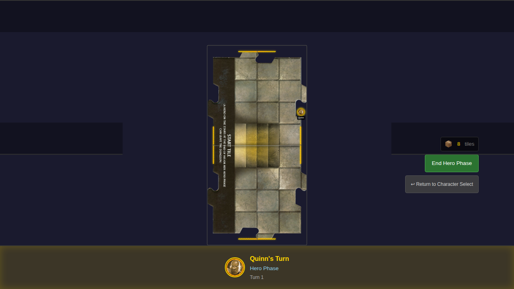

# 006 - Move a Hero

## User Story

> As a user, I can select a movement destination for my hero and see them move there, so that I can explore the dungeon.

## Test Scenarios

### Scenario 1: User moves hero to a new position

Given it is Quinn's turn in the Hero Phase  
And Quinn has speed 5  
When I click on the board near Quinn  
Then I see valid movement squares highlighted  
When I click on a highlighted square  
Then Quinn's token moves to that square  
And Quinn's token is now in the new position  

### Scenario 2: Movement respects occupied squares

Given there are two heroes on the board  
When I show movement options for the first hero  
Then the second hero's position is not shown as a valid destination  

## Screenshot Sequence

### 000 - Quinn's Turn in Hero Phase

Quinn's turn showing the hero on the game board in Hero Phase.

### 001 - Movement Squares Highlighted

Valid movement squares highlighted in blue, showing all reachable positions within Quinn's speed of 5.

### 002 - Selecting Destination

User about to click on a highlighted square to move the hero.

### 003 - Hero Moved

Quinn has moved to the new position. The movement overlay is closed.

## Programmatic Verification

Each screenshot includes programmatic verification of:
- Turn indicator showing correct hero and phase
- Movement overlay visibility state
- Valid movement squares calculated correctly
- Staircase positions excluded from valid moves
- Occupied squares excluded from valid moves
- Hero position updated in Redux store after movement
- Movement overlay cleared after hero moves

## Manual Verification Checklist

- [ ] Movement squares appear as blue highlighted areas
- [ ] Clicking a highlighted square moves the hero
- [ ] Hero token animates/moves to new position
- [ ] Movement overlay disappears after movement
- [ ] Cannot move to staircase squares
- [ ] Cannot move to squares occupied by other heroes
