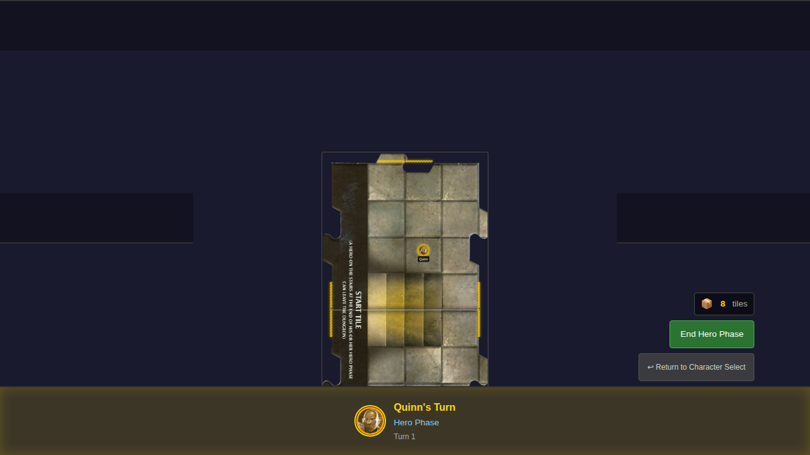
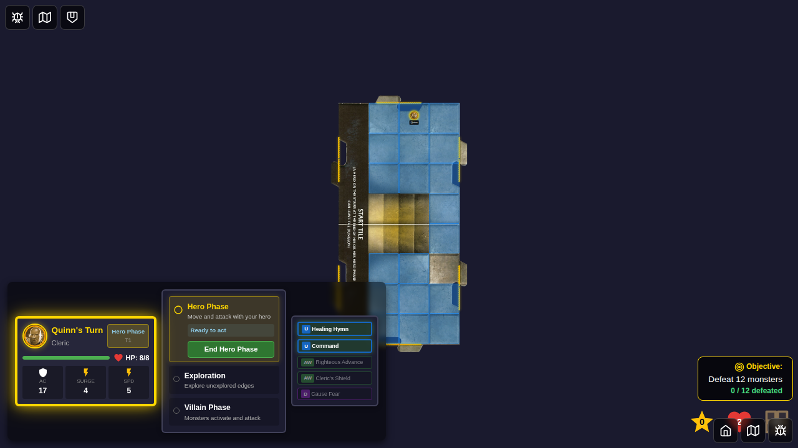
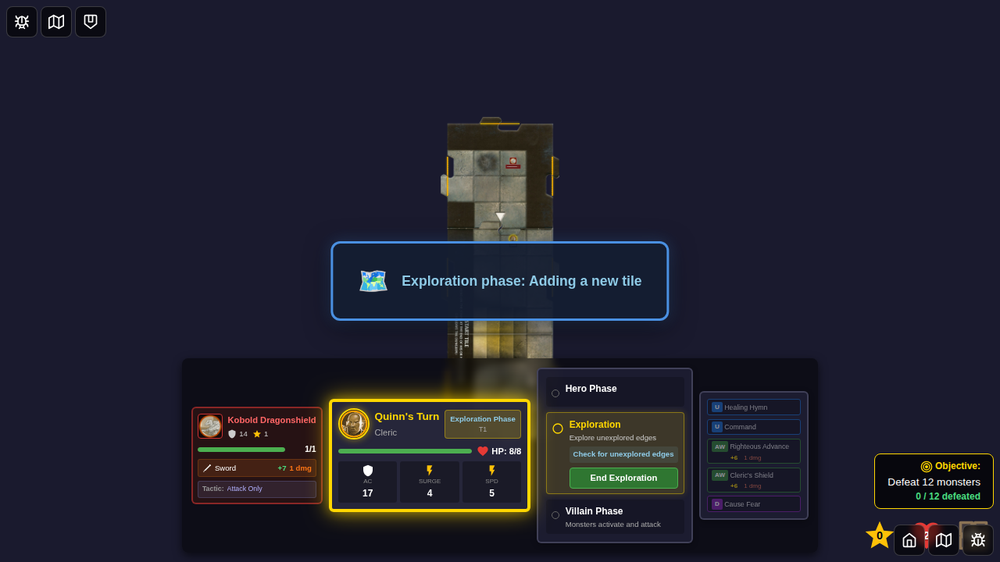
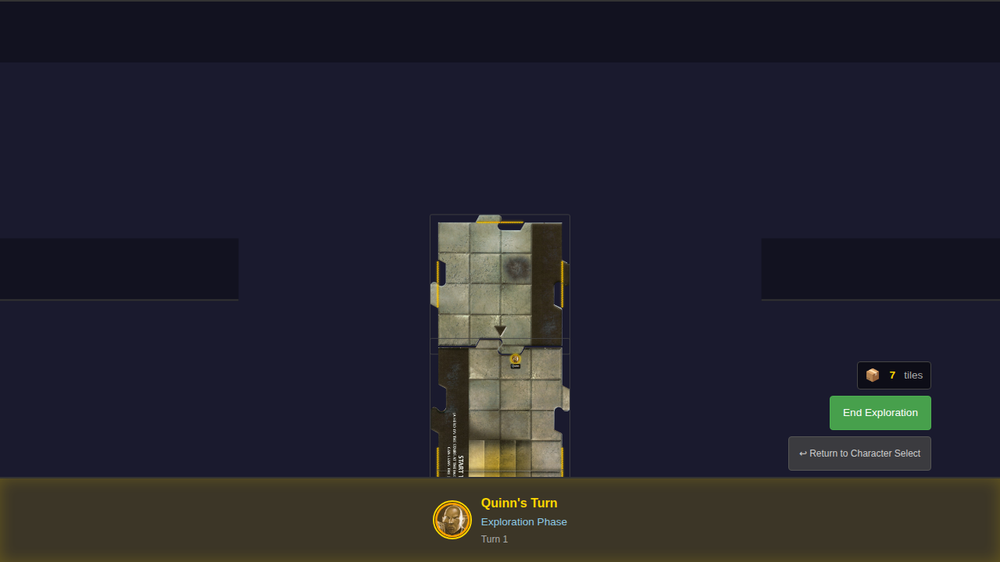

# Test 007 - Explore and Place New Tile

## User Story

> As a user, when my hero ends movement on an unexplored edge, I see a new tile drawn and placed, expanding the dungeon.

## Test Scenario

```gherkin
Feature: Explore and Place New Tile

  Scenario: Hero explores and reveals new tile
    Given it is Quinn's turn
    And Quinn is adjacent to an unexplored edge
    When Quinn moves onto the unexplored edge
    And the hero phase ends
    Then a new tile appears connected to that edge
    And the unexplored edge is now explored
    And the tile deck count decreases
```

## Screenshot Gallery

### 000 - Unexplored Edges Visible


Initial game state showing:
- Start tile with 4 unexplored edges (marked with "?" indicators)
- Tile deck counter showing 8 tiles remaining
- Hero Phase indicator

### 001 - Hero at Edge Position


Quinn positioned at the north edge of the tile (position x:2, y:0):
- Hero token visible at edge position
- Ready for exploration when phase ends

### 002 - New Tile Placed


After ending hero phase:
- Exploration phase triggered
- New tile placed north of start tile
- Tile deck decreased from 8 to 7

### 003 - Edge Now Explored


Final state showing:
- North edge of start tile no longer marked as unexplored
- North edge now connects to new tile
- Tile deck shows 7 tiles remaining

## Manual Verification Checklist

- [ ] Unexplored edges are visually indicated with "?" markers
- [ ] Tile deck counter shows correct count (8 at start)
- [ ] When hero is on edge and phase ends, exploration triggers
- [ ] A new tile appears connected to the unexplored edge
- [ ] The tile deck count decreases after placing a tile
- [ ] The explored edge no longer shows the "?" indicator

## Implementation Notes

- Exploration happens during the exploration phase, not during movement
- Hero must be positioned on an edge square at the end of hero phase
- Tiles are drawn from a shuffled deck
- Edge indicators are dashed golden lines with "?" symbols
