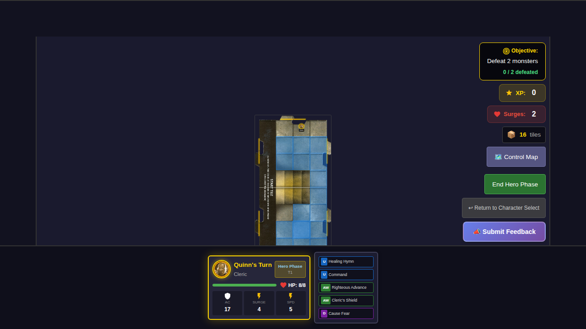
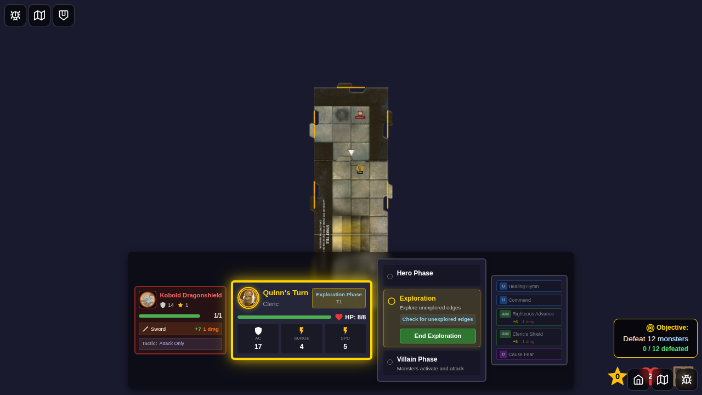

# E2E Test 008 - Spawn Monster on Exploration

## User Story

> As a user, when a new tile is placed, I see a monster appear on it at the correct scorch mark position (also called the "black spot" or "spawn marker" - the dark circular marking on the tile), so that I have something to fight and the game follows the rules.

## Test Scenarios

### Scenario 1: Monster appears on newly placed tile at scorch mark position

1. **Given** Quinn just placed a new tile through exploration (exploring north edge)
2. **Then** a monster token appears on the new tile at the scorch mark position
3. **And** the monster is at position (2, 1) - the dark circular marking on the tile
4. **And** I see a monster card displayed showing the monster's name
5. **And** the monster card shows AC and HP values

### Scenario 2: Monster card shows correct stats

Verifies that the monster card displays:
- Monster name
- AC (Armor Class)
- HP (Hit Points)
- XP (Experience Points)

### Scenario 3: No monster spawns when hero is not on edge

Verifies that no monster spawns when the hero ends their turn in the center of a tile (not on an unexplored edge).

## Scorch Mark Positioning

According to the official Wrath of Ashardalon rules for "placing a monster", when a new dungeon tile is revealed, the monster figure is positioned on the **scorch mark** of that tile. The scorch mark (also known as "black spot" or "spawn marker") is the dark circular marking visible on each dungeon tile, typically appearing in the lower-left area of the tile in its default orientation.

In the default tile orientation (arrow pointing south), the scorch mark is at position (1, 2) - lower-left quadrant.

As the tile rotates, the scorch mark position rotates with it:

| Tile Rotation | Arrow Direction | Scorch Mark Position | Quadrant     |
|---------------|-----------------|----------------------|--------------|
| 0°            | South           | (1, 2)               | Lower-left   |
| 90°           | West            | (1, 1)               | Upper-left   |
| 180°          | North           | (2, 1)               | Upper-right  |
| 270°          | East            | (2, 2)               | Lower-right  |

**Fallback Logic**: If the scorch mark is occupied by another monster or obstacle, the monster will spawn at an adjacent open square, checking positions in order: North, South, East, West, Northeast, Northwest, Southeast, Southwest.

## Screenshot Sequence

### 000 - Hero ready for exploration

Hero is positioned at the north edge, ready to trigger exploration.

### 001 - Monster spawns at scorch mark with card display

After ending the hero phase, a new tile is placed and a monster spawns at the scorch mark position (1, 2) - lower-left quadrant. The monster card is displayed showing the monster's name and stats (AC, HP, XP).

### 002 - Monster token visible at scorch mark position

After dismissing the monster card, the monster token remains visible on the newly placed tile at the scorch mark position.

## Manual Verification Checklist

- [ ] Monster token appears on the new tile (not the start tile)
- [ ] Monster token is positioned at the scorch mark (dark circular marking on tile)
- [ ] Monster token has a distinct red/enemy color scheme
- [ ] Monster card shows the monster's name prominently
- [ ] Monster card shows AC (Armor Class) value
- [ ] Monster card shows HP (Hit Points) value
- [ ] Monster card shows XP (Experience Points) value
- [ ] Monster card can be dismissed by clicking the X button
- [ ] Monster card can be dismissed by clicking outside the card
- [ ] After dismissal, monster token remains visible at scorch mark
- [ ] Monster is assigned to the exploring hero (controllerId)
