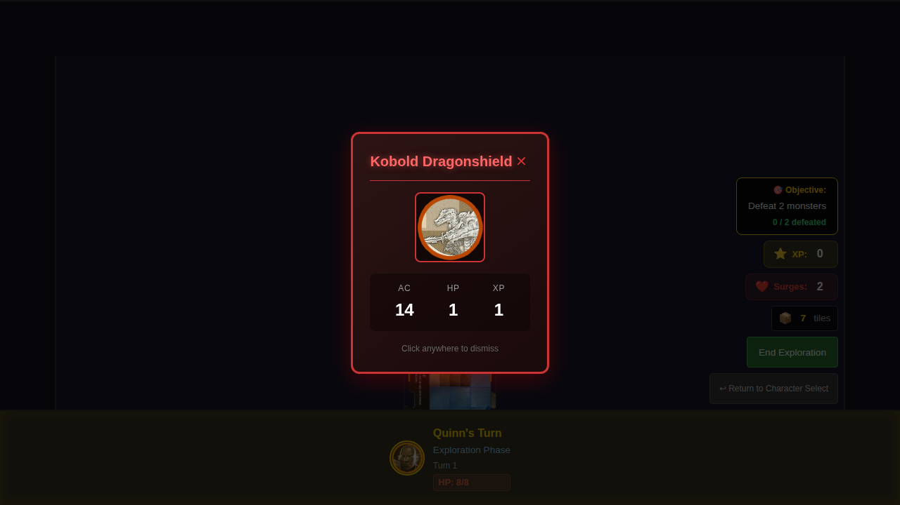
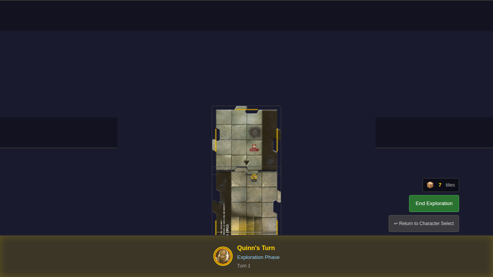

# E2E Test 008 - Spawn Monster on Exploration

## User Story

> As a user, when a new tile is placed, I see a monster appear on it, so that I have something to fight.

## Test Scenarios

### Scenario 1: Monster appears on newly placed tile

1. **Given** Quinn just placed a new tile through exploration
2. **Then** a monster token appears on the new tile
3. **And** I see a monster card displayed showing the monster's name
4. **And** the monster card shows AC and HP values

### Scenario 2: Monster card shows correct stats

Verifies that the monster card displays:
- Monster name
- AC (Armor Class)
- HP (Hit Points)
- XP (Experience Points)

### Scenario 3: No monster spawns when hero is not on edge

Verifies that no monster spawns when the hero ends their turn in the center of a tile (not on an unexplored edge).

## Screenshot Sequence

### 000 - Hero ready for exploration

Hero is positioned at the north edge, ready to trigger exploration.

### 001 - Monster spawns with card display

After ending the hero phase, a new tile is placed and a monster spawns. The monster card is displayed showing the monster's name and stats (AC, HP, XP).

### 002 - Monster token visible on tile

After dismissing the monster card, the monster token remains visible on the newly placed tile.

## Manual Verification Checklist

- [ ] Monster token appears on the new tile (not the start tile)
- [ ] Monster token has a distinct red/enemy color scheme
- [ ] Monster card shows the monster's name prominently
- [ ] Monster card shows AC (Armor Class) value
- [ ] Monster card shows HP (Hit Points) value
- [ ] Monster card shows XP (Experience Points) value
- [ ] Monster card can be dismissed by clicking the X button
- [ ] Monster card can be dismissed by clicking outside the card
- [ ] After dismissal, monster token remains visible
- [ ] Monster is assigned to the exploring hero (controllerId)
