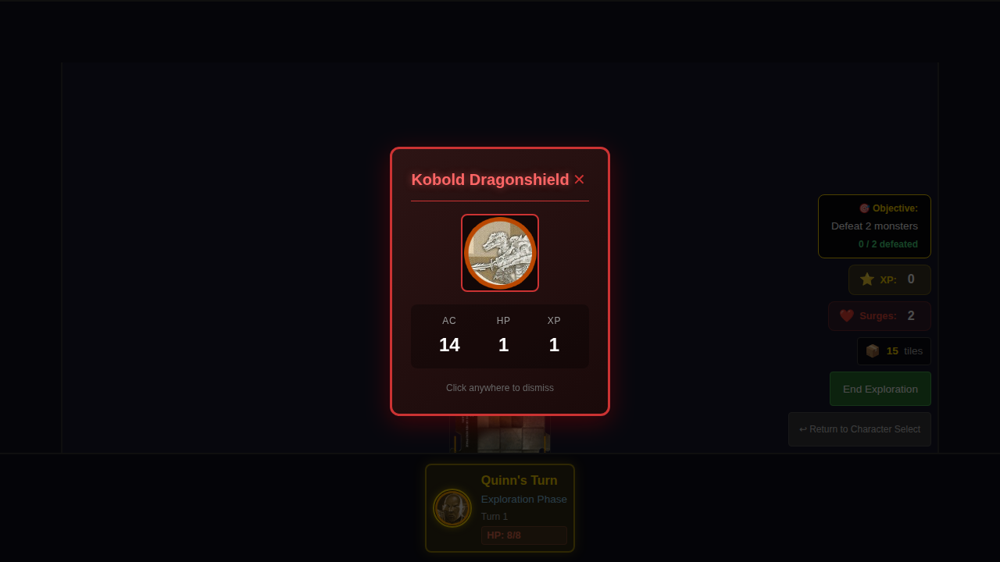
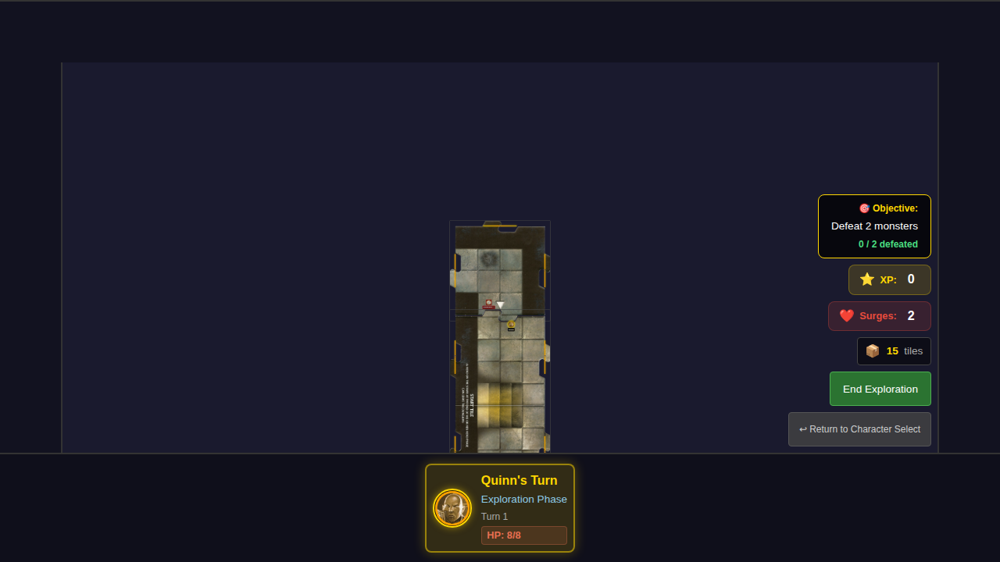

# E2E Test 008 - Spawn Monster on Exploration

## User Story

> As a user, when a new tile is placed, I see a monster appear on it at the correct black square position, so that I have something to fight and the game follows the rules.

## Test Scenarios

### Scenario 1: Monster appears on newly placed tile at black square position

1. **Given** Quinn just placed a new tile through exploration (exploring north edge)
2. **Then** a monster token appears on the new tile at the black square position
3. **And** the monster is at position (1, 3) - the south edge center (since tile has 0° rotation with arrow pointing south)
4. **And** I see a monster card displayed showing the monster's name
5. **And** the monster card shows AC and HP values

### Scenario 2: Monster card shows correct stats

Verifies that the monster card displays:
- Monster name
- AC (Armor Class)
- HP (Hit Points)
- XP (Experience Points)

### Scenario 3: No monster spawns when hero is not on edge

Verifies that no monster spawns when the hero ends their turn in the center of a tile (not on an unexplored edge).

## Black Square Positioning

Monsters spawn at the "black square" position on the tile, which is located at the edge where the arrow points (the connecting edge where heroes enter). The position depends on tile rotation:

| Tile Rotation | Arrow Direction | Black Square Position |
|---------------|-----------------|----------------------|
| 0°            | South           | (1, 3)               |
| 90°           | West            | (0, 1)               |
| 180°          | North           | (1, 0)               |
| 270°          | East            | (3, 1)               |

If the black square is occupied, the monster will spawn at an adjacent open square.

## Screenshot Sequence

### 000 - Hero ready for exploration

Hero is positioned at the north edge, ready to trigger exploration.

### 001 - Monster spawns at black square with card display

After ending the hero phase, a new tile is placed and a monster spawns at the black square position (1, 3). The monster card is displayed showing the monster's name and stats (AC, HP, XP).

### 002 - Monster token visible at black square position

After dismissing the monster card, the monster token remains visible on the newly placed tile at the black square position.

## Manual Verification Checklist

- [ ] Monster token appears on the new tile (not the start tile)
- [ ] Monster token is positioned at the black square (based on tile rotation)
- [ ] Monster token has a distinct red/enemy color scheme
- [ ] Monster card shows the monster's name prominently
- [ ] Monster card shows AC (Armor Class) value
- [ ] Monster card shows HP (Hit Points) value
- [ ] Monster card shows XP (Experience Points) value
- [ ] Monster card can be dismissed by clicking the X button
- [ ] Monster card can be dismissed by clicking outside the card
- [ ] After dismissal, monster token remains visible at black square
- [ ] Monster is assigned to the exploring hero (controllerId)
