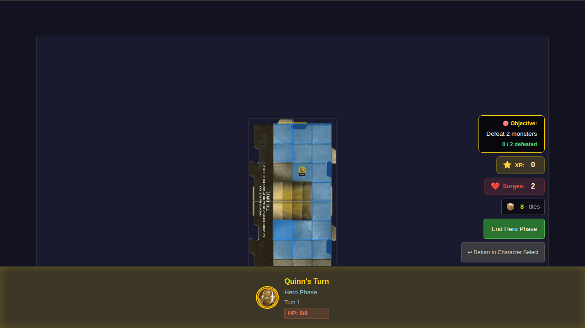
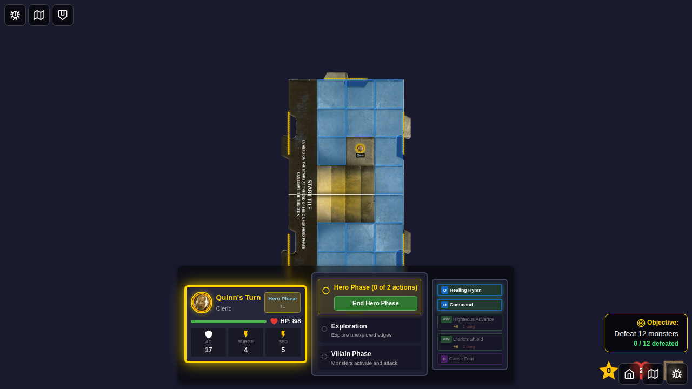
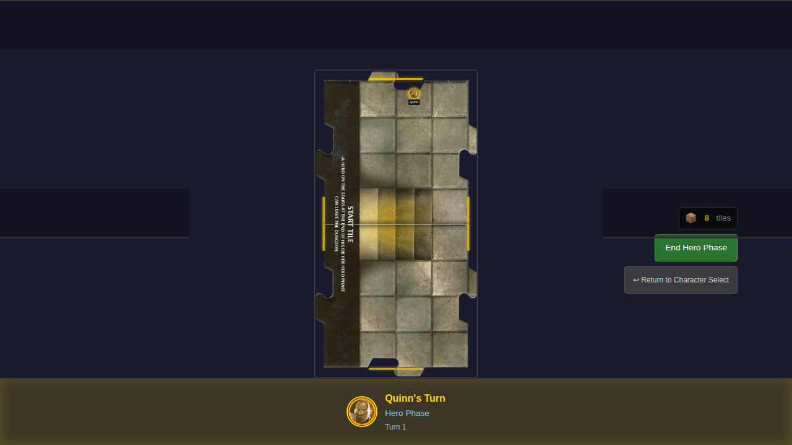
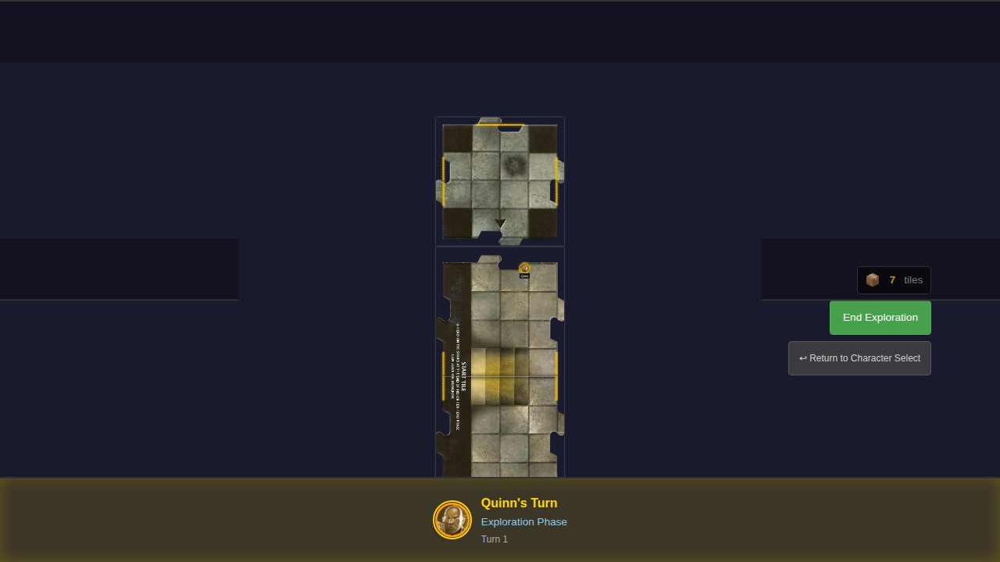
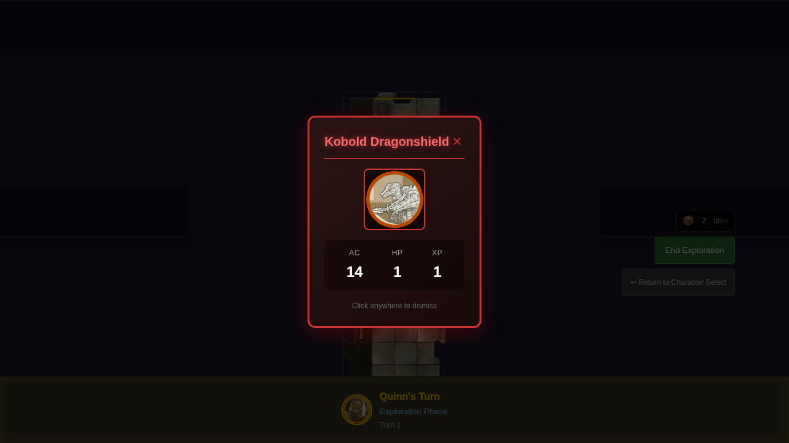

# Test 008 - Movement Triggers Exploration

## User Story

> As a user, when I move my hero to the edge of the tile using the movement UI and end my turn, I see a new tile drawn and placed, expanding the dungeon.

This test captures the **complete user experience** of tile exploration, including:
1. Selecting a hero and starting the game
2. Using the movement UI (clicking to show movement options)
3. Clicking on an edge square to move the hero there
4. Ending the hero phase to trigger exploration
5. Seeing the new tile placed and the tile deck counter decrease

## Test Scenario

```gherkin
Feature: Movement Triggers Exploration

  Scenario: Hero moves to edge using movement UI and triggers tile exploration
    Given it is Quinn's turn
    And Quinn is at position (2, 2)
    When I click on the tile to show movement options
    And I click on the north edge square (2, 0)
    Then Quinn moves to the edge position
    When I click "End Hero Phase"
    Then a new tile appears connected to the north edge
    And the tile deck count decreases from 8 to 7
    And the north edge is now explored

  Scenario: Hero movement to non-edge square does not trigger exploration
    Given it is Quinn's turn
    When I move Quinn to a non-edge square
    And I click "End Hero Phase"
    Then no new tile is placed
    And the tile deck count remains at 8
```

## Screenshot Gallery

### 000 - Initial Hero Position


Initial game state showing:
- Quinn positioned at (2, 2) near the center
- Start tile with 4 unexplored edges (marked with "?" indicators)
- Tile deck counter showing 8 tiles remaining
- Hero Phase indicator

### 001 - Movement Options Shown


After clicking on the tile:
- Blue highlighted squares show valid movement destinations
- Edge squares (including (2, 0) at north edge) are reachable
- Movement overlay is visible

### 002 - Hero Moved to Edge


After clicking on the north edge square:
- Quinn has moved to position (2, 0) at the north edge
- Movement overlay has disappeared
- Still in Hero Phase - exploration has not triggered yet
- Tile count still at 8

### 003 - Exploration Triggered


After clicking "End Hero Phase":
- Exploration phase triggered
- New tile placed north of start tile
- Tile deck decreased from 8 to 7
- North edge of start tile now marked as 'open'

### 004 - Edge Now Explored


Final state showing:
- North edge no longer shows unexplored indicator
- New tile has 3 unexplored edges (north, east, west)
- Total 6 unexplored edges now visible (3 from start tile + 3 from new tile)

## Manual Verification Checklist

- [ ] Movement overlay appears when clicking on tile during Hero Phase
- [ ] Edge squares are highlighted as valid movement destinations
- [ ] Hero moves to clicked square
- [ ] Movement overlay disappears after move
- [ ] Exploration triggers when ending hero phase with hero on edge
- [ ] New tile appears connected to the explored edge
- [ ] Tile deck count decreases after placing tile
- [ ] Explored edge no longer shows "?" indicator
- [ ] No exploration when hero is not on edge square

## Implementation Notes

- This test uses the actual movement UI (clicking to show movement, clicking on squares to move)
- Initial hero position is set deterministically for predictable testing
- The test captures the complete user experience from movement through exploration
- Unlike test 007, this test does NOT bypass the movement UI with direct Redux dispatch for the move itself
