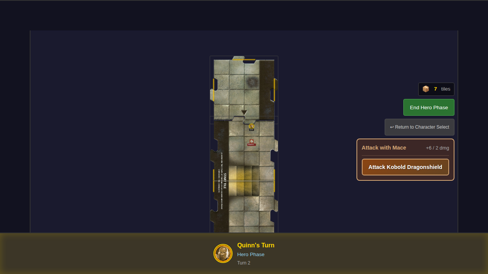
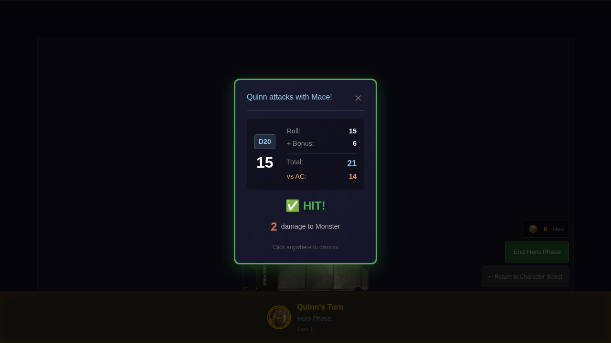
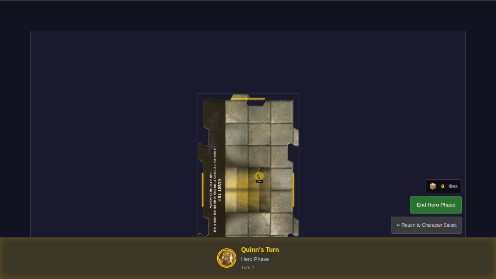

# 009 - Hero Attacks Monster

## User Story

> As a user, I can attack an adjacent monster with my hero's basic attack, roll a d20, and see if I hit or miss.

## Test Scenarios

### Test 1: Hero attacks adjacent monster and sees result
1. Player starts game with Quinn
2. Quinn is positioned on the game board
3. A monster is placed adjacent to Quinn on the same tile
4. **Attack button becomes visible** showing attack option with weapon stats
5. Player clicks the attack button to initiate attack
6. Combat result dialog shows the d20 roll, attack bonus, total, and target AC
7. The result (HIT or MISS) is clearly displayed
8. For hits, damage dealt is shown
9. Dialog can be dismissed

### Test 2: Hero misses attack against monster
1. Player starts game with Quinn
2. An attack that misses (total < AC) is dispatched
3. Combat result shows MISS
4. No damage is displayed for misses

### Test 3: Critical hit on natural 20
1. A natural 20 always hits regardless of AC
2. Critical hit is specially displayed

### Test 4: Monster is defeated when HP reaches 0
1. Monster spawns via exploration
2. Attack that deals enough damage to reduce HP to 0
3. Monster is removed from the game

## Screenshot Gallery

### Attack Button Visible
Shows the attack panel that appears when a hero is adjacent to a monster during hero phase. The panel displays the weapon name, attack bonus, and damage, with a button to initiate the attack.

### Attack Result
Shows the combat result dialog after clicking the attack button. Displays the d20 roll, attack bonus, total vs AC, and hit/miss result.

### Result Dismissed
Shows the game state after dismissing the combat result dialog.

## Acceptance Criteria Verification

- [x] When adjacent to a monster, an "Attack" option is available
- [x] Clicking attack shows the d20 roll result
- [x] The attack hits if roll + bonus >= monster AC
- [x] On hit, damage is applied and monster HP decreases
- [x] Hit or miss result is clearly displayed

## Manual Verification Checklist

- [ ] Attack panel appears when hero is adjacent to monster
- [ ] Attack button shows monster name to attack
- [ ] Combat result dialog appears after attack
- [ ] Dice roll, bonus, total, and AC are displayed correctly
- [ ] HIT result shows in green with checkmark
- [ ] MISS result shows in gray with X
- [ ] Critical hit shows with special styling
- [ ] Damage is displayed for hits
- [ ] Dialog dismisses on click
- [ ] Monster HP decreases on hit
- [ ] Monster is removed when defeated
