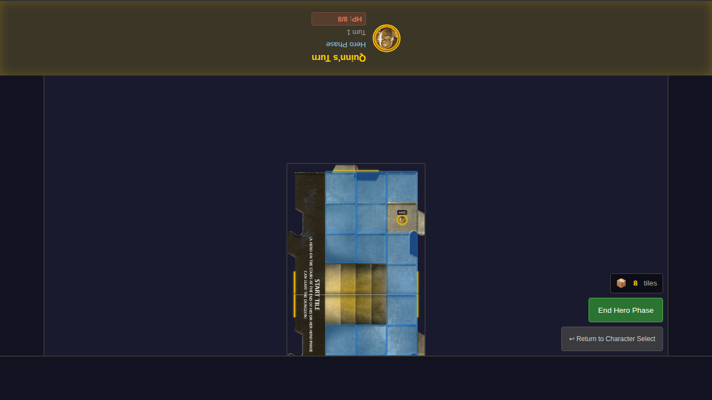
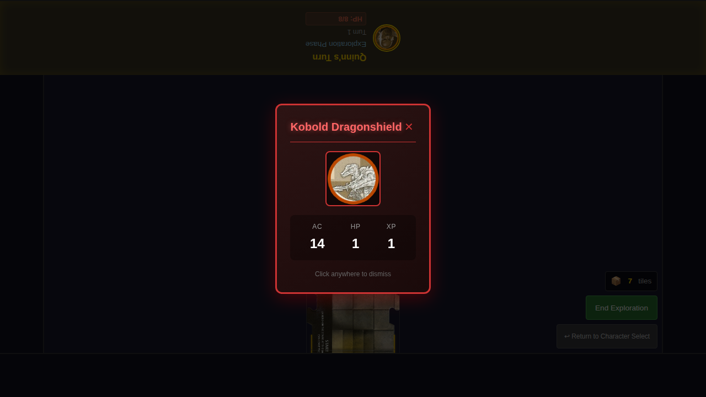
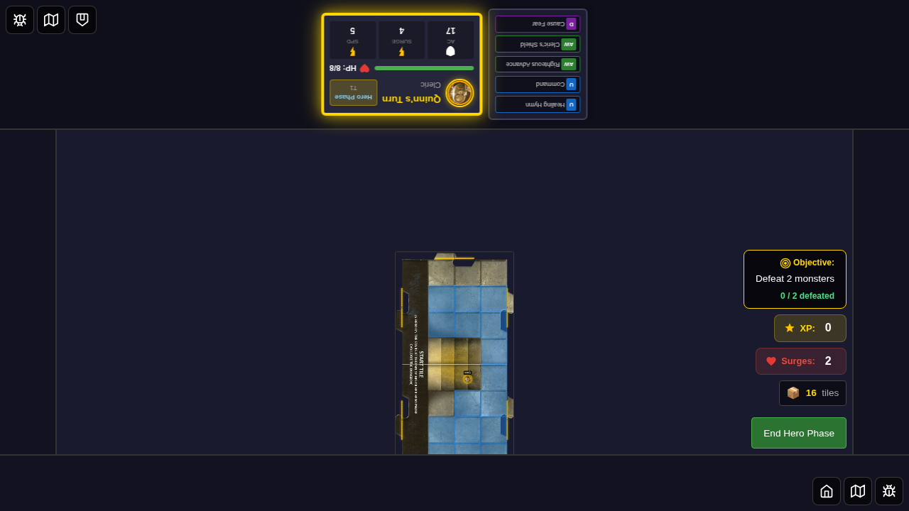
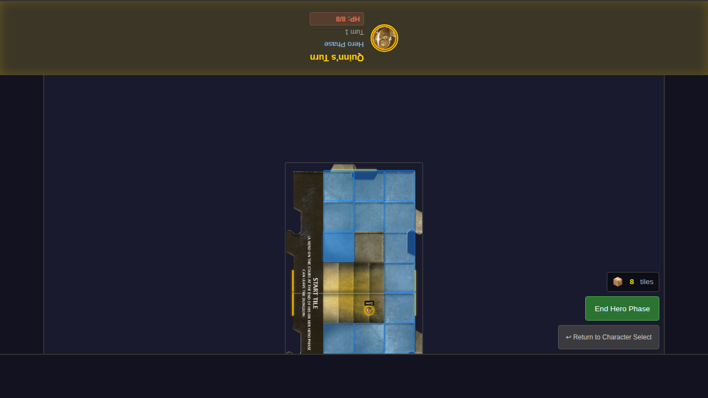
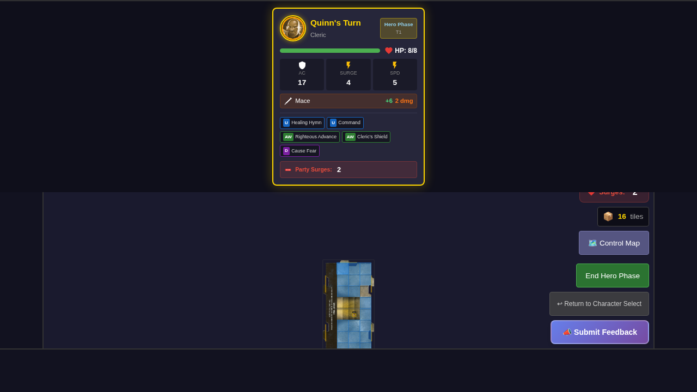
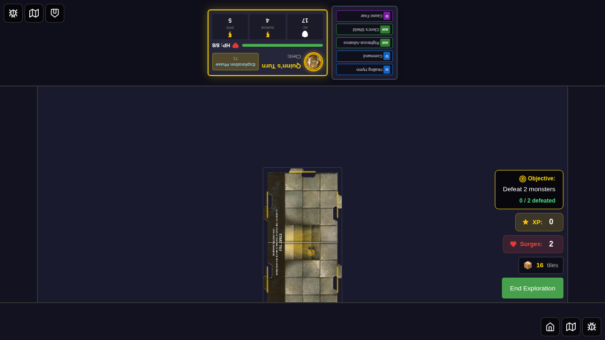

# 011 - Hero Turn Structure

This E2E test verifies the enforcement of valid hero turn structures during the hero phase.

## User Story

As a player, when my hero's turn starts:
- I should see movement options automatically displayed
- I can choose to move, attack (if adjacent to a monster), or pass/end my turn
- After taking valid action combinations (move+attack, attack+move, or double move), my turn should automatically end
- I should not be able to attack twice in a single turn
- I can always choose to pass/end my turn early

## Valid Action Sequences

| Sequence | Result |
|----------|--------|
| Move | Can still move (double move) or attack |
| Move → Move | Turn auto-ends → Exploration Phase |
| Move → Attack | Turn auto-ends → Exploration Phase |
| Attack → Move | Turn auto-ends → Exploration Phase |
| Pass/End Phase | Turn ends → Exploration Phase |

## Test Scenarios

### Test 1: Hero turn auto-advances after double move

1. Start game with one hero
2. Verify hero phase starts with movement options shown
3. Move once (can still move or attack)
4. Move again (double move)
5. Verify game auto-advances to Exploration Phase

### Test 2: Hero cannot attack twice (no double attacks)

1. Start game
2. Verify attack option is available
3. Verify controls (end phase button) are visible

### Test 3: Pass/end phase button advances to next phase

1. Start game
2. Click "End Hero Phase" without taking any actions
3. Verify game advances to Exploration Phase

## Screenshots

### Test 1: Double Move Auto-Advances

#### 000 - Hero Phase with Movement Shown

#### 001 - After First Move

#### 002 - Auto-Advanced to Exploration Phase

### Test 2: Attack Restriction Verification

#### 000 - Game Started for Attack Test

#### 001 - Hero Phase Controls

### Test 3: Pass/End Phase

#### 000 - Before End Phase

#### 001 - After Pass to Exploration

## Programmatic Verification

Each screenshot includes verification of:
- DOM state (phase indicator text, button visibility)
- Redux store state (`heroTurnActions`, `turnState`)
- Action availability (`canMove`, `canAttack`)
