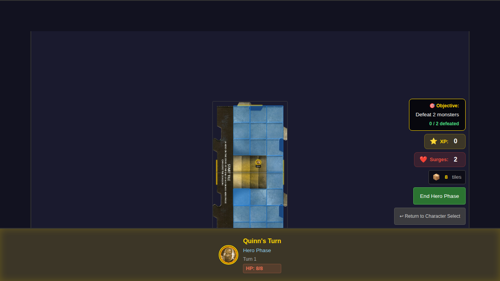
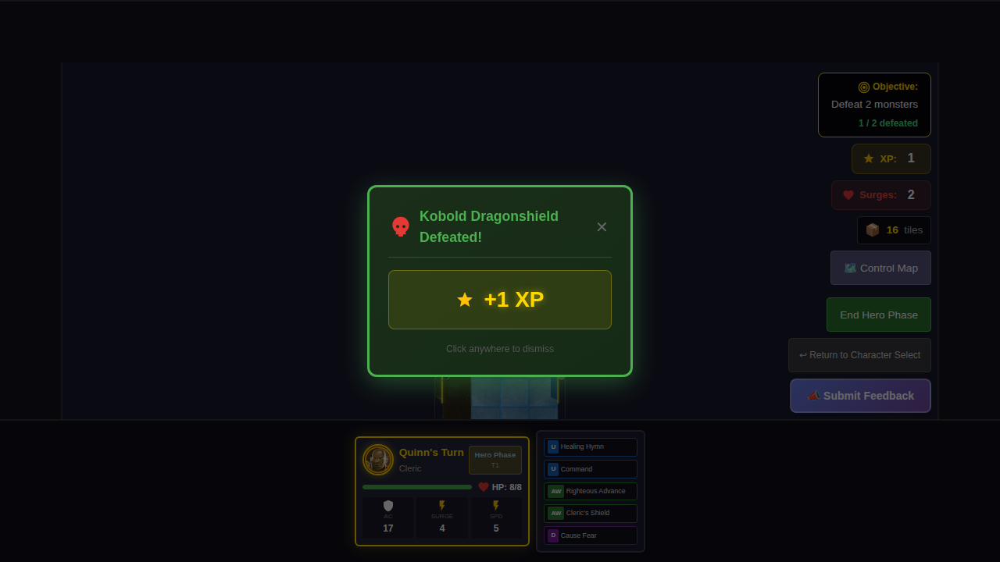

# 012 - MVP Scenario: Defeat Two Monsters

## User Story

As a player, I want to win the game by defeating two monsters, so that I can experience a complete game session with a clear victory condition.

As a player, if my party is eliminated before defeating two monsters, I want to see a defeat screen so I know the game has ended.

## Test Coverage

This test suite verifies the MVP scenario implementation:

1. **Objective Display** - Shows current progress "0 / 2 defeated" on the game board
2. **Victory Condition** - Game ends with victory screen after defeating 2 monsters
3. **Defeat Condition** - Game ends with defeat screen when all heroes reach 0 HP
4. **Monster Counter** - Correctly tracks number of monsters defeated

## Screenshots

### Objective Display (Initial State)

Game board showing the objective display with:
- 🎯 Objective: Defeat 2 monsters
- Progress: 0 / 2 defeated

### Victory Screen

Victory screen displayed after defeating 2 monsters, showing:
- 🏆 Victory! heading
- Completion message
- Monsters defeated count
- Return to Character Select button

### Return to Character Select (from Victory)

Character selection screen after returning from victory, with scenario state reset.

### Defeat Screen

Defeat screen displayed when all heroes are eliminated, showing:
- 💀 Defeat heading
- Progress made before defeat
- Return to Character Select button

### Return to Character Select (from Defeat)

Character selection screen after returning from defeat, with scenario state reset.

### Counter After One Monster Defeated

Game board showing the objective progress updated to 1 / 2 defeated after defeating one monster.

## Automated Test Coverage

All items are verified programmatically by the test suite with screenshots at each significant step:

| Verification Item | Test | Screenshot |
|-------------------|------|------------|
| Objective display shows "🎯 Objective: Defeat 2 monsters" | `Objective display shows current progress` | `000-objective-display-initial` |
| Progress shows "0 / 2 defeated" at game start | `Objective display shows current progress` | `000-objective-display-initial` |
| Progress updates to "1 / 2 defeated" after first monster kill | `Monster defeat counter increments correctly` | `000-counter-one-defeated` |
| Victory screen appears after defeating second monster | `Victory screen appears after defeating 2 monsters` | `000-victory-screen` |
| Victory screen shows 🏆 icon and "Victory!" title | `Victory screen appears after defeating 2 monsters` | `000-victory-screen` |
| Defeat screen appears when all heroes reach 0 HP | `Defeat screen appears when all heroes are eliminated` | `000-defeat-screen` |
| Defeat screen shows 💀 icon and "Defeat" title | `Defeat screen appears when all heroes are eliminated` | `000-defeat-screen` |
| Both screens have "Return to Character Select" button | Victory and Defeat tests | `000-victory-screen`, `000-defeat-screen` |
| Returning to menu resets game state | Victory and Defeat tests | `001-return-to-character-select`, `001-return-from-defeat` |
