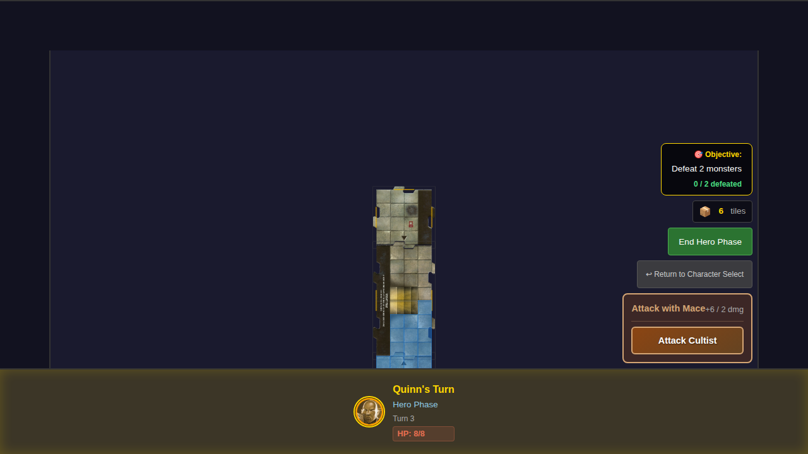

# 013 - Wall Collision Detection

This E2E test suite verifies that characters cannot move through dungeon walls and that diagonal movement is properly restricted at tile boundaries.

## User Story

As a player, I expect:
- My hero cannot move through walls in the dungeon
- Movement overlay only shows valid, legal moves
- Diagonal movement is blocked when both connected edges have walls
- Hero cannot move to the wall column (x=0) on the start tile
- Hero cannot move to non-adjacent tiles (must traverse through connected tiles)

## Test Scenarios

### Test 1: Movement overlay excludes diagonal moves through wall corners
**Steps:**
1. Start game with Quinn
2. Position hero at north-east corner of start tile (x=3, y=0)
3. Show movement options
4. Verify valid moves include adjacent squares within the tile

**Expected Result:**
- Movement overlay shows legal moves only
- Hero can move south, west, and diagonally within the tile
- No moves through unexplored edges (treated as walls)

### Test 2: Hero cannot move diagonally between tiles that are not directly connected
**Steps:**
1. Start game with Quinn
2. Position hero at east edge of start tile (x=3, y=2)
3. Show movement options
4. Verify no moves extend beyond tile boundary

**Expected Result:**
- All valid movement squares are within start tile bounds (x: 1-3)
- No diagonal moves to adjacent tile positions

### Test 3: Hero cannot move to non-adjacent tile (requires three tiles)
**Steps:**
1. Start game with Quinn
2. Explore north edge to create a north tile
3. Explore south edge to create a south tile (now have 3 tiles: north, start, south)
4. Position hero on south tile (y=9)
5. Show movement options
6. Verify hero cannot reach north tile

**Expected Result:**
- Three tiles exist: north tile (y: -4 to -1), start tile (y: 0-7), south tile (y: 8-11)
- Hero on south tile can reach south tile and start tile squares
- Hero cannot reach north tile squares (north and south tiles are not adjacent)
- Movement must traverse through connected tiles only

### Test 4: Movement squares respect tile boundaries and wall edges
**Steps:**
1. Start game with Quinn
2. Position hero at west edge of walkable area (x=1, y=2)
3. Show movement options
4. Verify no moves to wall column (x=0)

**Expected Result:**
- No movement squares at x=0 (wall column)
- No movement to staircase squares (x=1-2, y=3-4)
- Can move within walkable area

## Screenshots

### Test 1: Movement from corner

### Test 2: Movement at edge

### Test 3: Non-adjacent tile movement

### Test 4: Movement at west wall

## Manual Verification Checklist

- [ ] Movement overlay appears when clicking the game board
- [ ] Valid movement squares are highlighted in blue
- [ ] No movement squares appear outside tile boundaries
- [ ] No movement squares appear on the wall column (x=0)
- [ ] No movement squares appear on staircase squares
- [ ] Clicking a valid movement square moves the hero
- [ ] With three tiles, hero cannot move from one edge tile to the opposite edge tile
