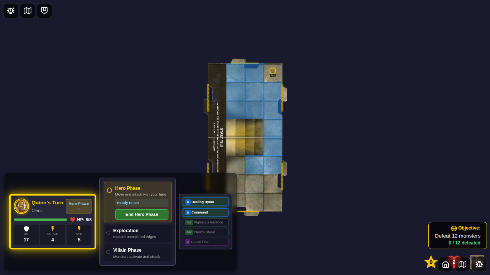
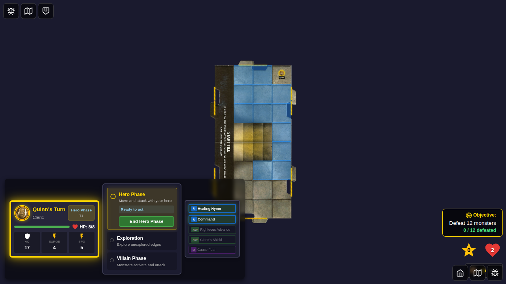
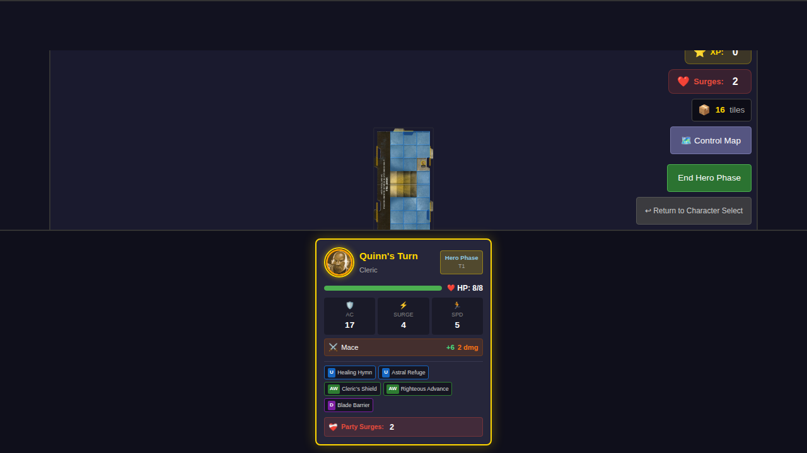
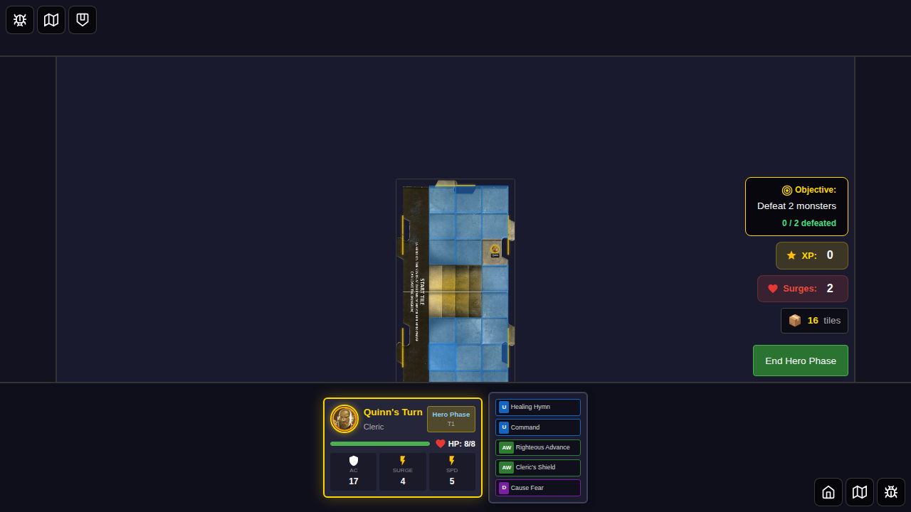
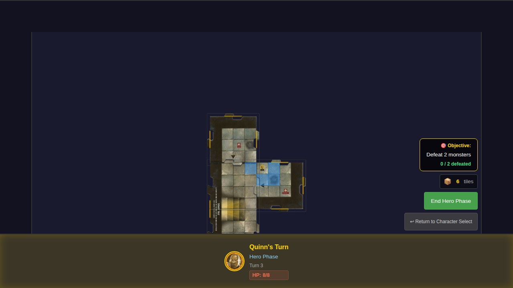
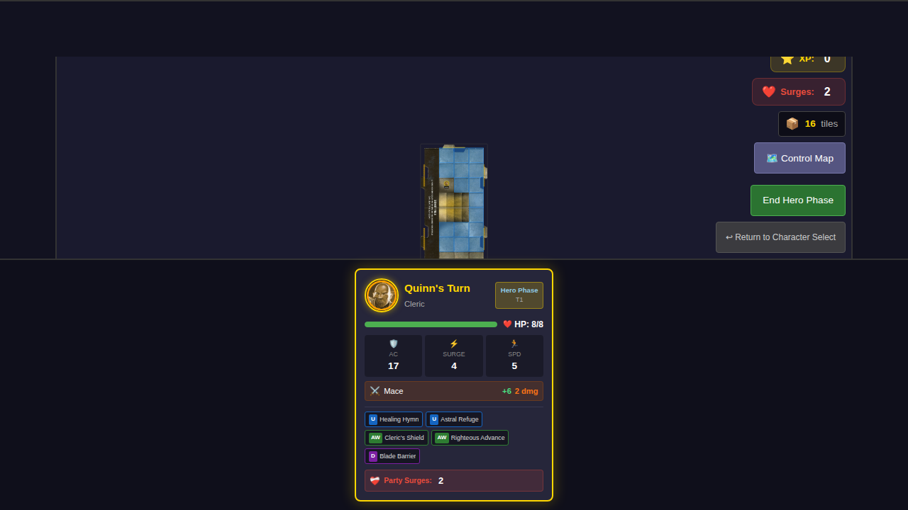
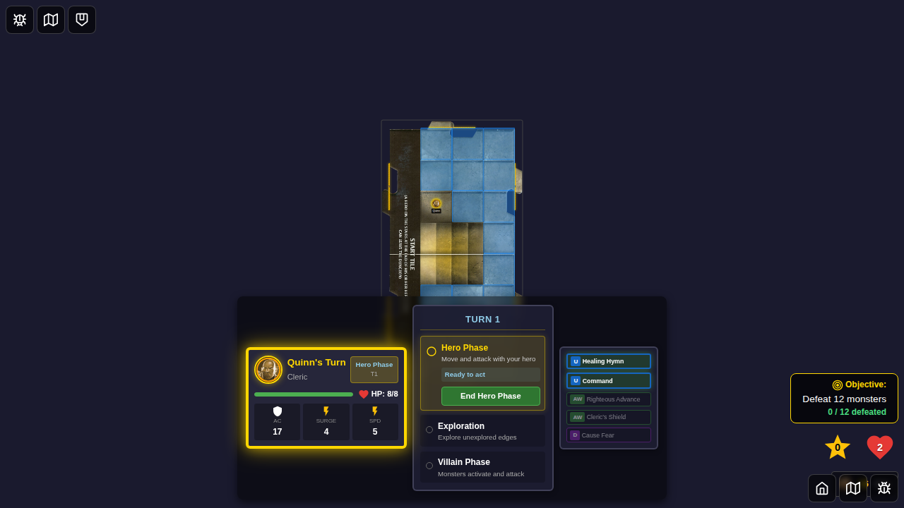

# 013 - Wall Collision Detection

This E2E test suite verifies that characters cannot move through dungeon walls and that diagonal movement is properly restricted at tile boundaries.

## User Story

As a player, I expect:
- My hero cannot move through walls in the dungeon
- Movement overlay only shows valid, legal moves
- Diagonal movement is blocked when both connected edges have walls
- Hero cannot move to the wall column (x=0) on the start tile
- Hero cannot move diagonally to non-adjacent tiles (must use cardinal moves through connected tiles)

## Test Scenarios

### Test 1: Movement overlay excludes diagonal moves through wall corners
**Steps:**
1. Start game with Quinn
2. Position hero at north-east corner of start tile (x=3, y=0)
3. Show movement options
4. Verify valid moves include adjacent squares within the tile

**Expected Result:**
- Movement overlay shows legal moves only
- Hero can move south, west, and diagonally within the tile
- No moves through unexplored edges (treated as walls)

### Test 2: Hero cannot move diagonally between tiles that are not directly connected
**Steps:**
1. Start game with Quinn
2. Position hero at east edge of start tile (x=3, y=2)
3. Show movement options
4. Verify no moves extend beyond tile boundary

**Expected Result:**
- All valid movement squares are within start tile bounds (x: 1-3)
- No diagonal moves to adjacent tile positions

### Test 3: Hero cannot move diagonally to non-adjacent tile (north and east tiles)
**Steps:**
1. Start game with Quinn
2. Explore north edge to create a north tile
3. Explore east edge to create an east tile (now have 3 tiles: start, north, east)
4. Position hero at corner of east tile (x=4, y=0)
5. Show movement options with speed=1 to test direct adjacency
6. Verify hero cannot reach north tile via diagonal move

**Expected Result:**
- Three tiles exist: north tile (y: -4 to -1), start tile (y: 0-7), east tile (x: 4-7)
- Hero at (4, 0) on east tile is diagonally adjacent to (3, -1) on north tile
- Hero CANNOT move diagonally to (3, -1) because north and east tiles are not directly connected
- Hero CAN move to cardinal directions (start tile, within east tile)
- This tests the rule: diagonal movement is not allowed between non-adjacent tiles

### Test 4: Movement squares respect tile boundaries and wall edges
**Steps:**
1. Start game with Quinn
2. Position hero at west edge of walkable area (x=1, y=2)
3. Show movement options
4. Verify no moves to wall column (x=0)

**Expected Result:**
- No movement squares at x=0 (wall column)
- No movement to staircase squares (x=1-2, y=3-4)
- Can move within walkable area

## Screenshots

### Test 1: Movement from corner

### Test 2: Movement at edge

### Test 3: Diagonal movement to non-adjacent tile (north and east)

### Test 4: Movement at west wall

## Manual Verification Checklist

- [ ] Movement overlay appears when clicking the game board
- [ ] Valid movement squares are highlighted in blue
- [ ] No movement squares appear outside tile boundaries
- [ ] No movement squares appear on the wall column (x=0)
- [ ] No movement squares appear on staircase squares
- [ ] Clicking a valid movement square moves the hero
- [ ] With north and east tiles, hero at east tile corner cannot move diagonally to north tile
