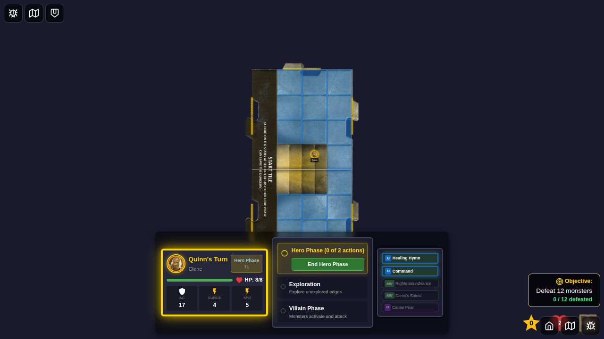
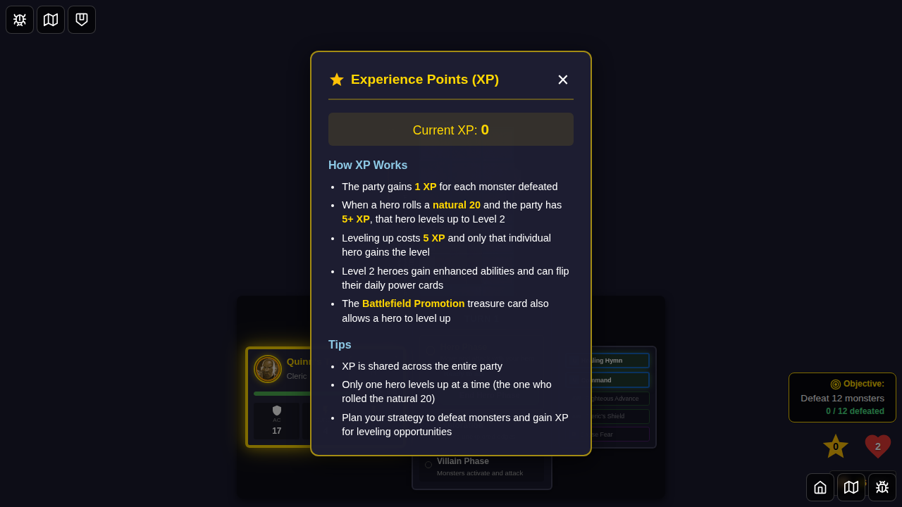
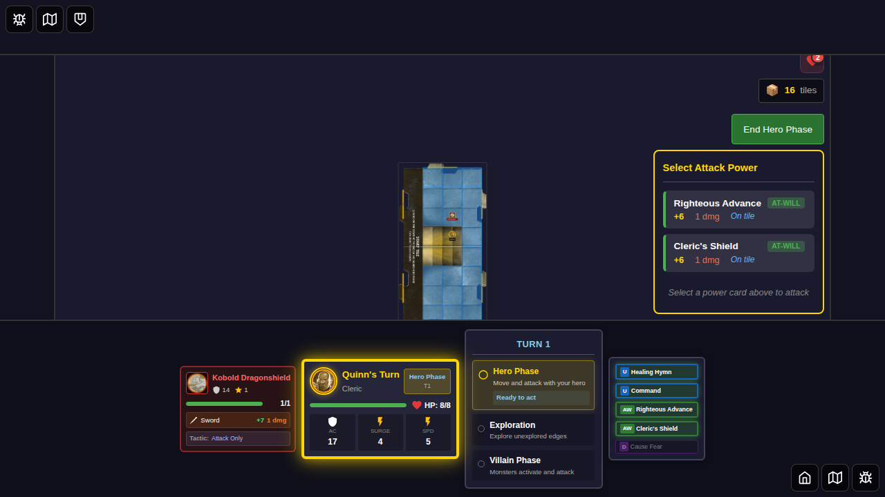

# E2E Test 014 - Defeat Monster and Gain XP

## User Story

> As a user, when I reduce a monster to 0 HP, it is removed from the board and I gain experience points.

## Test Scenarios

### Scenario 1: Hero defeats monster and gains experience

**Given:** A Kobold with 1 HP is on the board  
**When:** Quinn attacks and hits  
**Then:** The Kobold is removed from the board  
**And:** The party XP increases by the Kobold's XP value (1)  
**And:** A defeat notification appears showing "+1 XP"  
**And:** I see the updated XP total in the XP counter

### Scenario 2: XP accumulates correctly in party resources

**Given:** A monster is defeated  
**When:** The defeat flow completes  
**Then:** The XP counter shows the correct accumulated value  
**And:** The monster is removed from the game state

### Scenario 3: No XP gained when attack misses

**Given:** A Kobold with 1 HP is on the board  
**When:** Quinn attacks and misses  
**Then:** The Kobold remains on the board with 1 HP  
**And:** The party XP remains at 0  
**And:** No defeat notification appears

## Screenshot Sequence

### 000 - Initial Game Board with XP at 0

Shows the game board with Quinn and the refactored XP counter - a compact star icon with a badge showing "0".

### 001 - XP Popover with Details

When clicking the XP counter, a popover appears showing:
- Current XP value (0)
- How XP Works section explaining the XP mechanics
- Tips section with strategic advice
- Party gains 1 XP per monster defeated
- Level up occurs at 5 XP

### 002 - Monster on Board

A Kobold with 1 HP is positioned on the board adjacent to Quinn. The XP counter is visible in the top right.

## Verification Checklist

- [x] XP counter displays as a compact star icon with numeric badge
- [x] XP counter is clickable and shows a detailed popover
- [x] Popover explains how XP works and provides tips
- [x] Popover is dismissible by clicking the close button or backdrop
- [x] Initial XP value is 0
- [x] XP counter updates correctly when monsters are defeated
