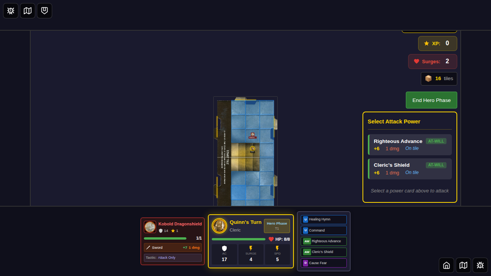
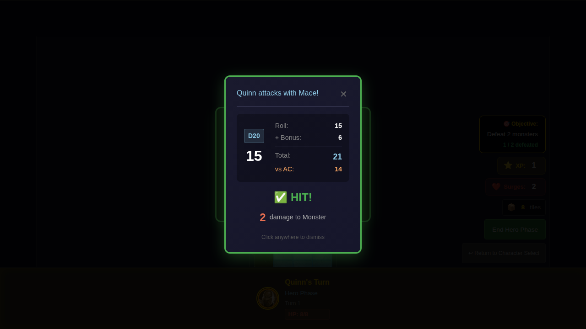
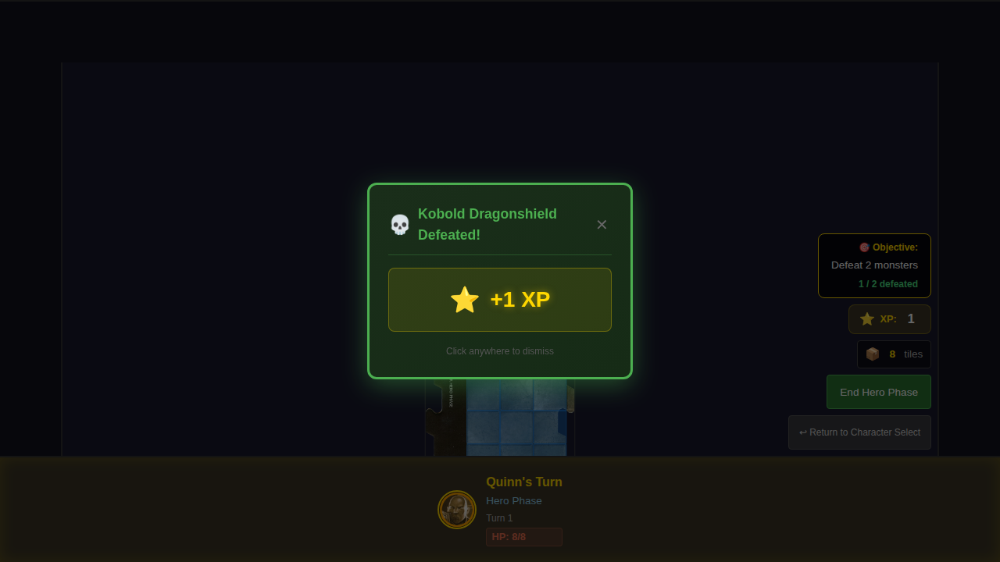
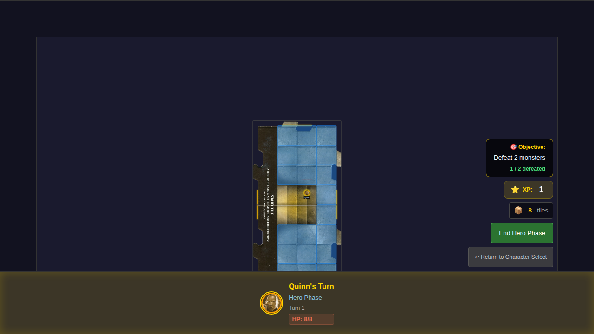

# E2E Test 014 - Defeat Monster and Gain XP

## User Story

> As a user, when I reduce a monster to 0 HP, it is removed from the board and I gain experience points.

## Test Scenarios

### Scenario 1: Hero defeats monster and gains experience

**Given:** A Kobold with 1 HP is on the board  
**When:** Quinn attacks and hits  
**Then:** The Kobold is removed from the board  
**And:** The party XP increases by the Kobold's XP value (1)  
**And:** A defeat notification appears showing "+1 XP"  
**And:** I see the updated XP total in the XP counter

### Scenario 2: XP accumulates correctly in party resources

**Given:** A monster is defeated  
**When:** The defeat flow completes  
**Then:** The XP counter shows the correct accumulated value  
**And:** The monster is removed from the game state

### Scenario 3: No XP gained when attack misses

**Given:** A Kobold with 1 HP is on the board  
**When:** Quinn attacks and misses  
**Then:** The Kobold remains on the board with 1 HP  
**And:** The party XP remains at 0  
**And:** No defeat notification appears

## Screenshot Sequence

### 000 - Initial Game Board with XP at 0

Shows the game board with Quinn, the XP counter visible and displaying 0.

### 001 - Monster on Board

A Kobold with 1 HP is positioned on the board adjacent to Quinn.

### 002 - Attack Hits Kobold

The combat result dialog shows that Quinn's attack hit the Kobold for 2 damage. The XP counter already shows the updated value.

### 003 - Defeat Notification with XP Gained

The defeat notification appears showing:
- "Kobold Dragonshield Defeated!"
- "+1 XP" indicator

### 004 - XP Counter Shows 1

After dismissing the notification, the XP counter clearly shows the new value of 1. The monster has been removed from the board.

## Verification Checklist

- [x] XP counter is visible on the game board
- [x] Initial XP value is 0
- [x] Combat result displays correctly when attacking a monster
- [x] Defeat notification appears when monster HP reaches 0
- [x] Defeat notification shows monster name and XP gained
- [x] XP counter updates after monster is defeated
- [x] XP accumulates correctly in party resources
- [x] No XP is gained when an attack misses
- [x] Monster is removed from board when defeated
- [x] Monster remains on board when attack misses
