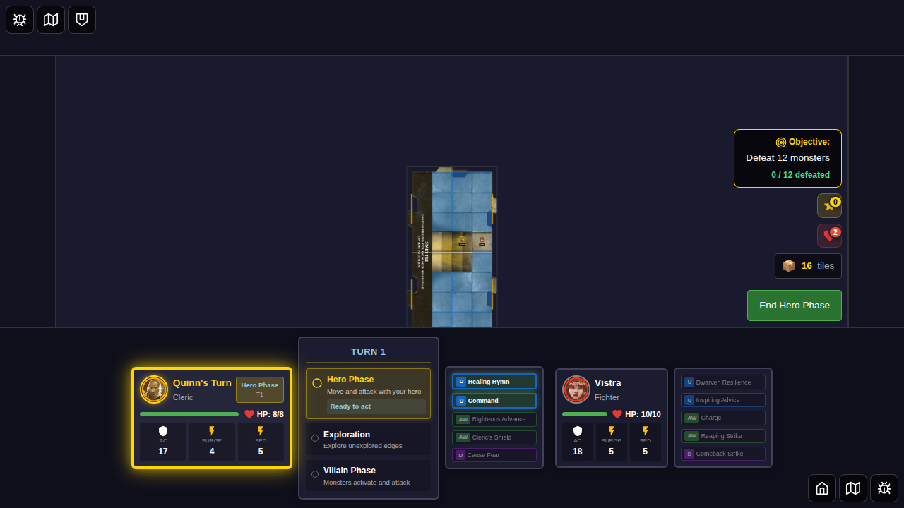
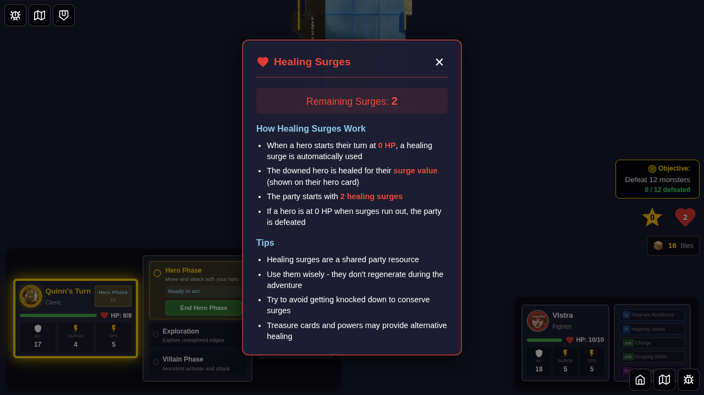
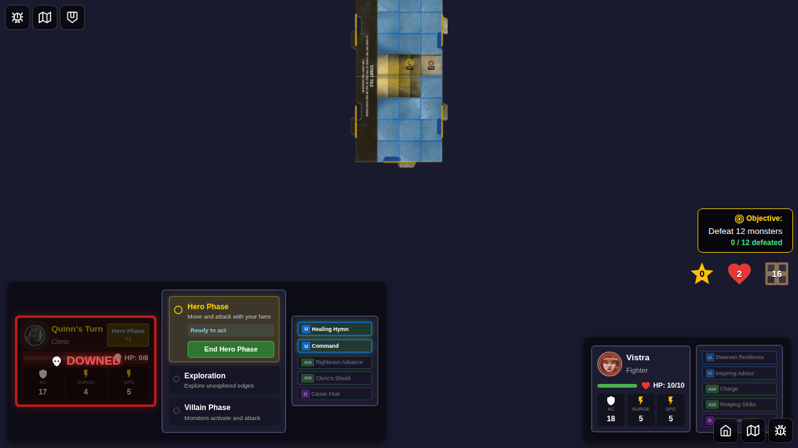
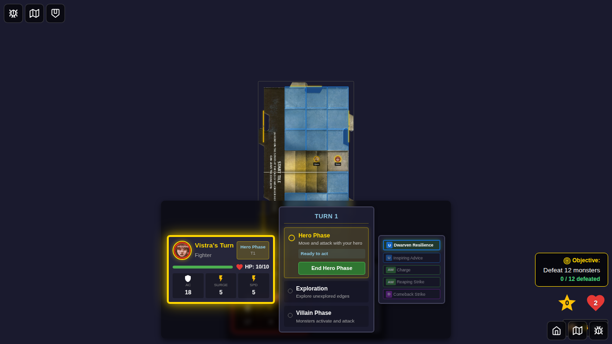

# E2E Test 015 - Healing Surge

## User Story

> As a player, when my hero is at 0 HP at the start of their turn, a healing surge is automatically used to heal them.

## Test Scenarios

### Scenario 1: Hero automatically healed at turn start
1. Start game with two heroes (Quinn and Vistra)
2. Verify party starts with 2 healing surges
3. Set Quinn to 0 HP
4. End Quinn's turn and Vistra's turn
5. When Quinn's turn starts again, healing surge triggers automatically
6. Quinn's HP is restored to surge value (4)
7. Surge count decreases from 2 to 1

### Scenario 2: No surge used when HP is greater than 0
1. Start game with Quinn at 1 HP
2. Go through a full turn cycle
3. Verify no surge is used since HP > 0

### Scenario 3: No surge used when no surges available
1. Start game with two heroes
2. Set Quinn to 0 HP and deplete all surges
3. Go through turn cycles
4. Verify no surge is used since none available

## Screenshot Gallery

### Test: Hero automatically healed at turn start

The game board shows the party starting with 2 healing surges displayed in the refactored counter - a compact heart icon with a badge showing "2".

When clicking the healing surge counter, a popover appears showing:
- Remaining Surges: 2
- How Healing Surges Work section explaining the mechanics
- Tips section with strategic advice
- Healing surges are automatically used when a hero starts their turn at 0 HP

Quinn has been reduced to 0 HP but it's still his turn, so no surge is used yet.

Vistra's turn begins. No healing surge is triggered since Vistra has HP > 0.

## Acceptance Criteria Verification

- [x] Healing surge counter displays as a compact heart icon with numeric badge
- [x] Healing surge counter is clickable and shows a detailed popover
- [x] Popover explains how healing surges work and provides tips
- [x] Popover is dismissible by clicking the close button or backdrop
- [x] Party starts with 2 healing surges (verified in screenshot 000)
- [x] Healing surge count is displayed (visible in all screenshots)
- [x] When hero at 0 HP starts turn, surge is used automatically
