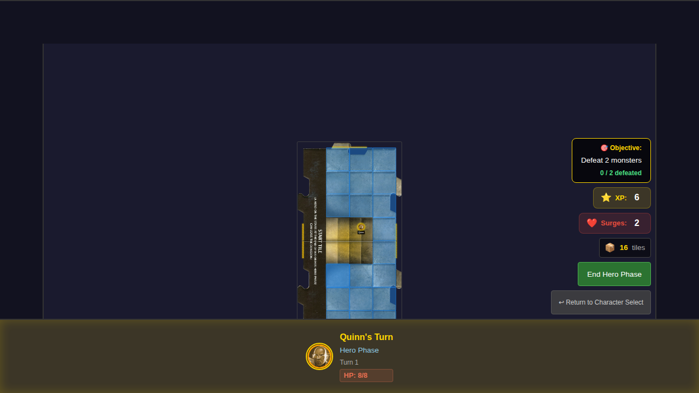
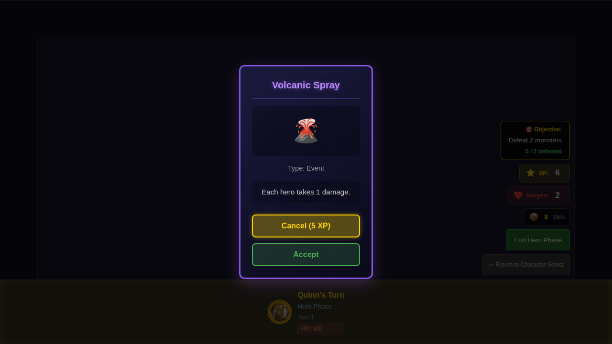
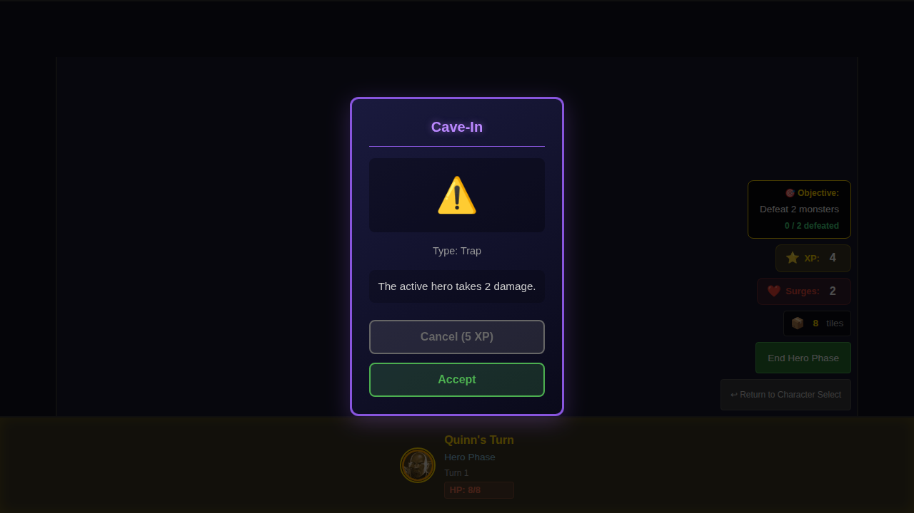

# 017 - Cancel Encounter with XP

## User Story

> As a player, when an encounter card is drawn, I can spend 5 XP to cancel it.

## Acceptance Criteria

- When encounter is drawn, a "Cancel (5 XP)" option appears
- Option is only available if party has 5+ XP
- Clicking cancel discards the encounter
- 5 XP is deducted from party total

## Test Scenarios

### Scenario 1: Player cancels encounter by spending XP
1. Start game with Quinn
2. Set party XP to 6
3. Draw an encounter card
4. Verify Cancel button is enabled
5. Click Cancel
6. Verify encounter is dismissed and XP is deducted (6 - 5 = 1)

### Scenario 2: Cancel button is disabled with insufficient XP
1. Start game with Quinn
2. Set party XP to 4
3. Draw an encounter card
4. Verify Cancel button is disabled
5. Accept encounter instead
6. Verify XP unchanged

### Scenario 3: Player accepts encounter without spending XP
1. Start game with Quinn
2. Set party XP to 10
3. Draw an encounter card
4. Click Accept
5. Verify XP unchanged (still 10)

## Screenshot Sequence

1. `000-initial-6-xp-chromium-linux.png` - Game board with 6 XP
2. `001-encounter-drawn-chromium-linux.png` - Encounter card displayed with enabled Cancel button
3. `002-encounter-cancelled-chromium-linux.png` - After cancelling, XP shows 1
4. `000-cancel-disabled-low-xp-chromium-linux.png` - Cancel button disabled with 4 XP

## Screenshots

