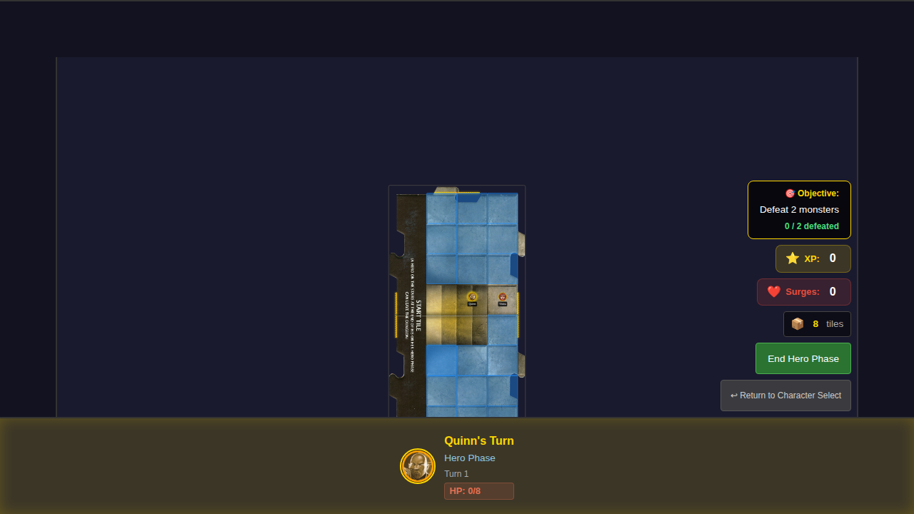
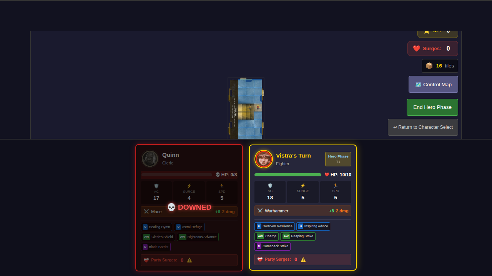
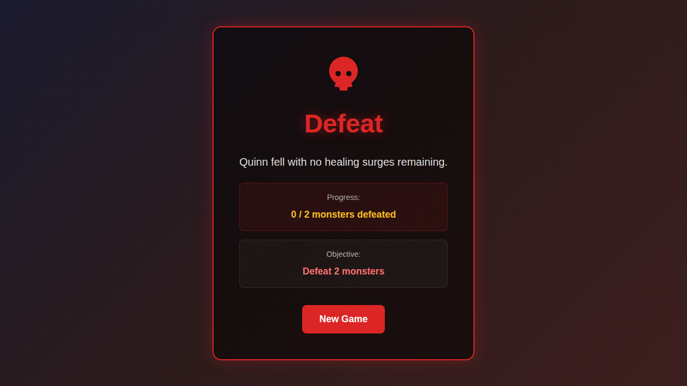
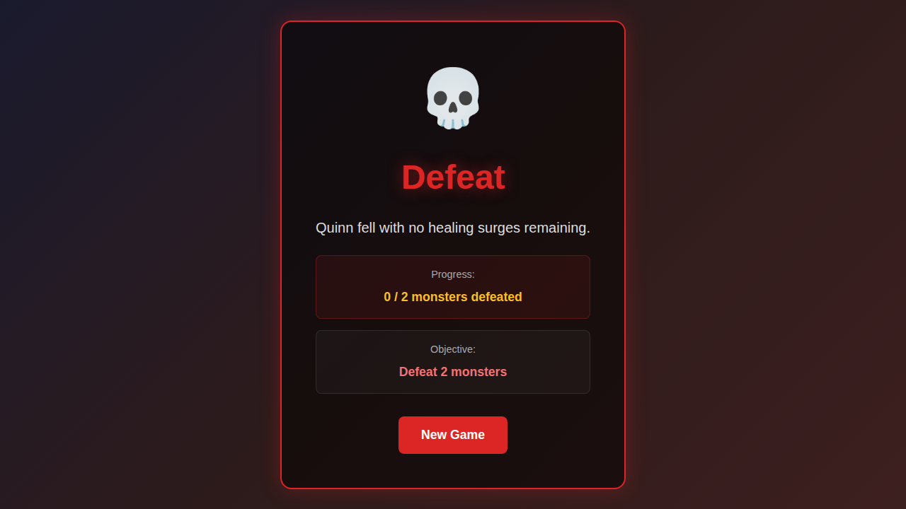
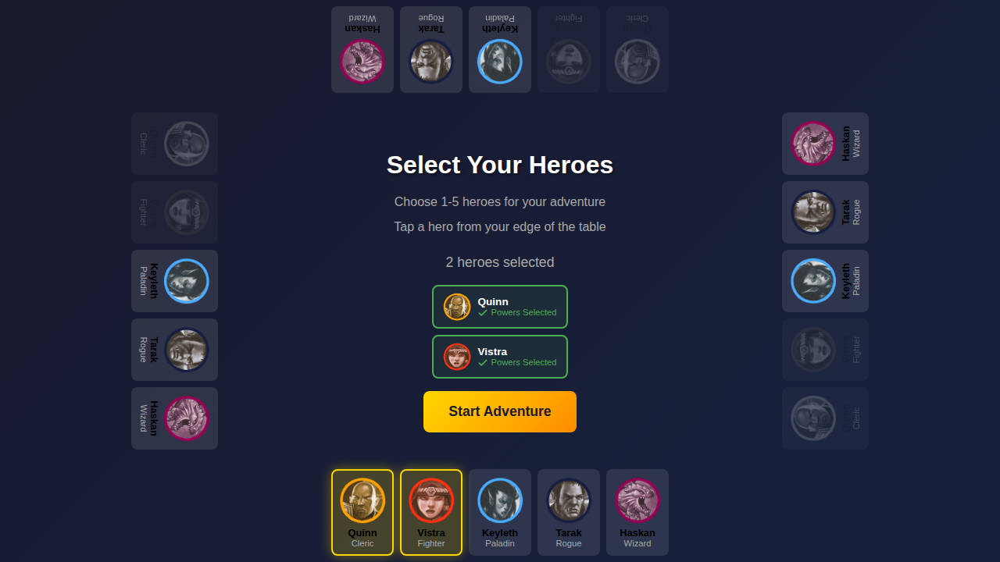

# E2E Test 018 - Party Defeat

## User Story

As a user, if a hero is at 0 HP and no healing surges remain, the party is defeated and I see a defeat screen.

## Test Scenarios

### Scenario 1: Game ends when hero dies with no surges

1. Start game with Quinn and Vistra
2. Set party to 0 healing surges
3. Set Quinn to 0 HP
4. End Quinn's turn (hero phase → exploration phase → villain phase)
5. Now Vistra's turn - game continues
6. End Vistra's turn (cycles back to Quinn)
7. When Quinn's turn begins again, defeat is triggered (0 HP + 0 surges)
8. Verify defeat screen displays with proper message
9. Verify "New Game" button is available
10. Click "New Game" to return to character select

### Scenario 2: Game does not end if healing surge is available

- When hero at 0 HP but surges are available, healing surge is used instead of defeat

## Screenshot Gallery

### 018-01: Party has 0 healing surges

### 018-02: Quinn at 0 HP

### 018-03: Vistra's turn (game continues)

### 018-04: Defeat screen displayed

### 018-05: New Game button

### 018-06: Returned to character select after clicking New Game

## Manual Verification Checklist

- [ ] Defeat screen shows "💀 Defeat" title
- [ ] Defeat message shows which hero fell and why ("Quinn fell with no healing surges remaining.")
- [ ] Progress shows monsters defeated count
- [ ] "New Game" button is visible and clickable
- [ ] Clicking "New Game" returns to character selection
- [ ] Defeat reason is cleared after starting new game
