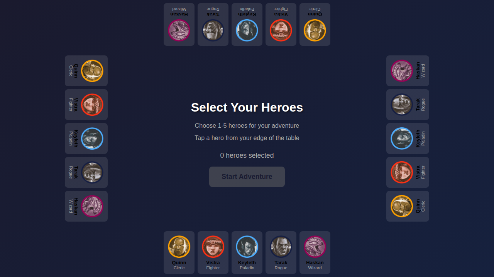
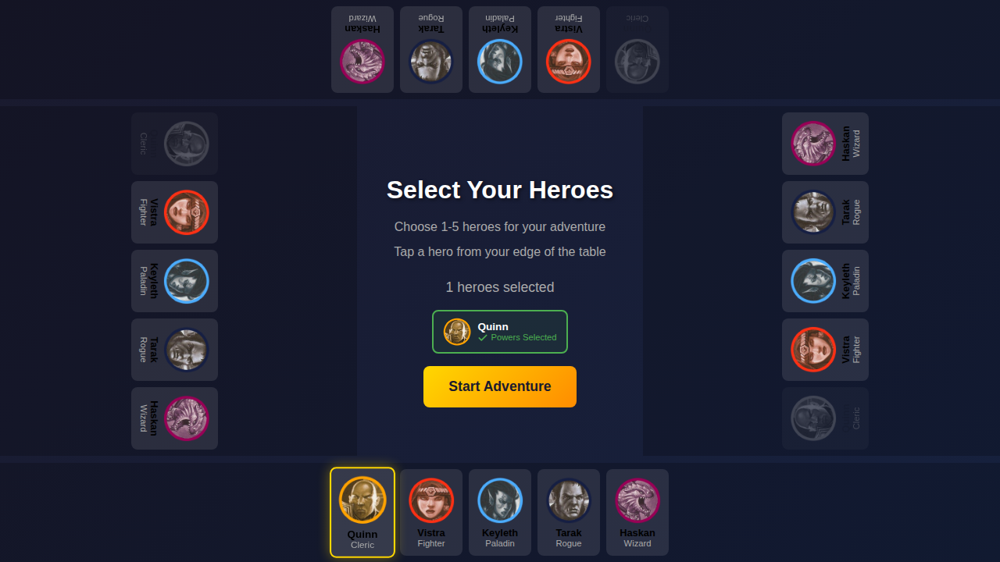
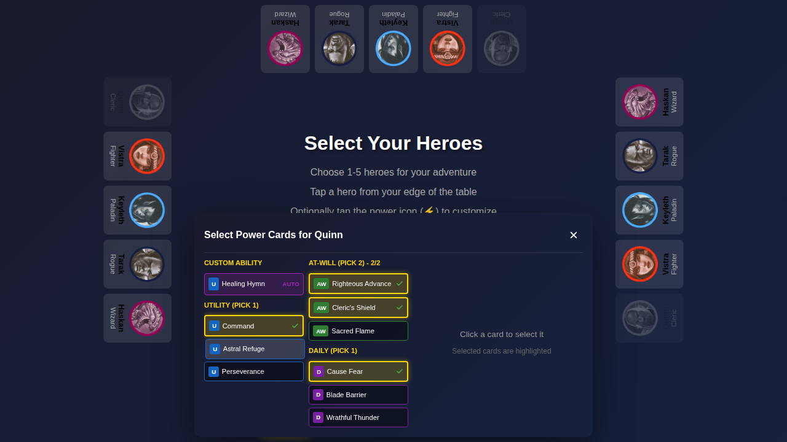
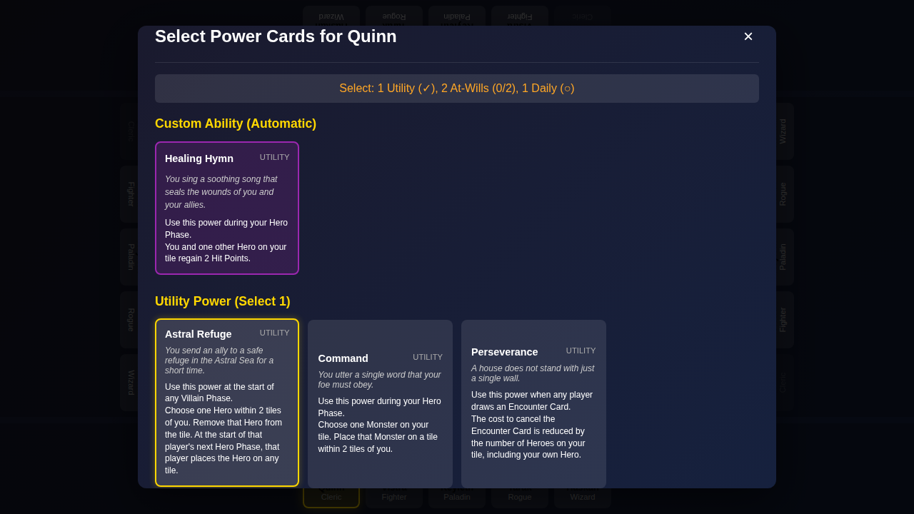
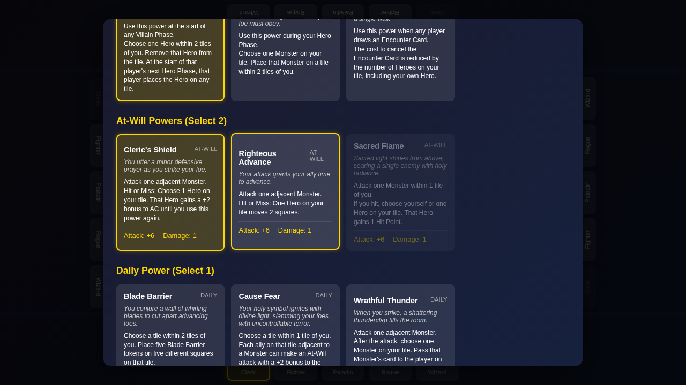
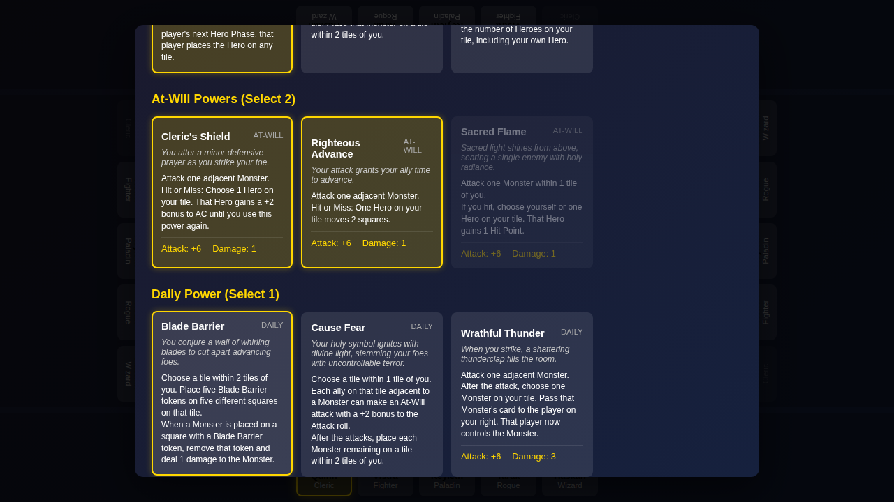
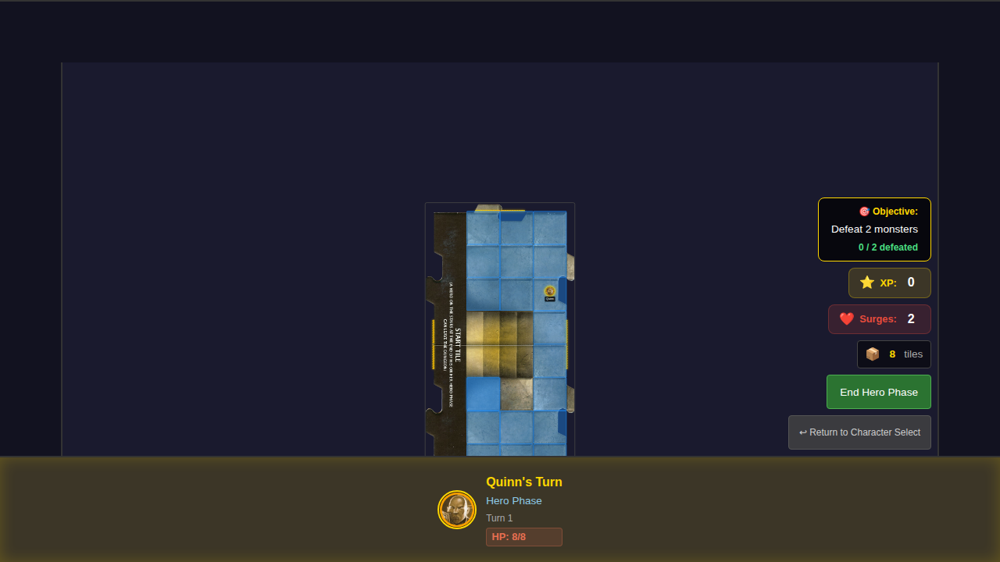

# 019 - Power Card Selection

This test verifies the power card selection feature where players select their hero's power cards before starting the game.

## User Story

As a player, I want to select power cards for my hero (1 utility, 2 at-wills, and 1 daily power) so that I can customize my hero's abilities for the adventure.

## Test Steps

1. **Initial Screen** - Character selection screen with no heroes selected
2. **Hero Selected** - Player selects Quinn from the bottom edge
3. **Power Card Modal** - Opens the power card selection modal for Quinn
4. **Utility Selected** - Player selects a utility power card (Astral Refuge)
5. **At-Will Selected** - Player selects two at-will power cards (Cleric's Shield and Righteous Advance)
6. **All Powers Selected** - Player selects a daily power card (Blade Barrier), completing the selection
7. **Modal Closed** - Power card selection modal is closed, showing powers are selected
8. **Game Started** - Player starts the game with finalized power cards

## Screenshot Gallery

### 000 - Initial Screen

Character selection screen with start button disabled.

### 001 - Hero Selected

Quinn is selected. "Select Powers" button appears for Quinn. Start button is disabled until powers are selected.

### 002 - Power Card Modal

Power card selection modal showing:
- Custom Ability (automatic): Healing Hymn
- Utility cards to choose from
- At-Will cards to choose from
- Daily cards to choose from

### 003 - Utility Selected

Astral Refuge utility power card is selected.

### 004 - At-Will Selected

Two at-will power cards selected: Cleric's Shield and Righteous Advance.

### 005 - All Powers Selected

All power cards selected (1 utility, 2 at-wills, 1 daily). Selection status shows "Complete".

### 006 - Modal Closed

Modal is closed. Quinn shows "✓ Powers Selected". Start button is now enabled.

### 007 - Game Started

Game has started with Quinn and their selected power cards.

## Manual Verification Checklist

- [ ] Custom ability (Healing Hymn) is automatically assigned to Quinn
- [ ] Player can select 1 utility power card
- [ ] Player can select 2 at-will power cards
- [ ] Player can select 1 daily power card
- [ ] Selection status updates as cards are selected
- [ ] Done button is disabled until all cards are selected
- [ ] Start button is disabled until power cards are selected for all heroes
- [ ] Selected power cards are preserved when starting the game
