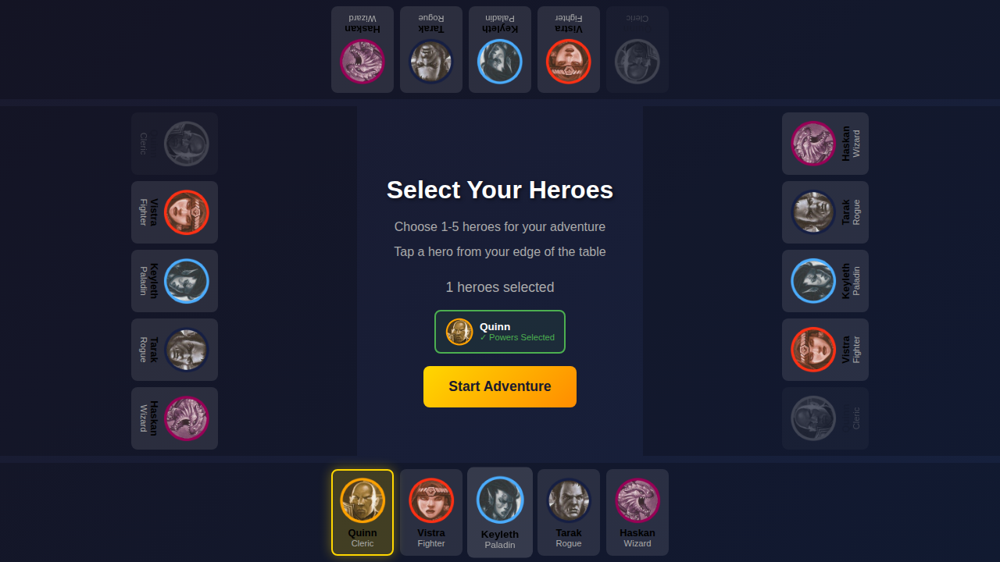
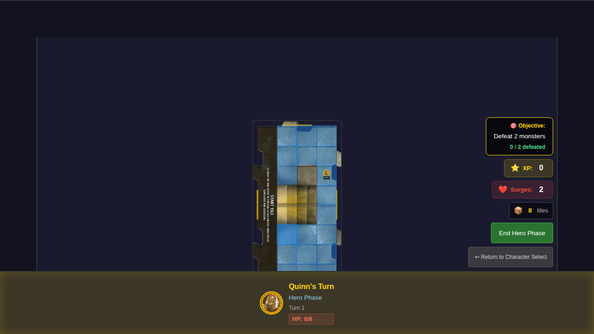

# 020 - Power Card Use

This test verifies that players can use their power cards (daily, at-will, utility, and custom abilities) during gameplay and that the card state persists across turn phases.

## User Story

As a player, I want to use my hero's power cards during gameplay so that I can execute special abilities and attacks beyond the basic attack.

## Test Overview

### Test 1: Player can use daily, at-will, and utility power cards during gameplay

This test verifies:
- Power cards are finalized when the game starts
- All power cards start in the unflipped (available) state
- At-will power cards can be used (flipped)
- Utility power cards can be used (flipped)
- Daily power cards can be used (flipped)
- Custom ability cards can be used (flipped)
- Each power card maintains its individual flipped state

### Test 2: Power card state persists across turn phases

This test verifies:
- Power card state persists when transitioning from Hero Phase to Exploration Phase
- Power card state persists when transitioning through Villain Phase
- Used (flipped) cards remain flipped across all game phases

## Test Steps (Test 1)

1. **Hero With Powers Selected** - Quinn is selected with all power cards chosen
2. **Game Started** - Game starts with all power cards finalized and unflipped
3. **At-Will Power Used** - Cleric's Shield (card ID 2) is used and becomes flipped
4. **Utility Power Used** - Astral Refuge (card ID 8) is used and becomes flipped
5. **Daily Power Used** - Blade Barrier (card ID 5) is used and becomes flipped
6. **Custom Ability Used** - Healing Hymn (card ID 1) is used and becomes flipped
7. **Second At-Will Available** - Righteous Advance (card ID 3) is still unflipped
8. **All Powers Used** - All 5 power cards are now flipped

## Screenshot Gallery

### 000 - Hero With Powers Selected


Quinn is selected with all power cards chosen. Start button is enabled.

### 001 - Game Started


Game has started. Quinn's power cards are finalized:
- Custom Ability: Healing Hymn (ID 1)
- Utility: Astral Refuge (ID 8)
- At-Wills: Cleric's Shield (ID 2), Righteous Advance (ID 3)
- Daily: Blade Barrier (ID 5)

All cards start unflipped (available).

### 002 - At-Will Power Used


Cleric's Shield (at-will) has been used. Card is now flipped.

### 003 - Utility Power Used


Astral Refuge (utility) has been used. Both at-will and utility cards are now flipped.

### 004 - Daily Power Used


Blade Barrier (daily) has been used. Three cards are now flipped.

### 005 - Custom Ability Used


Healing Hymn (custom ability) has been used. Four cards are now flipped.

### 006 - Second At-Will Available


Righteous Advance (second at-will) is still available (unflipped).

### 007 - All Powers Used


All five power cards have been used and are flipped.

## Screenshot Gallery (Test 2)

### 008 - Daily Used in Hero Phase


Daily power used during Hero Phase.

### 009 - Daily Persists in Exploration Phase


Daily power remains flipped after transitioning to Exploration Phase.

### 010 - Daily Persists Through Phases


Daily power remains flipped after transitioning through all phases.

## Power Card Types

| Type | Cards per Hero | Usage Rules |
|------|---------------|-------------|
| Custom Ability | 1 (automatic) | Varies by ability - some flip when used |
| At-Will | 2 (selected) | Can be used repeatedly; some may flip when used |
| Utility | 1 (selected) | Most flip when used |
| Daily | 1 (selected) | Flip when used; can only be used once per adventure |

## Manual Verification Checklist

- [ ] All power cards start unflipped when game begins
- [ ] Using a power card changes its state to flipped
- [ ] Each power card's state is tracked independently
- [ ] Power card states persist across Hero Phase → Exploration Phase transition
- [ ] Power card states persist across Exploration Phase → Villain Phase transition
- [ ] Daily powers remain flipped (cannot be reused) throughout the game
- [ ] Multiple at-will powers can be used independently

## Notes

This test uses programmatic verification (via Redux store state checks) as the primary validation mechanism. The screenshots serve as documentation and visual verification aids. If screenshot comparisons fail due to rendering differences, you can regenerate baselines with:

```bash
npm run test:e2e -- e2e/020-power-card-use/020-power-card-use.spec.ts --update-snapshots
```
