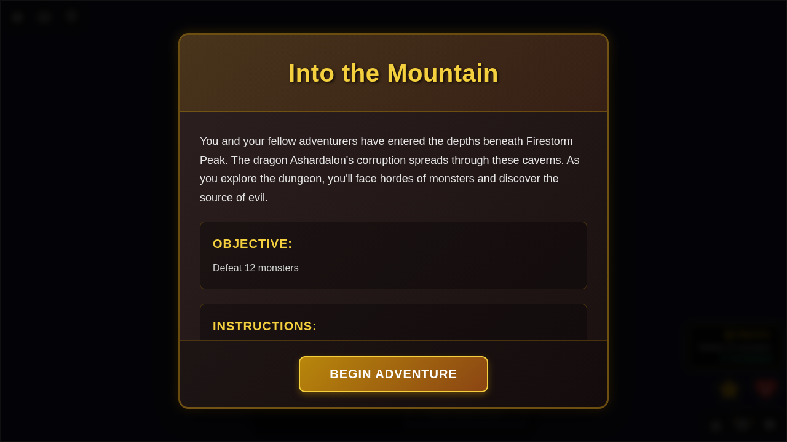
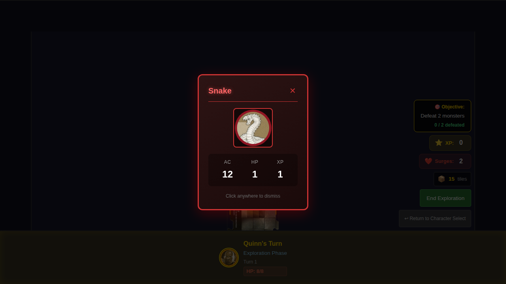
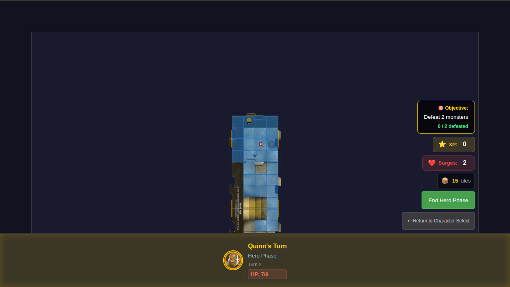
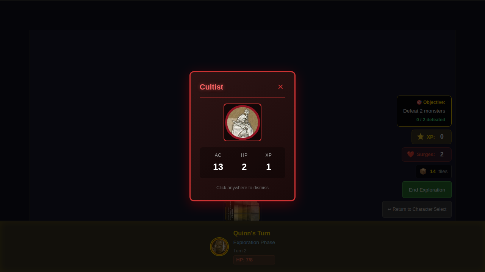

# Test 021 - Exploration on Newly Placed Tiles

## User Story

> As a user, when my hero stands on an unexplored edge of a newly placed tile and I end my turn, a new tile is revealed, just like when exploring from the start tile.

## Problem Addressed

This test verifies the fix for the bug where exploration would not trigger when a hero was standing on the edge of a newly placed tile. Previously, the `checkExploration` function only checked for edges on the start tile, ignoring edges on tiles that were placed during exploration.

## Test Scenario

```gherkin
Feature: Exploration on Newly Placed Tiles

  Scenario: Hero explores from a newly placed tile's edge
    Given it is Quinn's turn
    And Quinn is on the north edge of the start tile
    When Quinn ends the hero phase
    Then a new tile is placed north of the start tile
    And the game proceeds to the next hero phase
    
    When Quinn moves to the north edge of the newly placed tile
    And Quinn ends the hero phase
    Then a SECOND new tile is placed north of the first new tile
    And the dungeon now has 3 connected tiles
```

## Screenshot Gallery

### 000 - Initial Hero at Start Tile Edge


Initial state showing:
- Quinn positioned at north edge of start tile (y=0)
- 4 unexplored edges visible on start tile
- Tile deck shows 8 tiles

### 001 - First Exploration Triggered


After ending hero phase:
- Exploration phase triggered
- New tile placed north of start tile
- Tile deck decreased to 7

### 002 - Hero on New Tile's Edge


After moving hero to new tile:
- Quinn positioned at north edge of the newly placed tile (y=-4)
- The new tile has unexplored edges (north, east, west)
- Ready for second exploration

### 003 - Second Exploration Triggered


**This is the critical test** - after ending hero phase on a newly placed tile's edge:
- Second exploration phase triggered
- THIRD tile placed north of the first new tile
- Tile deck decreased to 6
- **Bug fix verified**: exploration now works on any tile, not just the start tile

### 004 - Three Tiles Connected


Final state showing:
- 3 tiles in the dungeon (start tile + 2 new tiles)
- Proper connections between tiles
- Dungeon expanded successfully from multiple explorations

## Manual Verification Checklist

- [ ] Hero can explore from start tile edge (baseline behavior)
- [ ] After first exploration, a new tile appears north of start tile
- [ ] Hero can move to the newly placed tile
- [ ] Hero can explore from the newly placed tile's edge
- [ ] After second exploration, a third tile appears
- [ ] Tile deck counter decreases correctly (8 → 7 → 6)
- [ ] All tiles are properly connected via open edges

## Implementation Notes

- The fix updates `checkExploration` to use `findTileAtPosition` instead of hardcoded start tile check
- Edge detection now uses `isOnTileEdge` from movement.ts which works for any tile
- This enables continuous dungeon exploration beyond just the starting area
