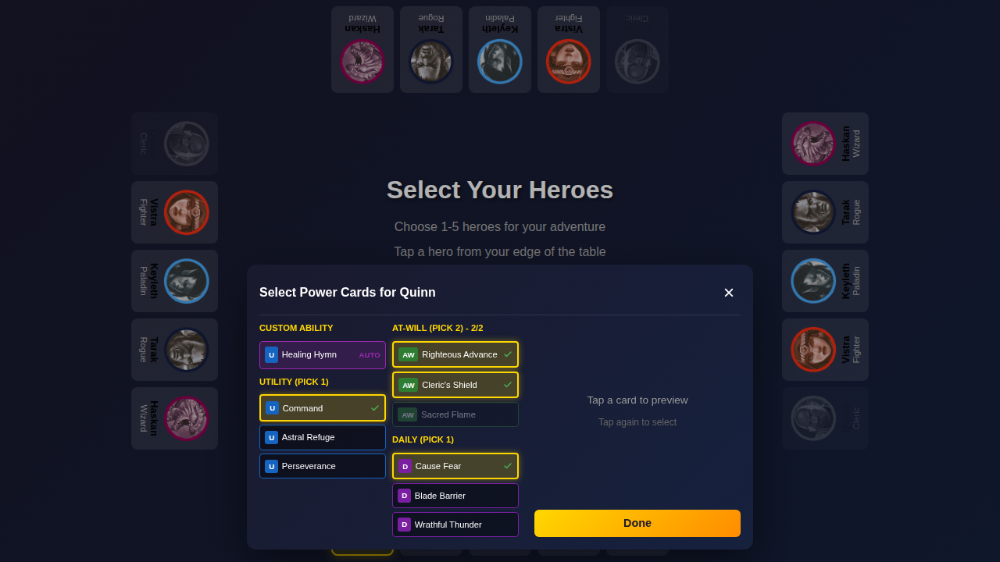
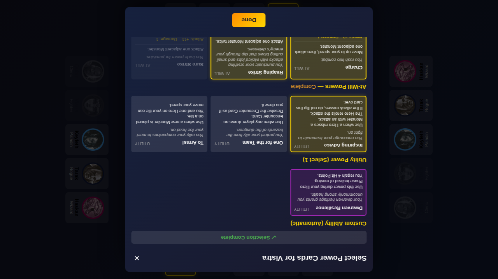
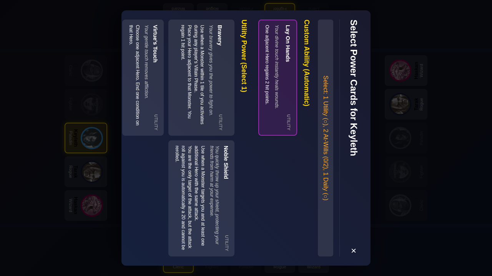
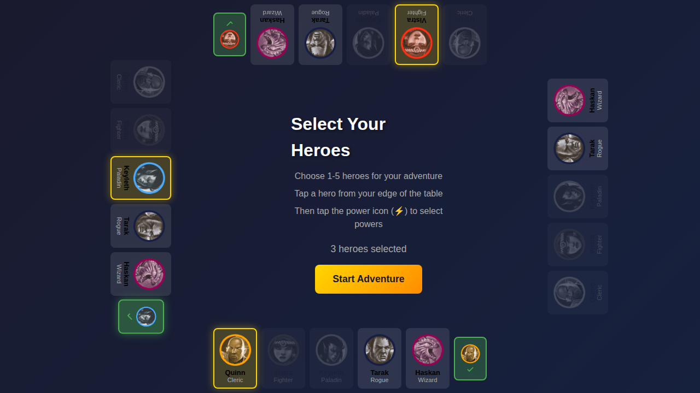
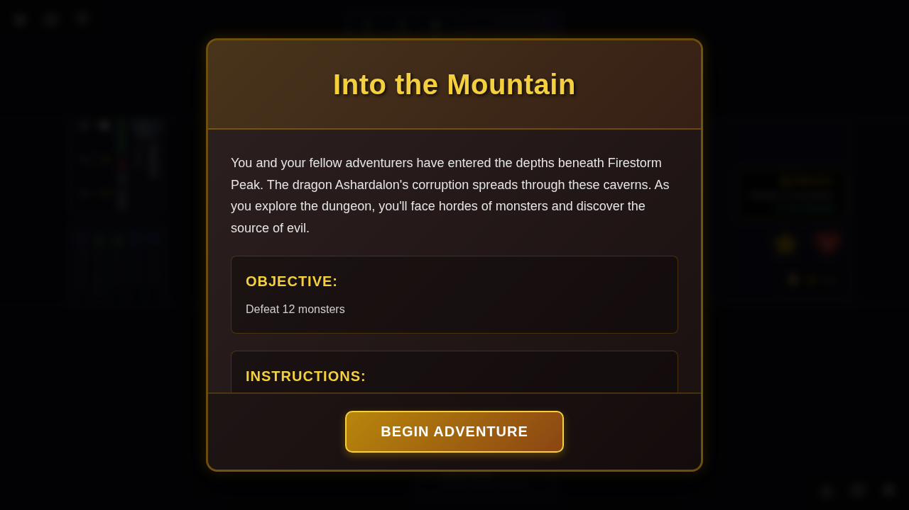
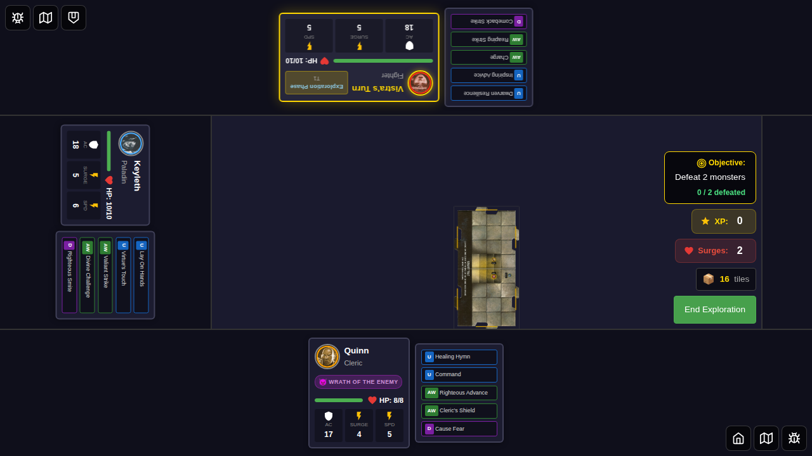
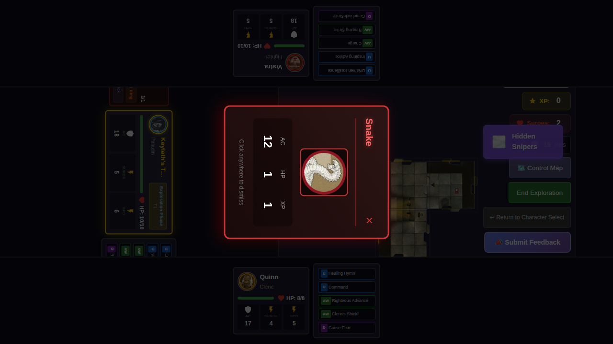

# 022 - Multi-Player UI Orientation

## User Story

As a player sitting at different sides of a tabletop display, I want my hero dashboard (status, HP, turn indicator) to be oriented toward my side of the screen so that I can easily read and interact with it from my physical position.

## Test Scenario

This test verifies that when multiple players join from different edges of the screen:
1. Each player's hero dashboard appears at their chosen edge
2. Dashboards are properly rotated to face the player at that edge
3. The active player's turn indicator shows full turn information
4. Non-active players see a simplified dashboard with their hero's name and HP
5. The shared game board in the center remains upright for all players

## Screenshots

### 000 - Power Selection (Quinn - Bottom Edge)
The power card selection modal for Quinn who joined from the bottom edge.

### 001 - Power Selection (Vistra - Top Edge)
The power card selection modal for Vistra who joined from the top edge.

### 002 - Power Selection (Keyleth - Left Edge)
The power card selection modal for Keyleth who joined from the left edge.

### 003 - Character Selection Complete
All three players have selected heroes from different edges and their power cards.

### 004 - Game Board (Quinn's Turn - Bottom)
Quinn's turn with the turn indicator at the bottom edge (standard orientation).
- **Bottom edge (Quinn)**: Active player with full turn indicator
- **Top edge (Vistra)**: Dashboard rotated 180° showing "Vistra" and HP
- **Left edge (Keyleth)**: Dashboard rotated 90° showing "Keyleth" and HP

### 005 - Game Board (Vistra's Turn - Top, 180° Rotation)
Vistra's turn with the turn indicator at the top edge, rotated 180° to face the player at the top.
- **Top edge (Vistra)**: Active player with turn indicator rotated 180°
- **Bottom edge (Quinn)**: Inactive dashboard
- **Left edge (Keyleth)**: Inactive dashboard

### 006 - Game Board (Keyleth's Turn - Left, 90° Rotation)
Keyleth's turn with the turn indicator at the left edge, rotated 90° to face the player on the left.
- **Left edge (Keyleth)**: Active player with turn indicator rotated 90°
- **Bottom edge (Quinn)**: Inactive dashboard
- **Top edge (Vistra)**: Inactive dashboard rotated 180°

## Verification Checklist

- [ ] Quinn's turn indicator appears at the bottom edge with full turn information
- [ ] Vistra's turn indicator appears at the top edge, rotated 180° to face the top player
- [ ] Keyleth's turn indicator appears at the left edge, rotated 90° to face the left player
- [ ] The right edge zone is empty (no player joined from there)
- [ ] The game board in the center is not rotated
- [ ] Non-active players see only name and HP (not turn phase info)
- [ ] Active player's dashboard is highlighted with a gold glow effect
- [ ] Power selection modals display correctly for each player
