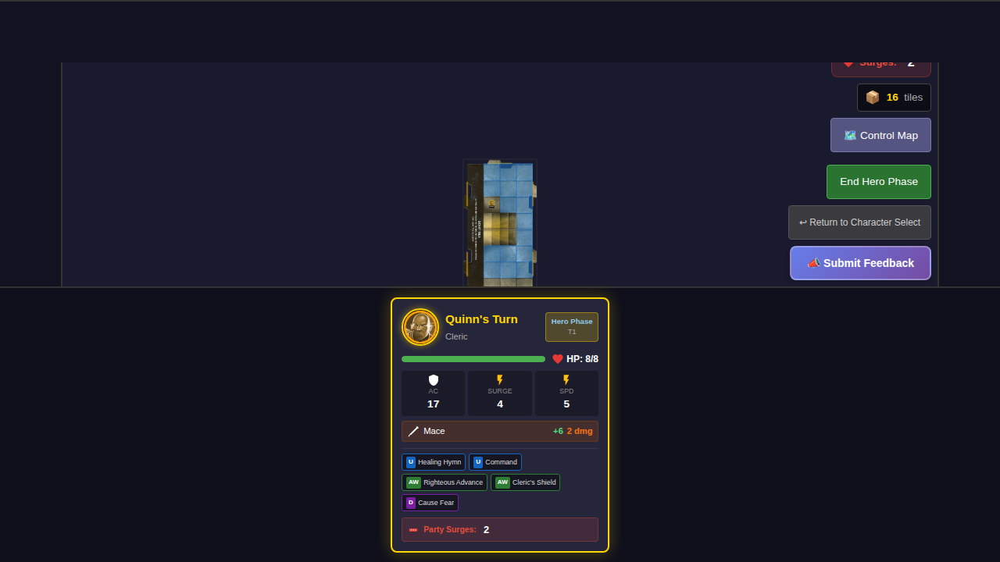
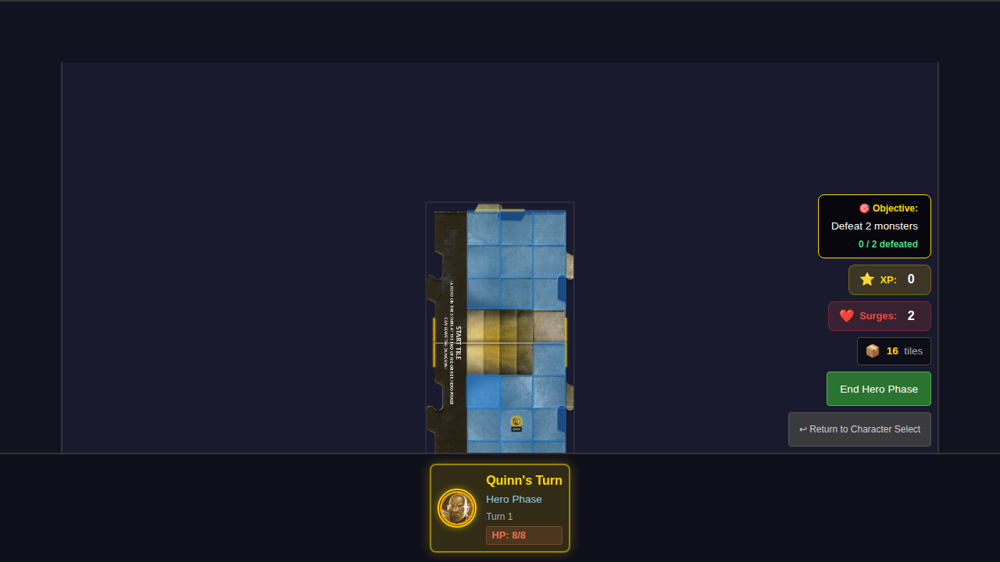
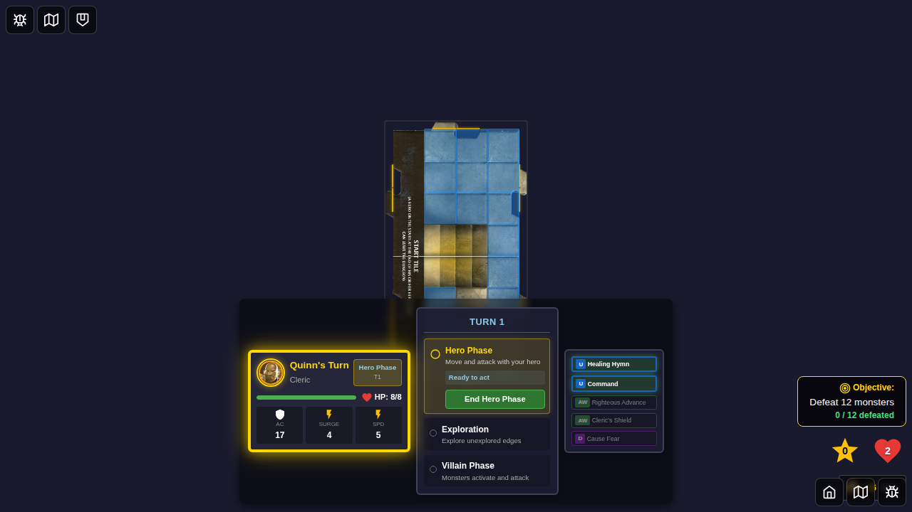

# 023 - Start Tile Sub-Tiles

## User Story

The start tile in Wrath of Ashardalon is a special double-sized tile composed of two joined sub-tiles. This test verifies that the start tile:

1. **Displays as a unified tile**: The start tile appears as a single, unbroken visual element on the game board
2. **Is logically divided into sub-tiles**: Internally, the tile is divided into north (y: 0-3) and south (y: 4-7) sub-tiles
3. **Allows movement between sub-tiles**: Heroes can move freely between the north and south halves
4. **Supports multiple heroes**: Different heroes can occupy different sub-tiles while still being on the "same" start tile
5. **Maintains adjacency rules**: All four unexplored edges (north, south, east, west) belong to the unified start tile

## Sub-Tile Structure

```
Start Tile (8 rows tall, 4 columns wide)
┌─────────────────────────┐
│  NORTH SUB-TILE (y: 0-3)│
│    Row 0: x=1,2,3       │
│    Row 1: x=1,2,3       │
│    Row 2: x=1,2,3       │
│    Row 3: x=1,2,3       │ ← Staircase at x=1,2
├─────────────────────────┤ ← Sub-tile boundary
│  SOUTH SUB-TILE (y: 4-7)│
│    Row 4: x=1,2,3       │ ← Staircase at x=1,2
│    Row 5: x=1,2,3       │
│    Row 6: x=1,2,3       │
│    Row 7: x=1,2,3       │
└─────────────────────────┘
```

## Design Rationale

According to the game rules, "The Start tile consists of 2 connected tiles. Each section is treated as its own tile for movement and counting." This implementation:

- Treats the start tile as ONE visual/logical tile for rendering and exploration
- Provides sub-tile identification for tile counting purposes
- Maintains the staircase as the visual center connecting both halves

## Screenshots

### 000 - Start Tile Unified
Shows the start tile as a single, unified visual element with one hero token.



### 001 - Hero in North Sub-Tile
Shows a hero positioned in the north half of the start tile (y: 0-3).


### 002 - Hero in South Sub-Tile
Shows a hero positioned in the south half of the start tile (y: 4-7).



### 003 - Start Tile Unexplored Edges
Shows all four unexplored edges of the start tile.



### 004 - Hero at Sub-Tile Boundary
Shows a hero positioned near the boundary between sub-tiles.


### 005 - Hero Moved to South Sub-Tile
Shows a hero that has moved from the north to the south sub-tile.


### 006 - Two Heroes in Different Sub-Tiles
Shows two heroes positioned in different sub-tiles of the start tile.


## Verification Checklist

- [ ] Start tile displays as a single unified visual element
- [ ] Start tile has exactly 4 unexplored edges (N, S, E, W)
- [ ] Heroes can be positioned in north sub-tile (y: 0-3)
- [ ] Heroes can be positioned in south sub-tile (y: 4-7)
- [ ] Heroes can move between sub-tiles
- [ ] Multiple heroes can occupy different sub-tiles
- [ ] The dungeon state shows only ONE start tile in the tiles array
