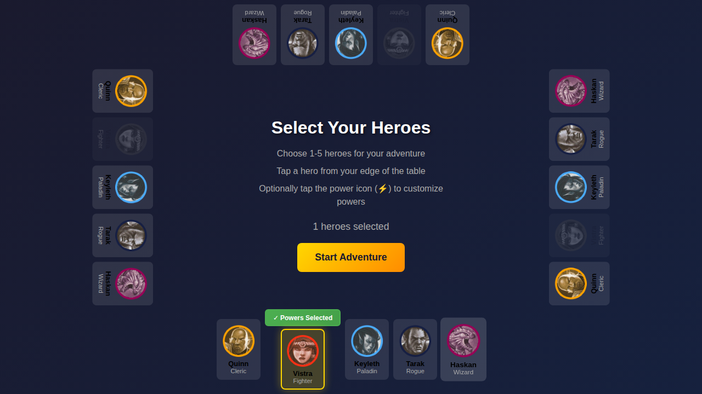
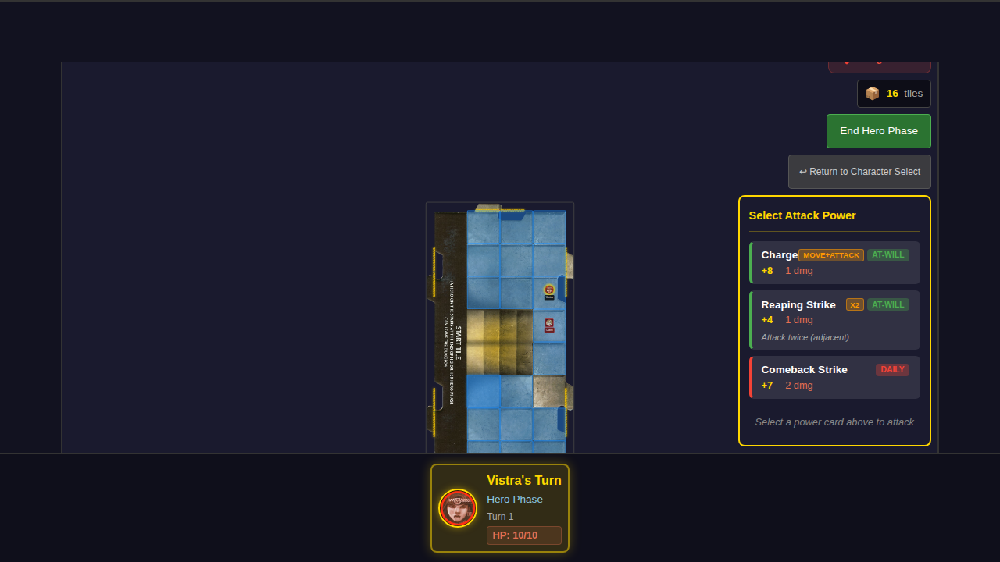
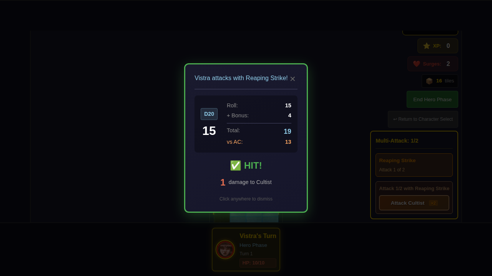
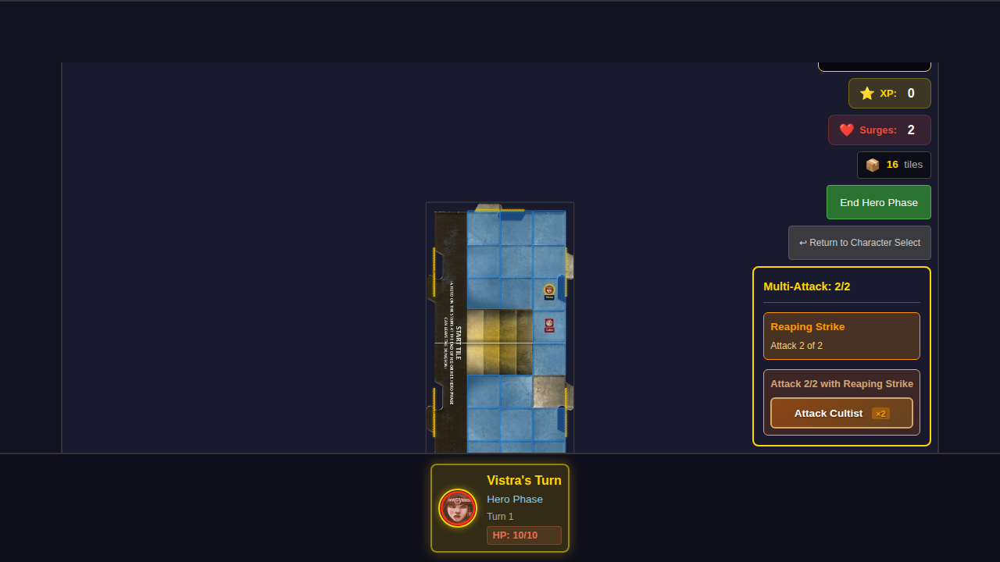
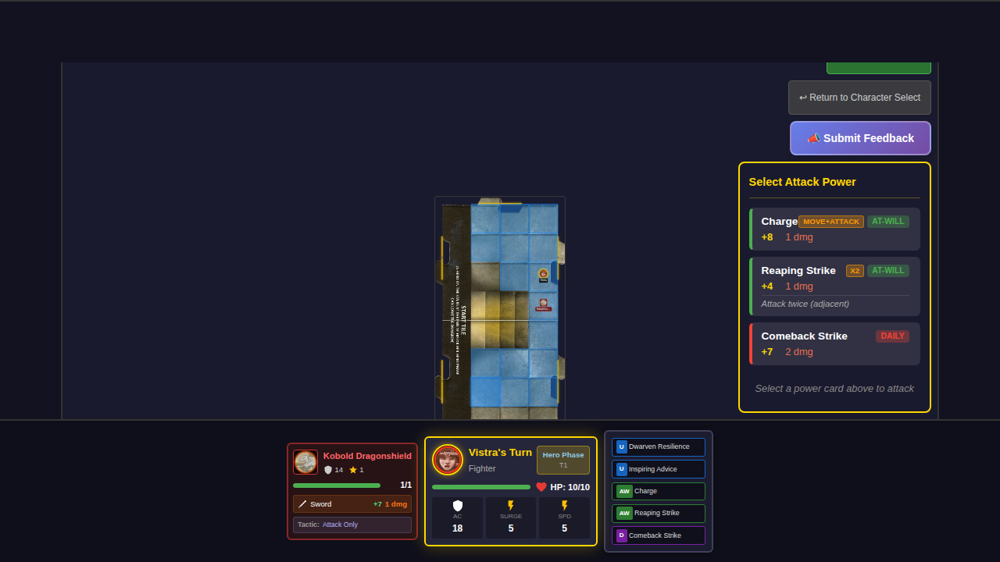

# 024 - Reaping Strike Multi-Attack

## User Story

As a player using Vistra (Fighter), I want to be able to use the Reaping Strike at-will power to attack a single adjacent monster twice, so that I can deal extra damage in combat.

## Test Scenario

This test verifies that:
1. The Reaping Strike power card (id 13) shows a "x2" badge indicating it attacks twice
2. When the player selects Reaping Strike, the attack button shows the "×2" multiplier
3. The multi-attack system properly tracks attack progress
4. The parsed action description shows "Attack twice (adjacent)"

## Screenshots

### Step 1: Vistra Selected with Powers

Vistra is selected as the hero with default power cards including Reaping Strike.

### Step 2: Game Board with Adjacent Monster

The game board shows Vistra with a Cultist monster adjacent. The power card attack panel is visible with Reaping Strike showing the "x2" badge.

### Step 3: Reaping Strike Selected

Reaping Strike is selected, showing the target selection with the "×2" attack multiplier on the attack button.

### Step 4: First Attack Result

The combat result for the first of two attacks is displayed.

### Step 5: After First Attack Dismissed

After dismissing the first attack result, the multi-attack progress is shown (1/2 attacks completed).

### Additional: Attack Panel with Special Badges

Shows the power card attack panel with special badges and parsed action descriptions visible.

## Acceptance Criteria

- [x] Reaping Strike shows "x2" badge in the power card list
- [x] Attack button shows "×2" multiplier when Reaping Strike is selected
- [x] Multi-attack state is properly initialized when using Reaping Strike
- [x] Action description shows "Attack twice (adjacent)"
- [x] At-will cards are NOT flipped when used (can be used repeatedly)
