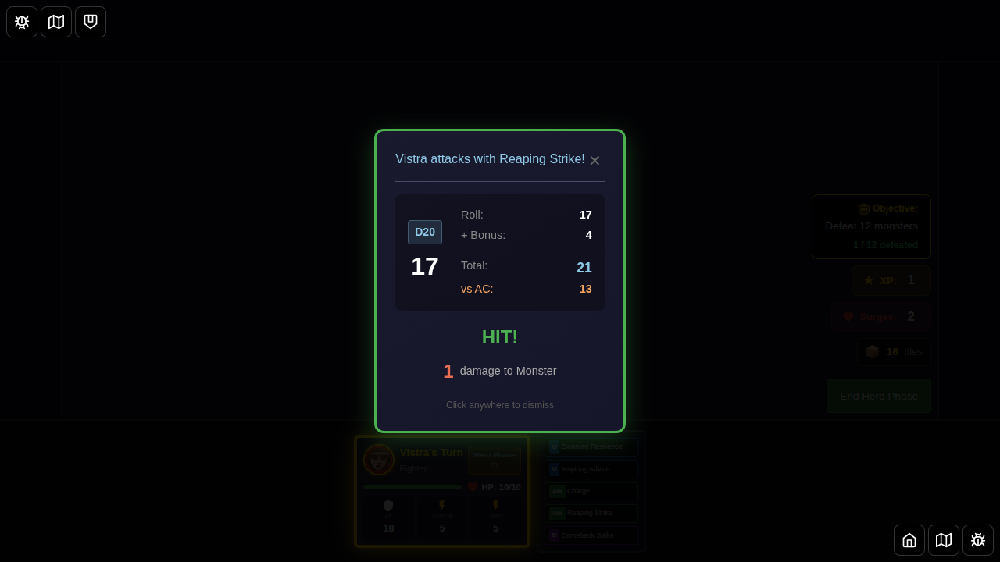
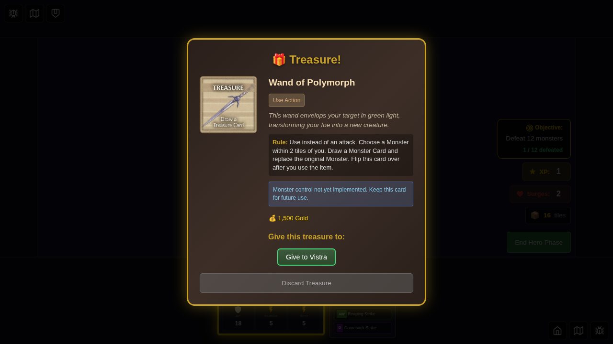

# 024 - Reaping Strike Multi-Attack

## User Story

As a player using Vistra (Fighter), I want to be able to use the Reaping Strike at-will power to attack a single adjacent monster twice, so that I can deal extra damage in combat.

## Test Scenario

This test verifies that:
1. The Reaping Strike power card (id 13) shows a "x2" badge indicating it attacks twice
2. When the player selects Reaping Strike, the attack button shows the "×2" multiplier
3. The multi-attack system properly tracks attack progress
4. Both attacks execute in sequence against the same target
5. Damage from both hits is applied to the target
6. The multi-attack state is properly cleaned up after completion
7. The parsed action description shows "Attack twice (adjacent)"

## Screenshots

### Step 1: Vistra Selected with Powers

Vistra is selected as the hero with default power cards including Reaping Strike.

### Step 2: Game Board with Adjacent Monster

The game board shows Vistra with a Cultist monster (2 HP) adjacent. The power card attack panel is visible with Reaping Strike showing the "x2" badge.

### Step 3: Reaping Strike Selected

Reaping Strike is selected, showing the target selection with the "×2" attack multiplier on the attack button.

### Step 4: First Attack Result

The combat result for the first of two attacks is displayed. The cultist takes 1 damage (2 HP → 1 HP).

### Step 5: After First Attack Dismissed

After dismissing the first attack result, the multi-attack progress is shown (Attack 1 of 2 completed). A "Cancel Remaining Attacks" button is visible, allowing the player to exit the multi-attack sequence early. The cultist still has 1 HP remaining.

### Step 6: Second Attack Result

The combat result for the second attack is displayed. The cultist takes another 1 damage (1 HP → 0 HP), defeating it.

### Step 7: After Second Attack Complete

After the second attack completes and the combat result is dismissed, the defeat notification is shown for the cultist. The multi-attack state is cleared. A treasure card is drawn and displayed (Wand of Polymorph).

### Additional: Attack Panel with Special Badges

Shows the power card attack panel with special badges and parsed action descriptions visible.

## Acceptance Criteria

- [x] Reaping Strike shows "x2" badge in the power card list
- [x] Attack button shows "×2" multiplier when Reaping Strike is selected
- [x] Multi-attack state is properly initialized when using Reaping Strike
- [x] Multi-attack progress is tracked (Attack 1 of 2, Attack 2 of 2)
- [x] First attack executes correctly with proper damage
- [x] After first attack, UI shows progress and cancel option
- [x] Cancel button is available to exit multi-attack early
- [x] Second attack executes automatically when the player clicks the attack button again
- [x] Second attack uses the same Reaping Strike card (from `multiAttackState`)
- [x] Damage from both attacks is applied (2 HP - 1 - 1 = 0 HP, monster defeated)
- [x] Multi-attack sequence completes after both attacks
- [x] Multi-attack state is cleared after completion
- [x] Defeat notification is shown when monster is defeated
- [x] Treasure card is drawn after monster defeat
- [x] Action description shows "Attack twice (adjacent)"
- [x] At-will cards are NOT flipped when used (can be used repeatedly)

## Implementation Notes

### Bug Fixes
This test revealed and fixed two critical bugs in the multi-attack system:

1. **Bug**: `canAttack` was being set to false after the first attack in a multi-attack sequence, preventing the second attack from executing.
   - **Fix**: Modified `setAttackResult` reducer to skip marking the attack action as used during a multi-attack. The action is now tracked only once when the multi-attack sequence completes in `recordMultiAttackHit`.

2. **Bug**: After `recordMultiAttackHit()` cleared `multiAttackState` (when sequence was complete), the code tried to access `multiAttackState.sameTarget`, causing potential errors.
   - **Fix**: Modified `handleDismissAttackResult` in GameBoard to save the `sameTarget` value before dispatching `recordMultiAttackHit()`.

### Test Implementation
The test uses Redux store dispatch to dismiss the combat result dialog due to Playwright event handling limitations with Svelte's reactive components. This is a known limitation and does not affect the functionality being tested - it only affects the E2E test automation approach.
