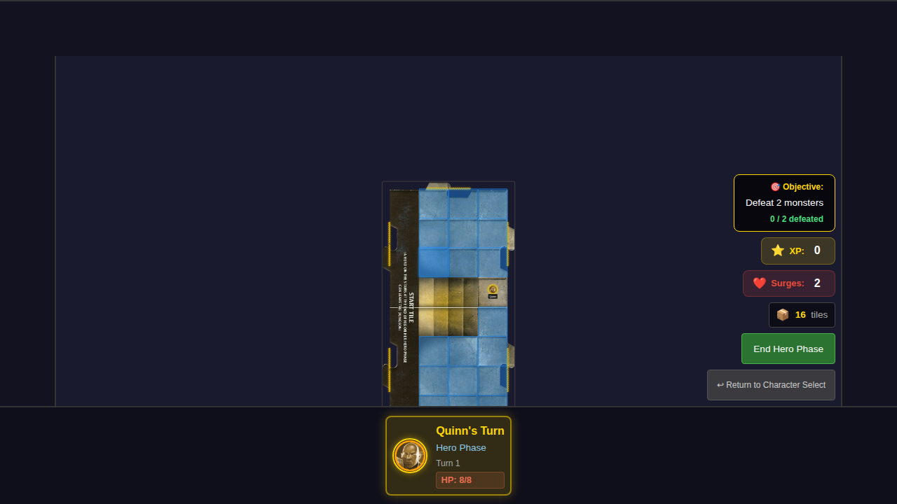
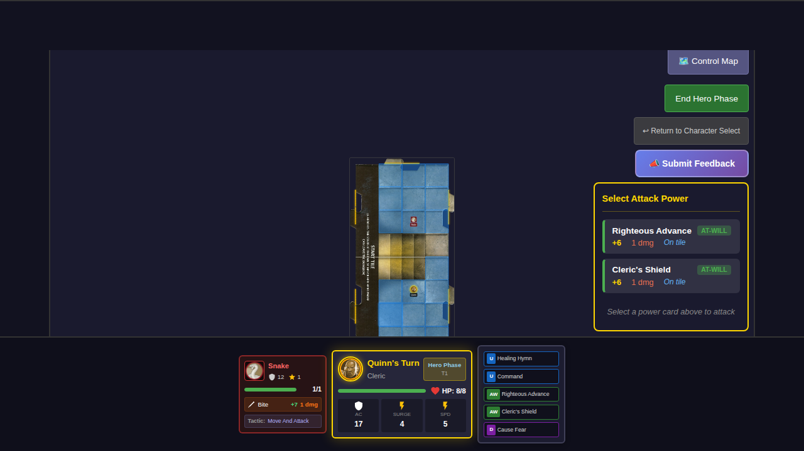
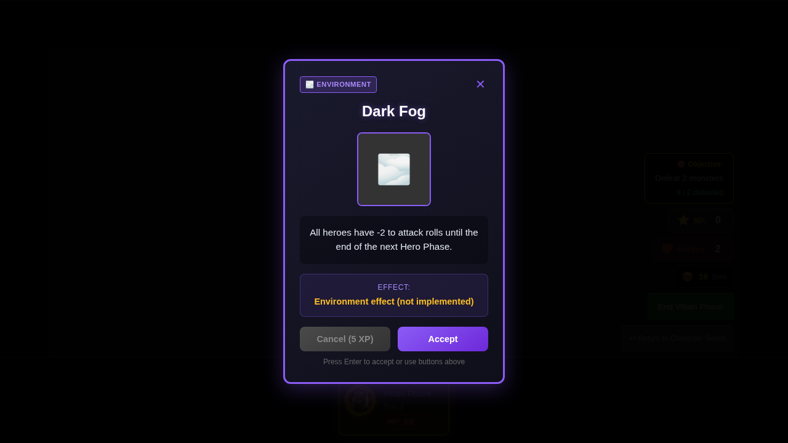

# 026 - Monster Card Tactics

## User Story

> As a player, during the Villain Phase, I see monsters behave according to their official card tactics - some monsters only attack when adjacent, while others move adjacent AND attack in the same turn.

## Feature Description

This test validates the implementation of monster card tactics from the official Wrath of Ashardalon monster cards. Each monster type has specific behaviors defined on their cards.

### Implemented Monster Tactics

| Monster | Tactic Type | Behavior |
|---------|-------------|----------|
| Kobold Dragonshield | `attack-only` | If adjacent: attack. Otherwise: move toward hero. |
| Snake | `move-and-attack` | If within 1 tile: move adjacent AND attack. Otherwise: move toward hero. |
| Human Cultist | `move-and-attack` | If within 1 tile: move adjacent AND attack. Otherwise: move toward hero. |

### Attack Stats (Per Monster Cards)

| Monster | Attack | Bonus | Damage |
|---------|--------|-------|--------|
| Kobold | Sword | +7 | 1 |
| Snake | Bite | +7 | 1 |
| Cultist | Dagger | +6 | 1 |

## Test Flow with Screenshots

### Step 1: Initial Game Board

The player starts the game with Quinn. The game board shows the Start Tile with the hero token positioned on it.

### Step 2: Snake Positioned Within Range

A Snake monster is placed at position (2, 2) on the start tile, while Quinn is at position (2, 5). The Snake is within 1 tile range (approximately 4 squares) of the hero, which triggers its `move-and-attack` tactic.

### Step 3: Snake Moves Adjacent and Attacks

When the Villain Phase begins and the Snake activates, it uses its `move-and-attack` behavior:
1. The Snake moves to a position adjacent to Quinn
2. The Snake immediately attacks Quinn with its Bite (+7 attack bonus)
3. Both the movement and attack happen in a single turn

This is the key difference from `attack-only` monsters like the Kobold, which would only move toward the hero without attacking.

## Test Scenarios

### Test 1: Snake Move-and-Attack
- **Setup**: Snake at (2, 2), Hero at (2, 5)
- **Condition**: Snake is within 1 tile range
- **Expected**: Snake moves adjacent to hero AND attacks in the same turn
- **Verification**: `monsterAttackResult` is not null, monster position is adjacent to hero

### Test 2: Kobold Attack-Only
- **Setup**: Kobold at (2, 2), Hero at (2, 5)
- **Condition**: Kobold is NOT adjacent to hero
- **Expected**: Kobold only moves toward hero (does NOT attack)
- **Verification**: `monsterAttackResult` is null, monster moved closer to hero

### Test 3: Attack Stats Verification
- **Setup**: Kobold adjacent to hero at (2, 6), Hero at (2, 5)
- **Condition**: Kobold is adjacent and will attack
- **Expected**: Attack uses +7 bonus (per monster card), damage calculated correctly
- **Verification**: Attack roll uses correct bonus, hit/miss determined by AC comparison

## Manual Verification Checklist

- [x] Snake moves to a position adjacent to the hero
- [x] Snake attacks immediately after moving (same turn)
- [x] Kobold only moves when not adjacent (doesn't attack)
- [x] Attack bonuses match the monster card values (+7 for Kobold/Snake, +6 for Cultist)

## Implementation Notes

### Partial Implementations
- **Status effects**: Poisoned (Snake, Cultist) not yet implemented - damage dealt but status not applied
- **Kobold exploration**: Rule to explore when on tile with unexplored edge not yet implemented

### Future Work (Complex Tactics)
The following monsters require more complex implementations and are documented for future PRs:

| Monster | Complexity | Notes |
|---------|------------|-------|
| Cave Bear | Area attack | Attacks ALL heroes on same tile |
| Duergar Guard | Exploration | Can explore from monster position |
| Gibbering Mouther | Area attack | Attacks ALL heroes within 1 tile |
| Grell | Conditions | Poisoned (adjacent), Dazed (within 1 tile) |
| Orc Archer | Ranged | 2-tile range attack, miss damage |
