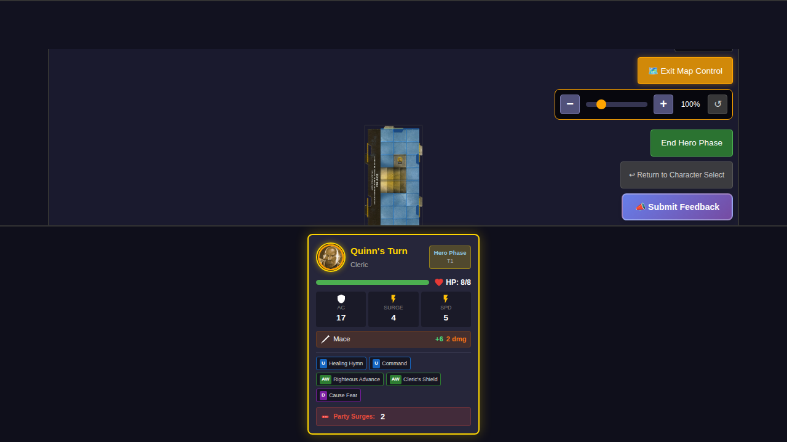
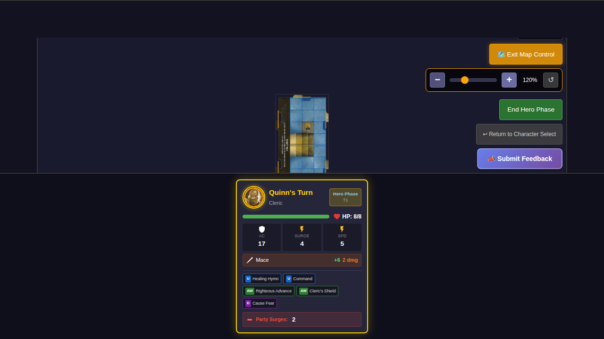
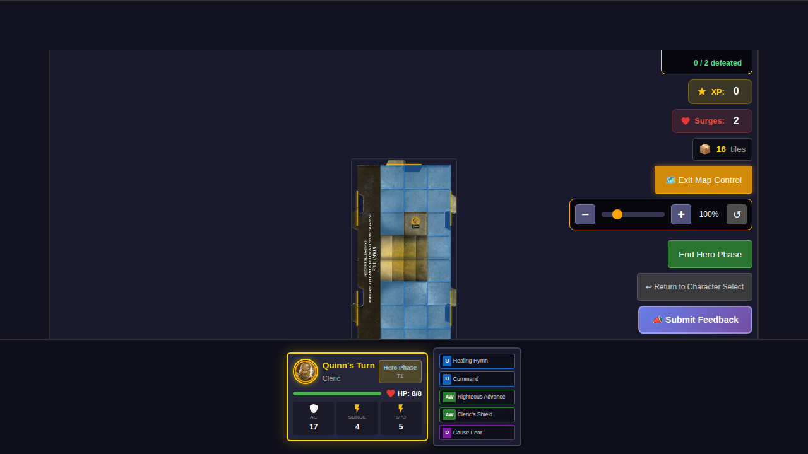
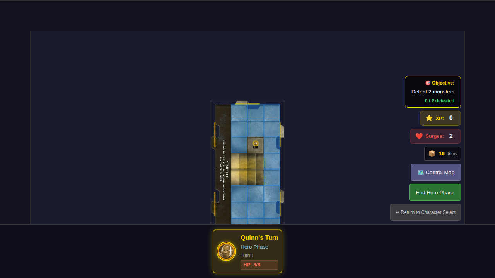

# 028 - Map Zoom and Pan Controls

## User Story

As a player, I want to be able to zoom in and out of the game map and pan around it, so that I can focus on specific areas of interest and navigate larger or more complex dungeon layouts.

## Test Scenarios

### 1. Toggle Map Control Mode and Use Zoom Controls

**Steps:**
1. Navigate to character selection and start a game
2. Verify map control button is visible and inactive
3. Click "Control Map" to enter map control mode
4. Verify zoom controls appear (zoom in/out buttons, slider, reset button)
5. Use zoom in button to increase zoom level
6. Reset the view to default zoom
7. Exit map control mode

**Expected Behavior:**
- Map control button toggles between "Control Map" and "Exit Map Control"
- Zoom controls are only visible in map control mode
- Zoom level changes are reflected in the percentage display
- Reset button returns zoom to 100%

### 2. Zoom Out Functionality

**Steps:**
1. Enter map control mode
2. Zoom in first, then zoom out
3. Zoom out below 100%

**Expected Behavior:**
- Zoom out button reduces zoom level by 10%
- Zoom level can go below 100% (minimum 50%)

### 3. Zoom Slider Functionality

**Steps:**
1. Enter map control mode
2. Use slider to set specific zoom level

**Expected Behavior:**
- Slider allows precise zoom level control
- Zoom level updates immediately as slider moves

## Screenshots

### Initial Game Board (Map Control Inactive)

### Map Control Mode Active with Zoom Controls

### Map Zoomed In (120%)

### Map View Reset to 100%

### Map Control Exited

## Device-Specific Features

### Mouse Users
- Click "Control Map" button to toggle map control mode
- Use zoom in/out buttons or slider to adjust zoom
- Drag the map to pan when in map control mode

### Touch Users
- Tap "Control Map" button to toggle map control mode
- Use pinch gesture to zoom in/out
- Use touch drag to pan the map

## Notes

- Rotation of the map is explicitly not supported
- Map controls reset when exiting map control mode
- Game interactions (movement, attacks) are disabled while in map control mode
