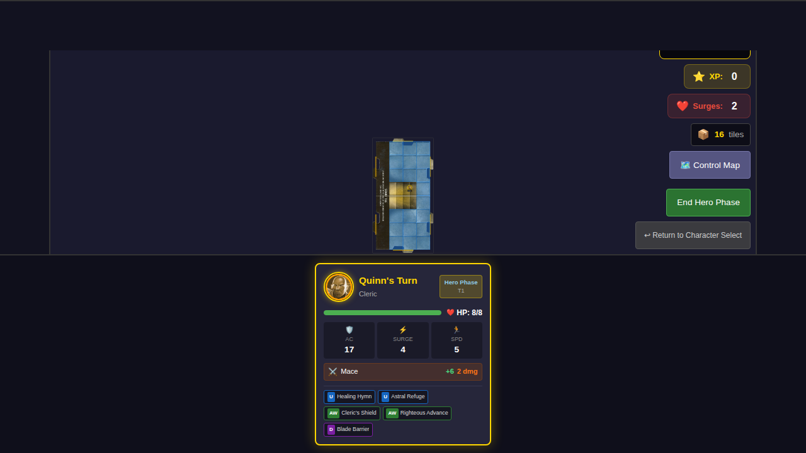
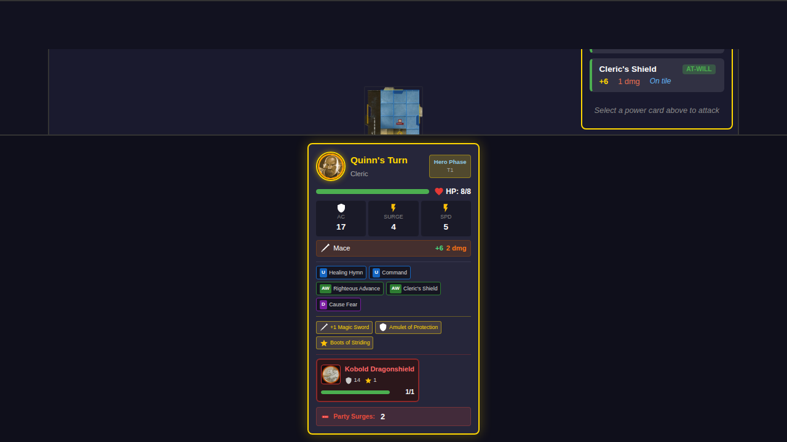
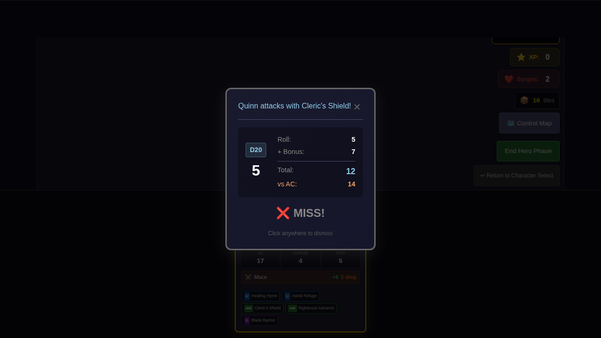
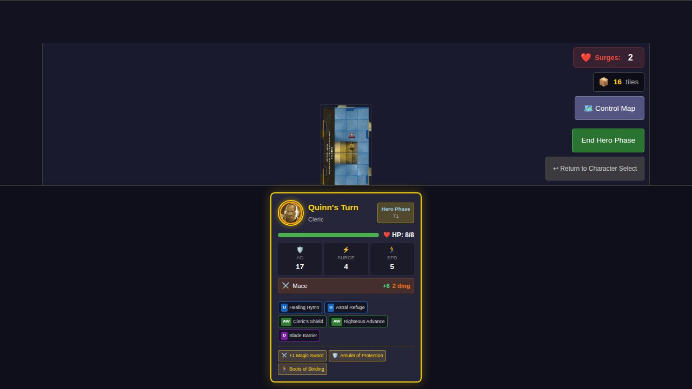
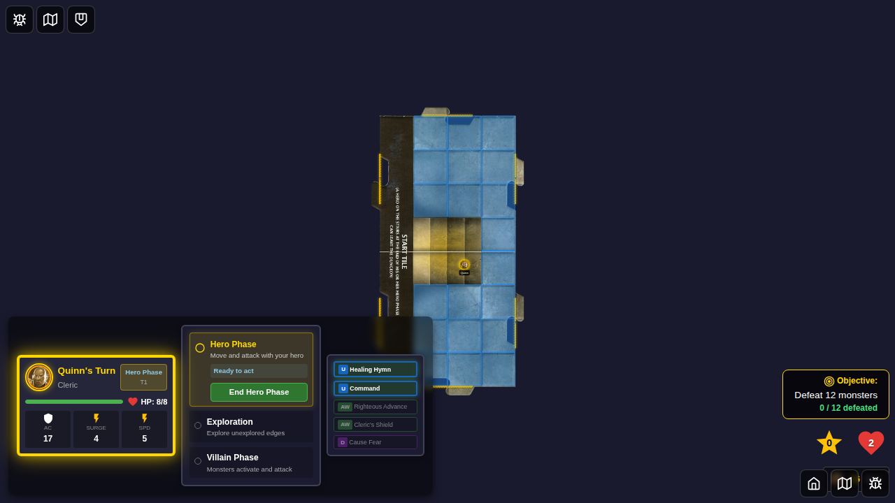
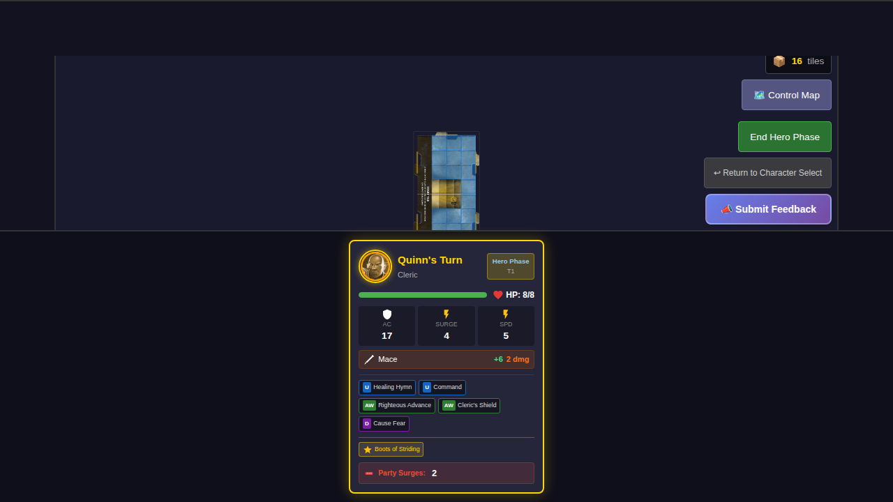

# 029 - Treasure Item Bonuses Integration

This E2E test demonstrates that treasure card passive bonuses (attack, damage, AC, speed) are correctly applied during gameplay.

## User Story

As a player with equipped treasure items, I want the passive bonuses from those items to be automatically applied when I attack monsters, when monsters attack me, and when I move around the board.

## What This Test Validates

### Attack Bonuses
- A hero equipped with +1 Magic Sword (ID 134) gets +1 attack bonus applied to attacks
- The bonus is added via `applyItemBonusesToAttack()` when attacking with power cards

### AC Bonuses  
- A hero equipped with Amulet of Protection (ID 136) gets +1 AC bonus
- The bonus is applied via `calculateTotalAC()` when monsters attack during villain phase

### Speed Bonuses
- A hero equipped with Boots of Striding (ID 138) gets +1 Speed bonus
- The bonus is applied via `calculateTotalSpeed()` when calculating movement options

## Screenshots

### Test 1: Hero with equipped items gets bonuses applied

Hero starts with three equipped items: +1 Magic Sword, Amulet of Protection, and Boots of Striding.

A monster is placed adjacent to the hero, showing the attack panel with power cards.

Hero attacks using Cleric's Shield. **The attack bonus shows +7** (base +6 plus +1 from equipped Magic Sword), demonstrating that item bonuses are now integrated into attack resolution.

After the attack, the hero's inventory still shows all equipped items with their persistent passive bonuses.

### Test 2: Speed bonus extends movement range

Hero's base movement range without any speed bonus items (speed 5).

With Boots of Striding equipped, the hero's effective speed is 6 (5 base + 1 from item).

## Implementation Details

The bonuses are integrated in:
- `src/components/GameBoard.svelte` - Uses `applyItemBonusesToAttack()` and `calculateTotalSpeed()`
- `src/store/gameSlice.ts` - Uses `calculateTotalAC()` in `activateNextMonster`

## Related Files

- `src/store/treasure.ts` - Defines bonus calculation functions
- `src/store/combat.ts` - Contains helper functions for applying bonuses
- `docs/TREASURE_IMPLEMENTATION.md` - Documentation of treasure system
