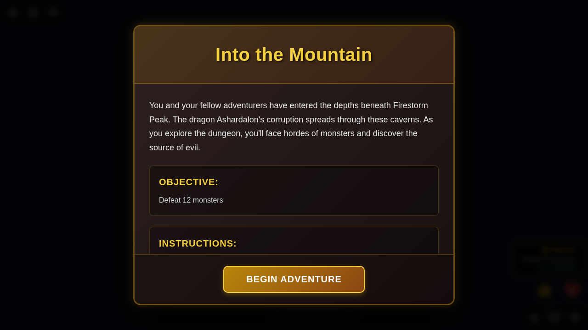
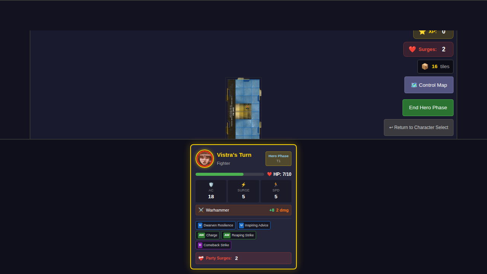
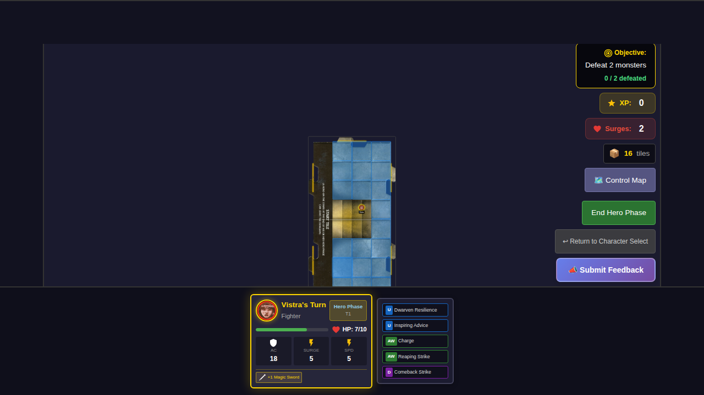
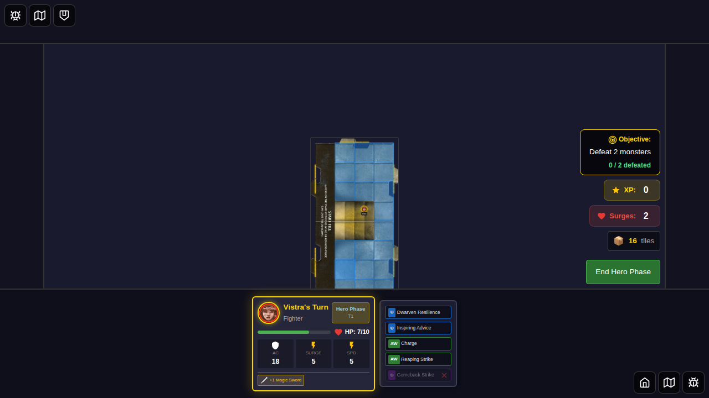
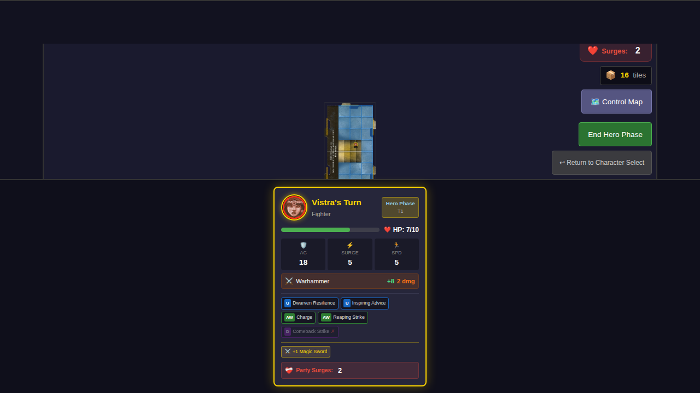
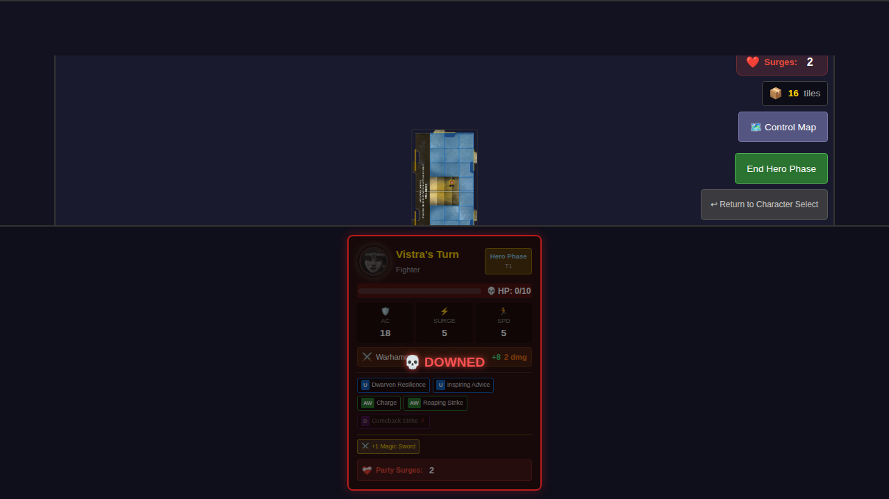

# 030 - Player Card Display

## User Story

As a player, I want to see my hero's complete status on my player card including HP, stats (AC, Surge, Speed), attack info, power cards, and treasure items so that I can make informed decisions during gameplay.

## Test Scenario

This test verifies that player cards:
1. Display all core hero stats (HP, AC, Surge, Speed)
2. Show the hero's basic attack information
3. Display power cards with their types and usage state
4. Update dynamically when HP changes (e.g., after taking damage)
5. Display treasure items when equipped
6. Show when power cards are flipped/used
7. Display party surge counter with available healing surges
8. Show KO/downed state when hero is at 0 HP
9. Display warning when no surges are available

## Screenshots

### 000 - Player Card Initial State
The player card showing Vistra's complete stats at game start:
- Name and class
- HP bar with current/max HP
- Core stats (AC: 18, Surge: 5, Speed: 5)
- Attack info (Warhammer +8, 2 dmg)
- Power cards (utility, at-wills, daily)

### 001 - Player Card After Damage
The player card after the hero takes 3 damage:
- HP updated from 10/10 to 7/10
- HP bar visually reflects the damage (70% fill)

### 002 - Player Card With Treasure
The player card after equipping a +1 Magic Sword:
- Treasure items section appears
- Item displays with appropriate icon and name

### 003 - Player Card With Flipped Power
The player card after using the daily power:
- Daily power card shows as flipped/used
- Visual indicator (dimmed, with ✗) shows the card is spent

### 004 - Player Card With Party Surges
The player card showing the party surge counter:
- Party surges section visible at bottom of card
- Shows number of healing surges available (2)

### 005 - Player Card KO State
The player card when hero is downed (0 HP):
- KO overlay with "DOWNED" text
- Portrait appears grayed out
- HP bar empty with skull icon
- Red border indicates critical state

### 006 - Player Card No Surges Warning
The player card when no healing surges remain:
- Surge count shows 0
- Warning icon (⚠️) displayed
- Critical visual feedback when downed with no surges

## Verification Checklist

- [x] Hero name and class display correctly
- [x] HP shows current and max values
- [x] HP bar fills proportionally and changes color at thresholds
- [x] AC, Surge, and Speed stats are visible and accurate
- [x] Attack info shows name, bonus, and damage
- [x] Power cards display with type indicators (AW, D, U)
- [x] Flipped power cards appear dimmed with ✗ indicator
- [x] Treasure items appear in a separate section when equipped
- [x] Player card updates reactively when state changes
- [x] Party surge counter displays healing surges available
- [x] KO/downed state shows overlay when at 0 HP
- [x] Warning displays when no surges are available
