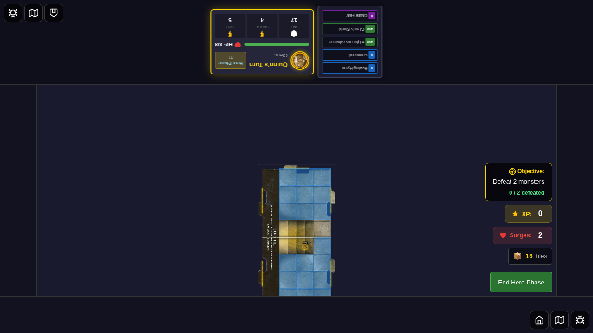
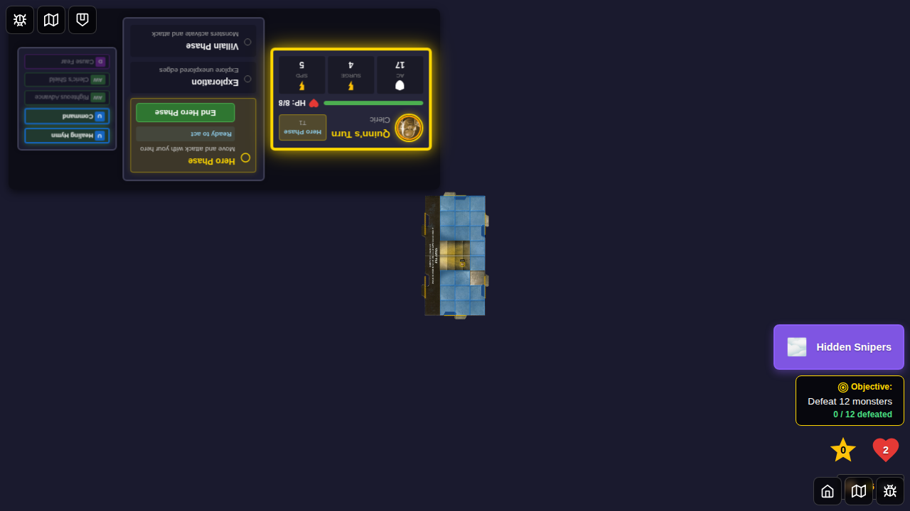
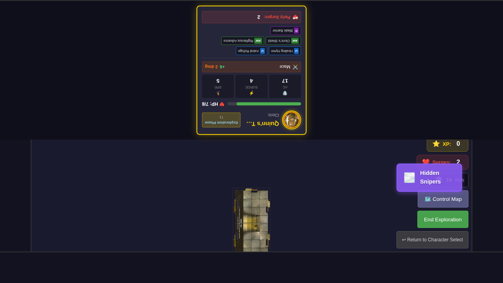
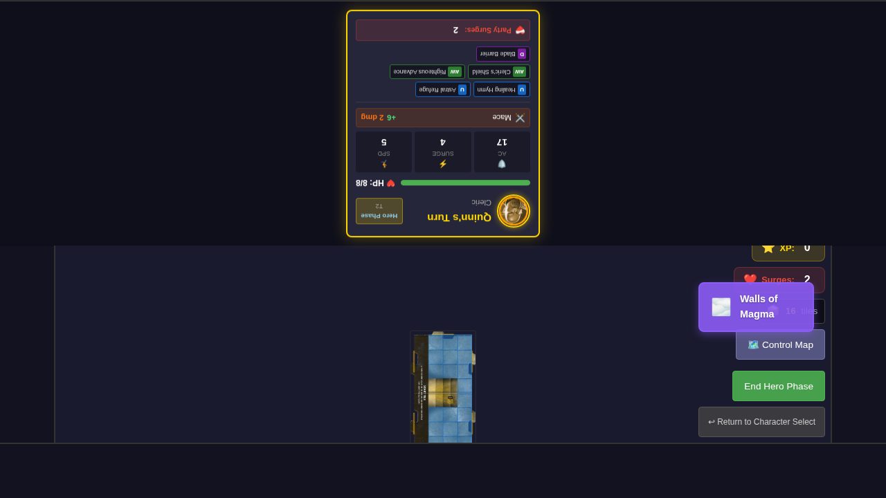
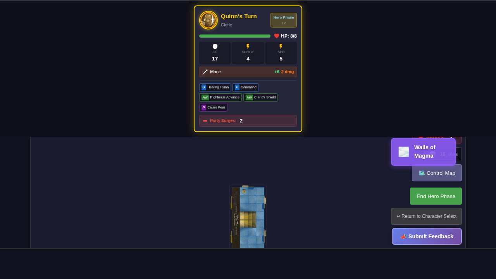
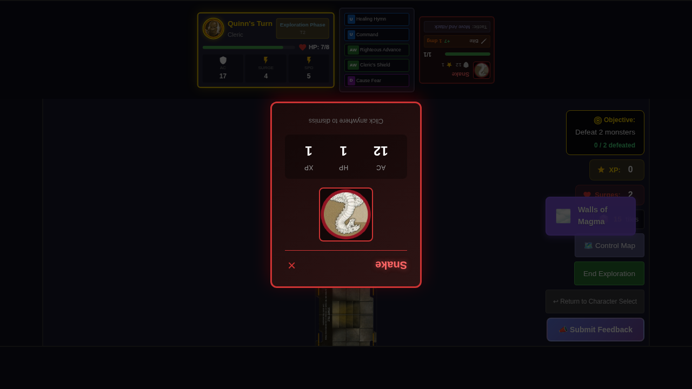
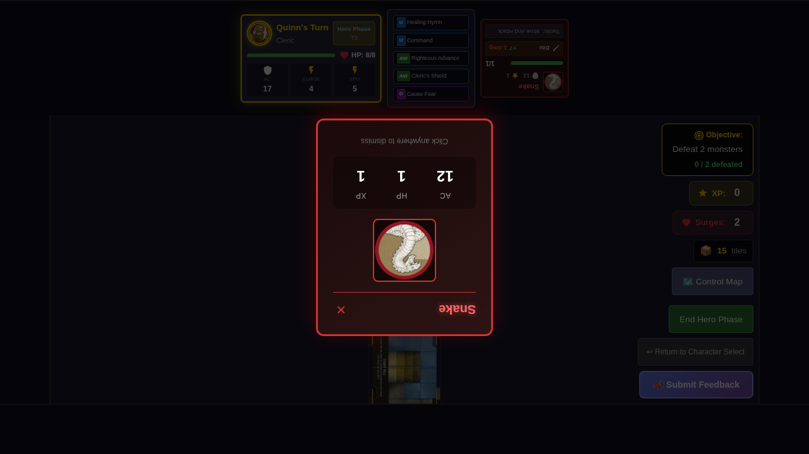
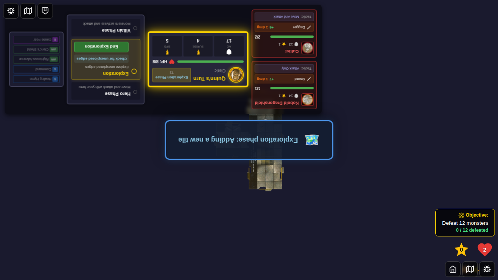

# Test 031 - Environment Effects

## User Story

As a player, I want environment cards to create persistent dungeon-wide effects that affect gameplay across multiple turns, so that the game presents dynamic challenges beyond individual encounters.

## Test Scenario

This test verifies that:
1. Environment cards can be activated and display in the UI
2. Hidden Snipers environment applies 1 damage when hero ends Hero Phase alone on tile
3. Walls of Magma environment applies 1 damage when hero ends Hero Phase adjacent to wall
4. Environment effects are only applied when an environment is active
5. Environments persist across turns until replaced or removed

## Screenshots

### Step 1: Character Select Screen

**Verification**: Character selection screen is shown with available heroes

### Step 2: Game Started with No Environment

**Verification**: Game board is displayed, no environment indicator visible, `activeEnvironmentId` is null

### Step 3: Hidden Snipers Activated

**Verification**: Environment indicator displays "Hidden Snipers" in top-right corner, `activeEnvironmentId` is set to 'hidden-snipers'

### Step 4: Damage Applied After Hero Phase

**Verification**: Quinn's HP decreased by 1 (from 8 to 7) due to Hidden Snipers effect (hero was alone on tile)

### Step 5: Walls of Magma Activated

**Verification**: Environment indicator now displays "Walls of Magma", replacing Hidden Snipers, `activeEnvironmentId` is 'walls-of-magma'

### Step 6: Hero Adjacent to Wall

**Verification**: Quinn positioned at edge of tile (x: 1, y: 0), adjacent to wall

### Step 7: Walls of Magma Damage Applied

**Verification**: Quinn's HP decreased by 1 due to Walls of Magma effect (hero was adjacent to wall)

### Step 8: Environment Deactivated

**Verification**: Environment indicator no longer visible, `activeEnvironmentId` is null

### Step 9: No Damage Without Environment

**Verification**: Quinn's HP unchanged after ending Hero Phase (no environment active to apply damage)

## Key Behaviors Tested

1. **Environment Activation**: Environment cards activate and display in UI
2. **Hidden Snipers Effect**: Applies 1 damage when hero ends phase alone on tile
3. **Walls of Magma Effect**: Applies 1 damage when hero ends phase adjacent to wall
4. **Environment Replacement**: New environment replaces old one correctly
5. **Effect Persistence**: Effects only apply when environment is active
6. **UI Indicator**: Environment indicator shows/hides based on active environment

## Implementation Details

- Environment state tracked in Redux store via `activeEnvironmentId`
- Environment effects applied in `applyEndOfHeroPhaseEnvironmentEffects()` function
- Environment indicator component displays active environment name with icon
- Environment cards are activated (not discarded) when drawn
- New environments replace existing ones automatically
