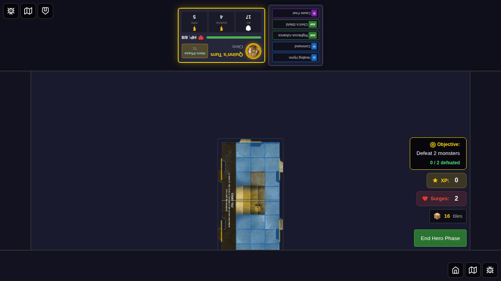
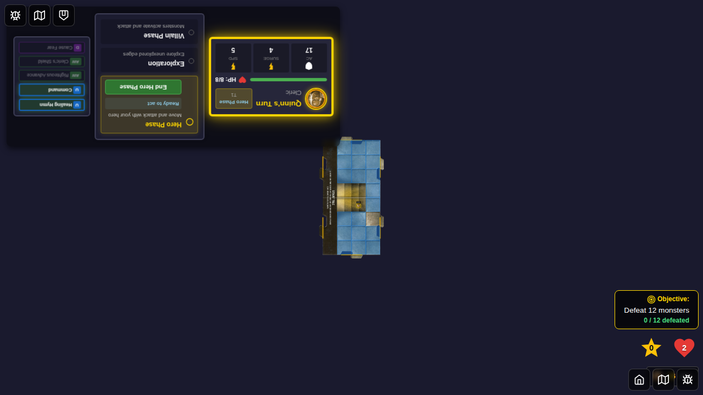

# E2E Test 032 - Trap and Hazard System

## User Story
As a player, I want trap and hazard markers to be visible on the game board so that I can see where dangers are placed and respond appropriately during gameplay.

## Test Overview
This test verifies that:
1. The game state includes trap and hazard tracking arrays
2. Trap and hazard system infrastructure is in place
3. The UI can display trap and hazard markers when they exist

## Implementation Details

### Trap System
Traps are persistent markers that trigger effects during the Villain Phase:
- **Lava Flow**: Spreads to adjacent tiles and damages heroes (1 HP)
- **Poisoned Dart Trap**: Attacks heroes on the tile (+8 attack, 2 damage on hit, 1 on miss)
- **Rolling Boulder**: Moves toward closest hero and deals 2 damage
- **Whirling Blades**: Moves toward closest hero and attacks (+8, 2 damage on hit, 1 on miss)

All traps can be disabled with a DC 10 roll during the hero phase.

### Hazard System
Hazards are markers with ongoing effects:
- **Cave In**: Attacks heroes on tile when placed (+9 attack, 2 damage on hit, 1 on miss)
- **Pit**: Attacks heroes on tile when placed (+10 attack, 2 damage and hero falls in pit)
- **Volcanic Vapors**: Heroes on tile become Poisoned (status effect not yet implemented)

## Screenshots

### Step 1: Character Selection

*Initial character selection screen*

### Step 2: Game Started (No Traps/Hazards)

*Game board with Quinn positioned, no traps or hazards present*

### Step 3: Trap/Hazard State Verification

*Game state includes trap and hazard tracking arrays and counters*

## Technical Implementation

### Data Structures
```typescript
interface TrapState {
  id: string;
  encounterId: string;
  position: { x: number; y: number };
  disableDC: number;
}

interface HazardState {
  id: string;
  encounterId: string;
  position: { x: number; y: number };
}
```

### Game State Integration
- `game.traps: TrapState[]` - Active traps on the board
- `game.hazards: HazardState[]` - Active hazards on the board
- `game.trapInstanceCounter: number` - Counter for unique trap IDs
- `game.hazardInstanceCounter: number` - Counter for unique hazard IDs

### UI Components
- `TrapMarker.svelte` - Displays trap markers at trap positions
- `HazardMarker.svelte` - Displays hazard markers at hazard positions

### Core Logic
- `trapsHazards.ts` - Helper functions for trap/hazard management
- `villainPhaseTraps.ts` - Villain phase trap activation logic
- `encounters.ts` - Trap/hazard placement on encounter resolution

## Manual Verification Checklist
- [ ] Trap and hazard arrays exist in game state
- [ ] Trap and hazard instance counters exist in game state
- [ ] Game starts without errors related to trap/hazard system
- [ ] UI renders correctly with trap/hazard infrastructure in place

## Future Enhancements
- Full E2E workflow test showing trap placement from encounter card
- Villain phase trap activation demonstration
- Trap disable interaction test
- Status effect system integration (Poisoned status for Volcanic Vapors)
