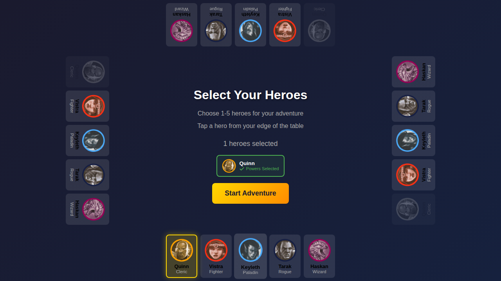
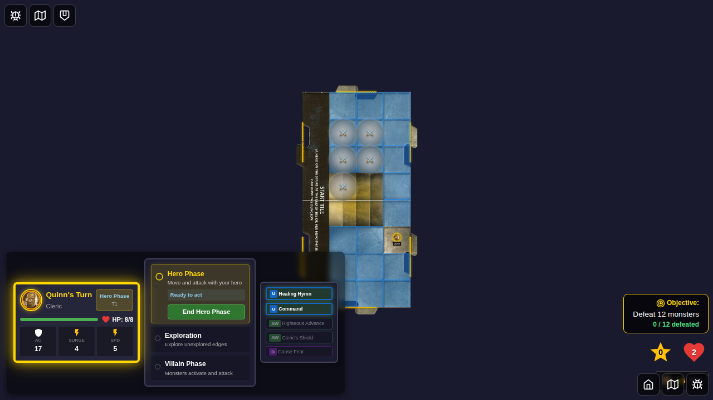
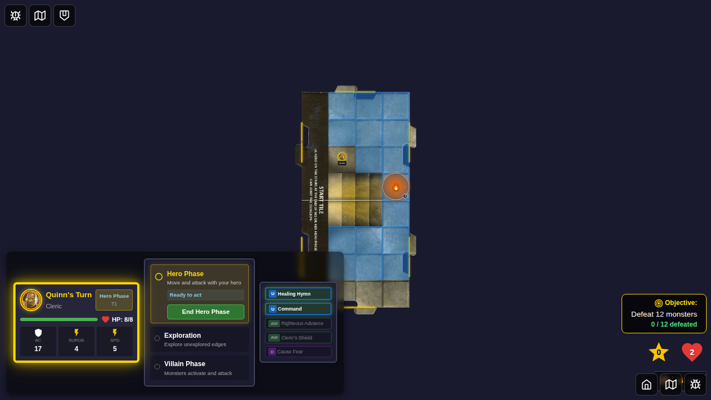
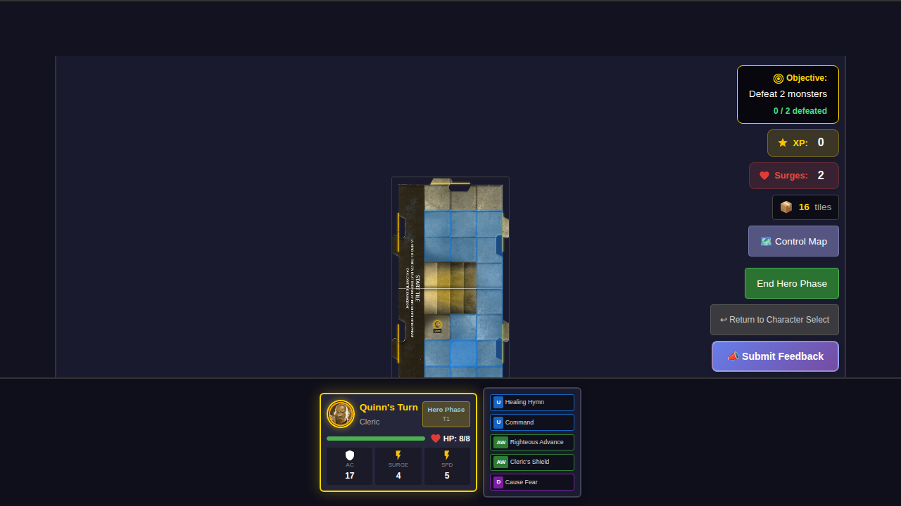
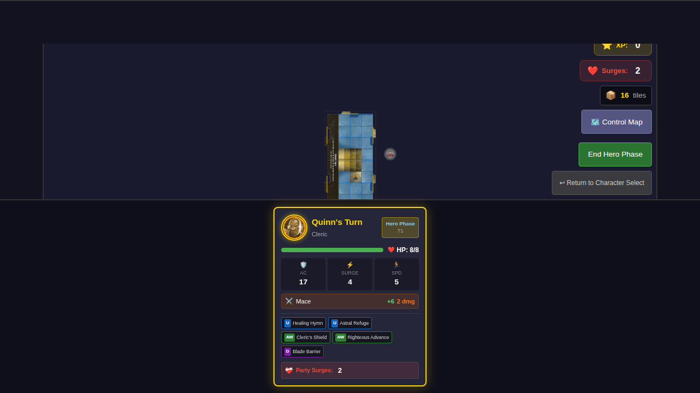

# 033 - Board Tokens

## User Story

As a player using power cards like Blade Barrier and Flaming Sphere, I want to see persistent board tokens placed and tracked on the game board, so that I can interact with them during gameplay and use their effects.

## Test Coverage

This E2E test verifies:
- Board tokens can be placed on the game board
- Different token types render with distinct visual styles (Blade Barrier vs Flaming Sphere)
- Tokens with charges display the charge counter
- Tokens can be removed from the board
- Multiple tokens of the same type can exist on the board
- Token state is properly tracked in the Redux store

## Test Flow

### Step 1: Hero Selection with Power Cards

**What's verified:**
- Quinn (Cleric) is selected
- Power cards are selected (including Blade Barrier daily)
- Start game button is enabled

**Programmatic checks:**
- Hero Quinn has `selected` class
- "Powers Selected" text is displayed
- Start game button is enabled

### Step 2: Game Started - No Tokens Yet

**What's verified:**
- Game board is displayed
- No board tokens exist initially
- Hero is on the start tile

**Programmatic checks:**
- Game board is visible
- `boardTokens` array in Redux store is empty

### Step 3: Blade Barrier Tokens Placed

**What's verified:**
- 5 Blade Barrier tokens are rendered on the board
- Tokens have the sword emoji (⚔️) and silver color
- Tokens are positioned at specific locations

**Programmatic checks:**
- Exactly 5 board tokens are rendered in DOM
- First token has `data-token-type="blade-barrier"` attribute
- Redux store has 5 tokens with correct properties:
  - `type: 'blade-barrier'`
  - `powerCardId: 5`
  - `ownerId: 'quinn'`

### Step 4: Flaming Sphere Token with Charges

**What's verified:**
- Flaming Sphere token renders with fire emoji (🔥) and orange-red color
- Charge counter badge displays "3"
- Token replaces previous Blade Barrier tokens

**Programmatic checks:**
- Exactly 1 board token is rendered
- Token has `data-token-type="flaming-sphere"` attribute
- Redux store has token with:
  - `type: 'flaming-sphere'`
  - `charges: 3`
  - `canMove: true`

### Step 5: Tokens Removed

**What's verified:**
- All tokens are removed from the board
- Game board returns to clean state

**Programmatic checks:**
- No board tokens in DOM
- Redux store `boardTokens` array is empty

### Step 6: Blade Barrier with Monster

**What's verified:**
- Blade Barrier token is placed
- Monster spawns at same position as token
- Both token and monster coexist on board (damage happens during exploration phase)

**Programmatic checks:**
- 1 monster token is rendered
- 1 board token is rendered
- Redux store has both monster and token at position `{ x: 5, y: 3 }`

## Manual Verification Checklist

- [ ] Blade Barrier tokens display with silver color and sword emoji
- [ ] Flaming Sphere displays with orange-red color and fire emoji
- [ ] Charge counter badge is visible on Flaming Sphere (shows "3")
- [ ] Tokens are positioned correctly on the game board
- [ ] Multiple tokens can exist simultaneously
- [ ] Tokens disappear when removed
- [ ] Monster and token can occupy the same square
- [ ] Token visual style matches the component design (circular, glowing)

## Implementation Notes

This test validates the board token infrastructure that was added to support power cards like Blade Barrier (ID: 5) and Flaming Sphere (ID: 45). The test uses programmatic token placement since the UI for token placement (tile/position selection modals) is not yet implemented.

### Current Limitations
- Token placement UI not tested (requires modal implementation)
- Flaming Sphere movement not tested (requires hero phase controls)
- Blade Barrier damage trigger only verified at component level (automatic during monster spawn)

### Future Test Coverage
- Token placement via power card usage UI
- Flaming Sphere movement during hero phase
- Blade Barrier damage removal during exploration phase
- Token persistence across multiple turns
