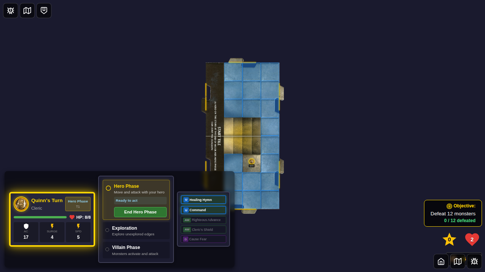
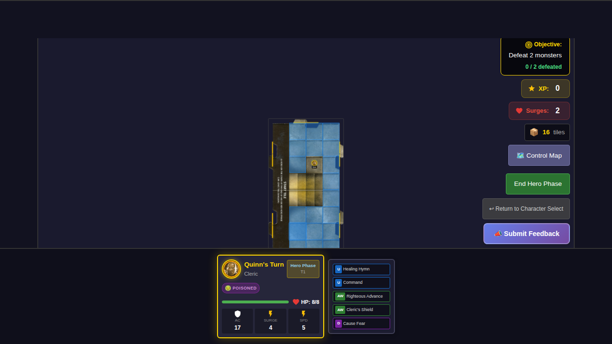
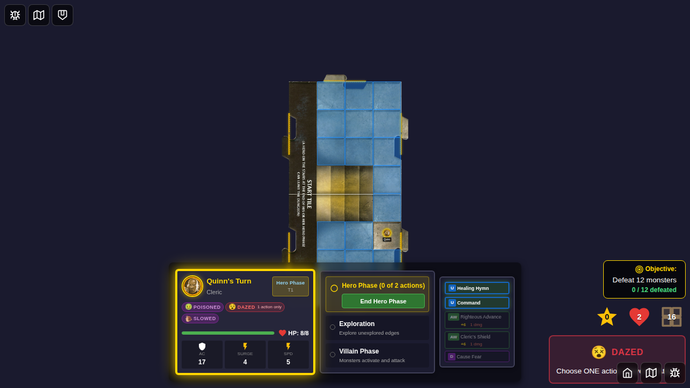
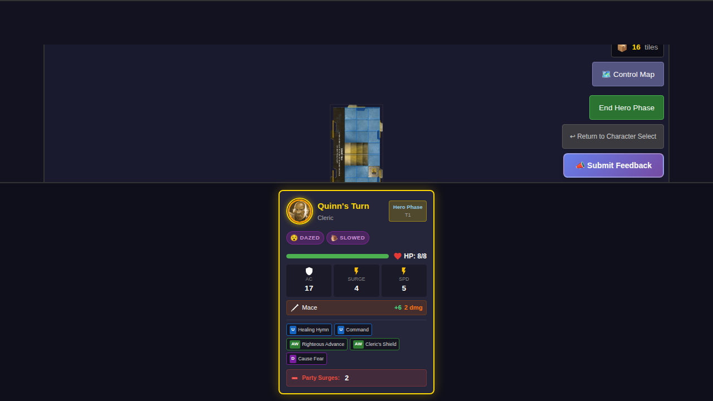
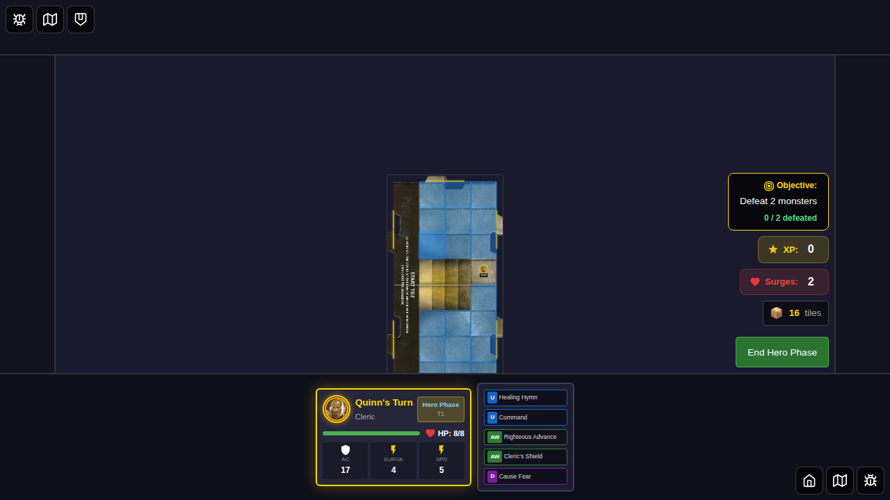
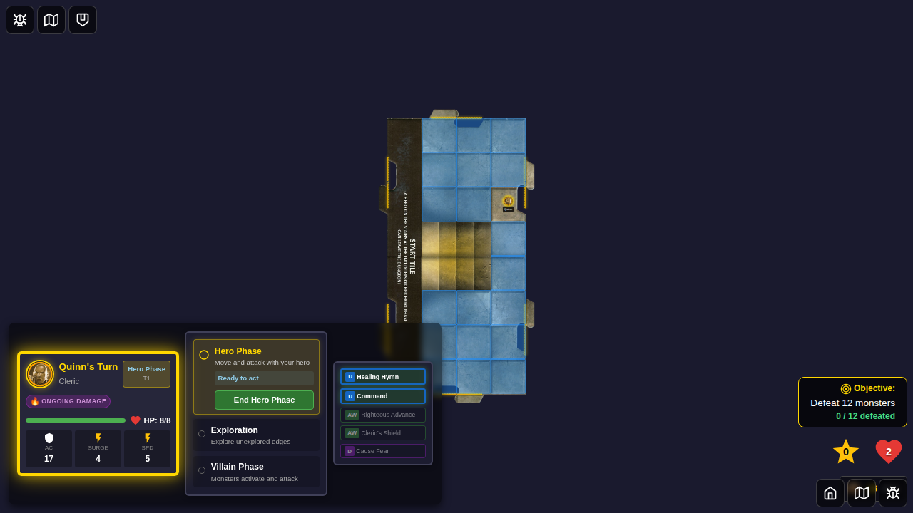
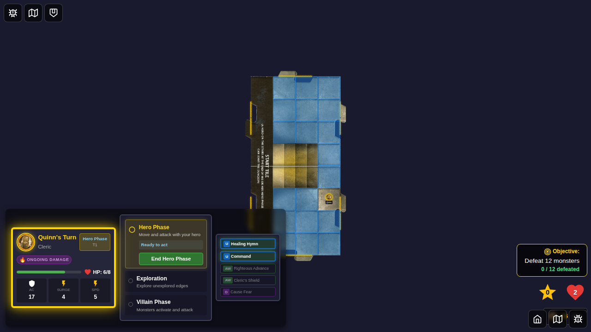
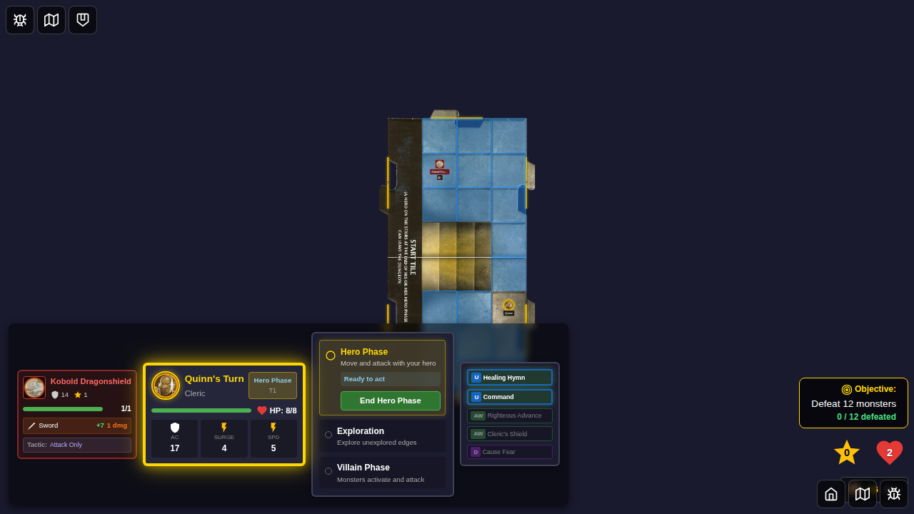
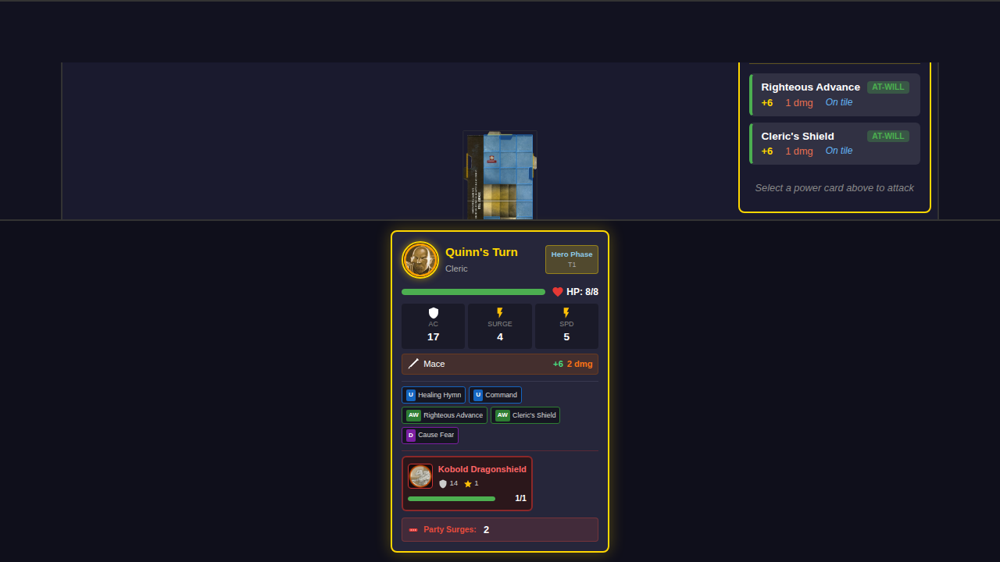

# E2E Test 034: Status Effects

## User Story

As a player, when a monster with a status effect attack (like a snake) hits my hero, I want to see the status effect applied, displayed, and processed correctly so that I understand how conditions affect gameplay.

## Screenshots

This test captures screenshots at key points to visually demonstrate status effect functionality. Screenshots are generated automatically on first run with `--update-snapshots` and stored in `034-status-effects.spec.ts-snapshots/`.

### Test 1: Apply and Display Hero Status Effects

#### 000 - Initial State (No Status)

- Hero card visible at bottom of screen
- No condition badges displayed
- Hero at full HP (8/8)

#### 001 - Poisoned Status Applied

- Poisoned icon (🤢) displayed on hero card
- Status badge visible in conditions section
- Hero still at full HP

#### 002 - Multiple Status Effects

- Three status icons displayed: poisoned (🤢), dazed (😵), slowed (🐌)
- All badges visible and properly spaced
- Status section expanded to show all conditions

#### 003 - Status Removed (Others Remain)

- Poisoned icon removed
- Dazed and slowed icons still displayed
- Demonstrates selective status removal

### Test 2: Process Status Effects

#### 000 - Initial HP Full

- Hero at full HP (8/8)
- HP indicator in turn info shows 8/8

#### 001 - Ongoing Damage Applied (Before Processing)

- Ongoing damage icon (🔥) displayed
- HP still at 8/8 (not yet processed)
- Status visible but damage not yet applied

#### 002 - HP Reduced After Processing

- HP reduced to 6/8 (2 damage from ongoing effect)
- Status still present (persists)
- HP indicator updated in turn info

### Test 3: Monster Status Effects

#### 000 - Monster with Slowed Status

- Kobold monster token visible on board
- Slowed icon (🐌) displayed on monster token
- Status badge positioned near monster

#### 001 - Monster Status Removed

- Monster still visible
- Status badge no longer displayed
- Clean monster token without conditions

## Test Scenarios

### 1. Snake Attack Applies Poisoned Status
**Story:** A snake monster attacks a hero and applies the poisoned status effect.

**Steps:**
1. Start game with Quinn
2. Verify no status effects initially
3. Spawn a snake monster adjacent to Quinn
4. Trigger villain phase and activate monster
5. Monster attacks and hits Quinn with poisoned effect
6. Verify poisoned status is applied in game state
7. Verify poisoned badge (🤢) is displayed on player card

**Expected Results:**
- Snake attack applies poisoned status to hero
- Status effect is tracked in Redux state
- Poisoned icon displays on player card with tooltip

### 2. Status Effects Process at Turn Start
**Story:** Ongoing damage status effects deal damage at the start of each hero turn.

**Steps:**
1. Start game with Quinn (8 HP)
2. Apply ongoing-damage status effect (2 damage)
3. Verify status is applied but no damage yet
4. Complete full turn cycle (hero → exploration → villain → hero)
5. Verify ongoing damage applied at start of new hero turn
6. HP reduced by 2 (from 8 to 6)
7. Status remains active

**Expected Results:**
- Ongoing damage processes at turn start
- HP correctly reduced
- Status persists until removed
- UI updates to show reduced HP

### 3. Status Effect with Duration Expires
**Story:** Status effects with duration limits automatically expire after the specified number of turns.

**Steps:**
1. Start game with Quinn
2. Apply dazed status with duration of 1 turn
3. Verify dazed badge (😵) is displayed
4. Complete one full turn cycle
5. Status expires automatically
6. Verify badge is removed from UI

**Expected Results:**
- Status with duration=1 lasts one turn
- Status automatically removed after expiry
- UI updates to hide expired status badges
- No manual removal needed

### 4. Monster Status Effects Display
**Story:** Status effects applied to monsters display on the monster token.

**Steps:**
1. Start game with Quinn
2. Spawn a kobold monster
3. Apply slowed status to monster
4. Verify slowed badge (🐌) displays on monster token
5. Remove status using removeMonsterStatus action
6. Verify badge disappears

**Expected Results:**
- Monster status badges display on monster tokens
- Status changes reflect immediately in UI
- Both application and removal work correctly

## Screenshots

Due to the dynamic nature of status effects and the need for specific game states (monster hits, turn processing), screenshots are generated programmatically during test execution. Each test includes comprehensive programmatic checks to verify:

- Redux state contains correct status effects
- DOM elements display status badges
- Status icons and tooltips are correct
- Status effects process at appropriate times

## Implementation Details

### Status Types Tested
- **poisoned**: Applied by snake/cultist attacks
- **ongoing-damage**: Deals damage each turn
- **dazed**: Limits actions (duration-based)
- **slowed**: Reduces movement speed

### Key Components
- `statusEffects.ts`: Core status logic
- `gameSlice.ts`: Status application and processing
- `MonsterToken.svelte`: Monster status display
- `PlayerCard.svelte`: Hero status display

### Redux Actions Used
- `game/applyHeroStatus`: Apply status to hero
- `game/removeHeroStatus`: Remove status from hero
- `game/applyMonsterStatus`: Apply status to monster
- `game/removeMonsterStatus`: Remove status from monster
- `game/activateNextMonster`: Trigger monster attacks (with status effects)

## Manual Verification

While automated tests verify the logic, manual testing can confirm:
1. Status icons are visually appealing and clear
2. Tooltips provide helpful information
3. Multiple status effects stack and display correctly
4. Status effects integrate naturally with game flow
5. Performance remains smooth with multiple active statuses
