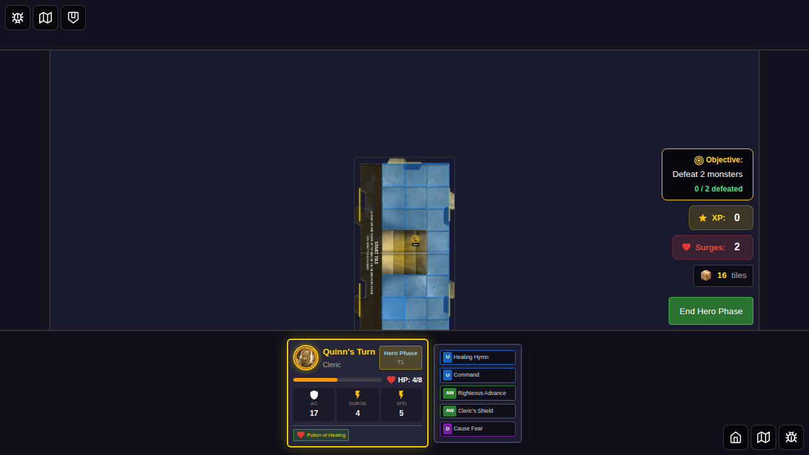
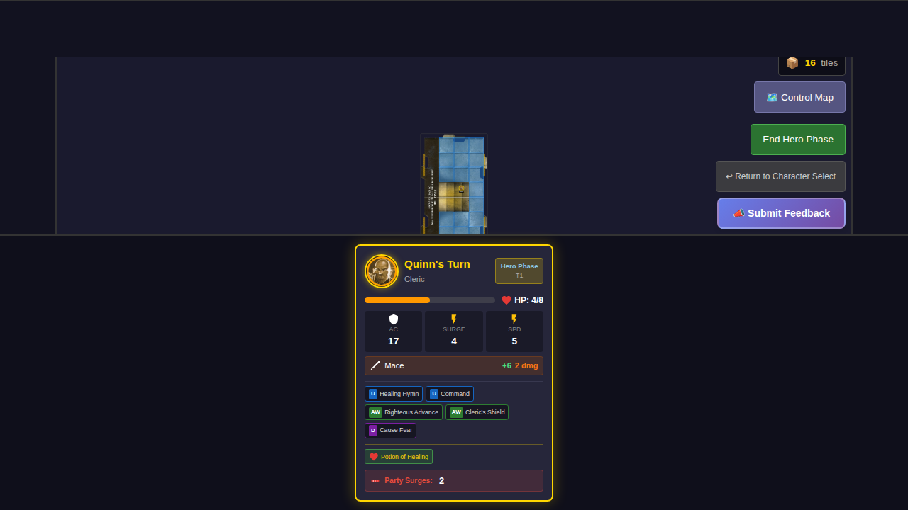
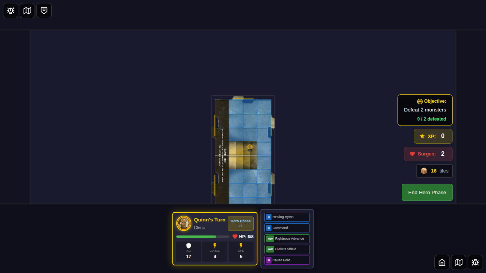
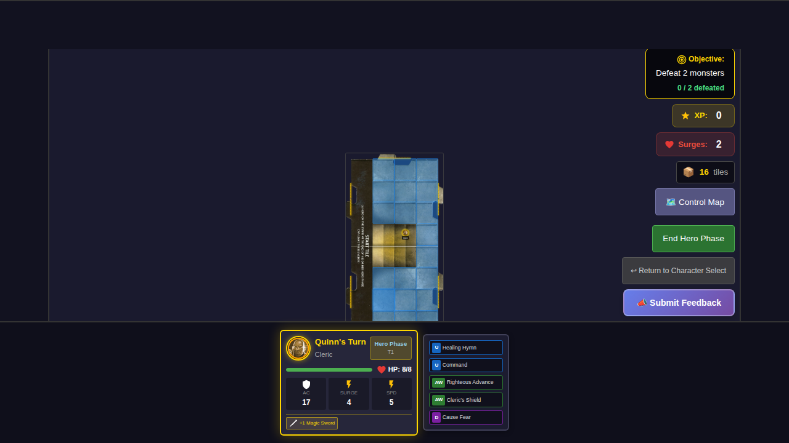
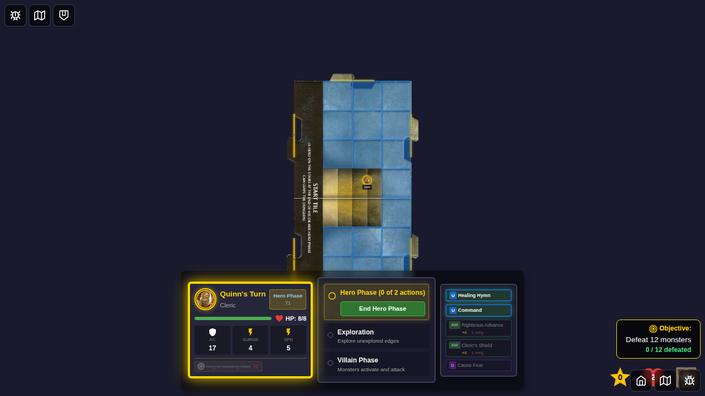

# 035 - Use Consumable Items

This test verifies that players can use consumable and action treasure items from their inventory.

## User Story

As a player, when I have consumable or action treasure items in my inventory, I should be able to:
1. See which items are usable (consumable or action items)
2. Click on a usable item to use it during my Hero Phase
3. Have the item's effect applied (e.g., healing from a potion)
4. See the item removed from inventory if it's a consumable
5. Understand that passive items (like +1 Magic Sword) provide bonuses automatically and don't need to be "used"
6. Understand that flipped items cannot be used again until refreshed

## Test Scenarios

### Scenario 1: Use Potion of Healing
A hero with 4/8 HP uses a Potion of Healing from their inventory, restoring 2 HP and removing the potion from inventory.

### Scenario 2: Non-consumable Items Are Not Usable
Passive bonus items (like +1 Magic Sword) are displayed in inventory but are not clickable, as they provide their bonus automatically.

### Scenario 3: Flipped Items Cannot Be Used Again
Items that have already been used and flipped cannot be clicked again until they are refreshed by another game mechanic.

## Screenshot Sequence

### Test 1: Hero can use Potion of Healing to restore HP

| Step | Description | Screenshot |
|------|-------------|------------|
| 000 | Hero at 4/8 HP with Potion of Healing in inventory |  |
| 001 | Potion highlighted as usable (green border) |  |
| 002 | After using potion - HP restored to 6/8, potion removed |  |

### Test 2: Non-consumable items are not usable

| Step | Description | Screenshot |
|------|-------------|------------|
| 000 | Hero with +1 Magic Sword (passive item, not clickable) |  |

### Test 3: Flipped items cannot be used again

| Step | Description | Screenshot |
|------|-------------|------------|
| 000 | Hero with flipped Ring of Shooting Stars (not clickable) |  |

## Verification Checklist

- [ ] Consumable items (e.g., Potion of Healing) are clickable during Hero Phase
- [ ] Clicking a consumable item applies its effect
- [ ] Consumable items are removed from inventory after use
- [ ] Used consumable items appear in the treasure discard pile
- [ ] Passive bonus items are not clickable
- [ ] Flipped items are not clickable
- [ ] Visual feedback shows which items are usable (green border/hover effect)
- [ ] Items are only usable during the active hero's turn
- [ ] Items have appropriate tooltips indicating they can be used
