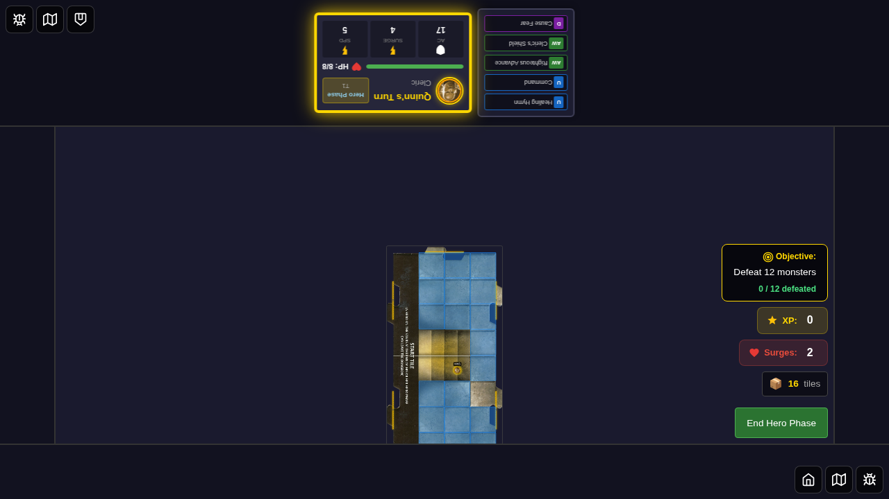
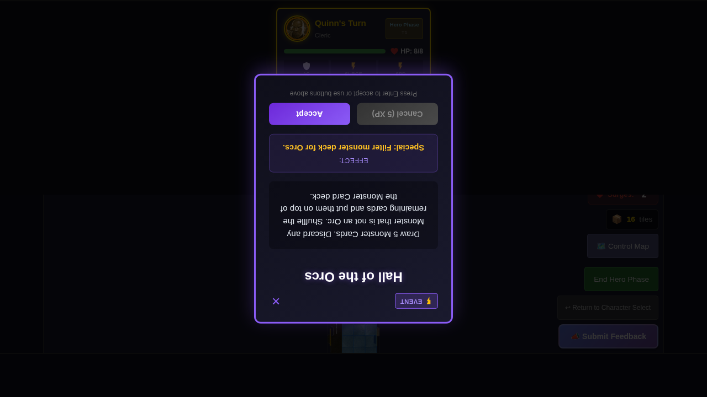
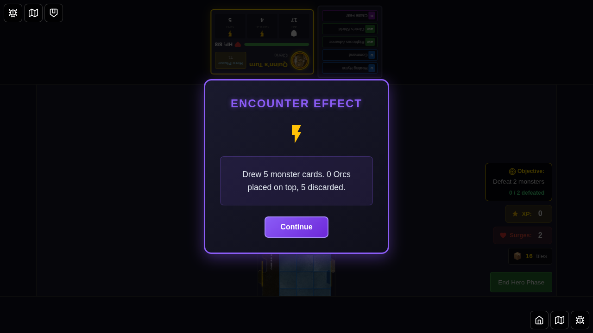
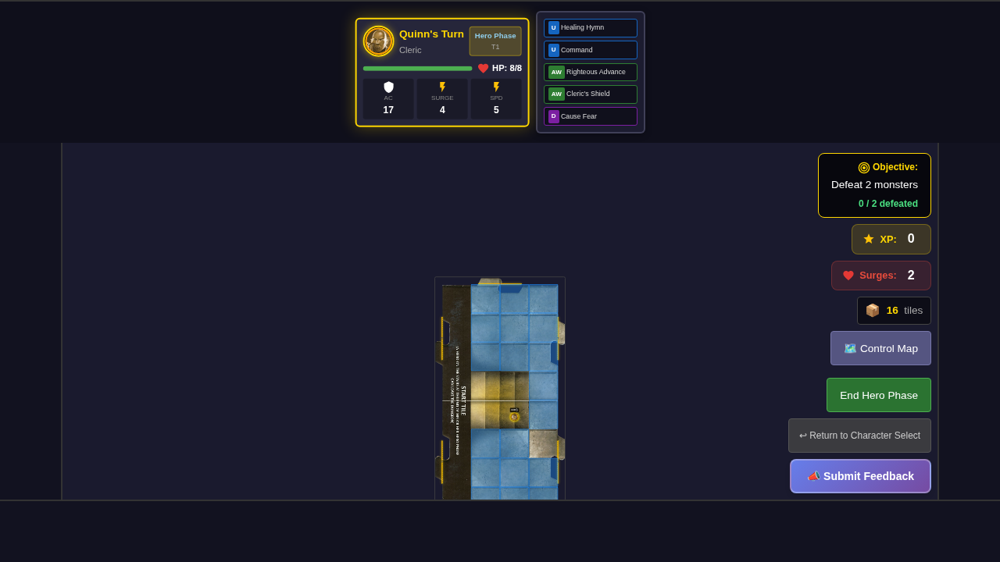
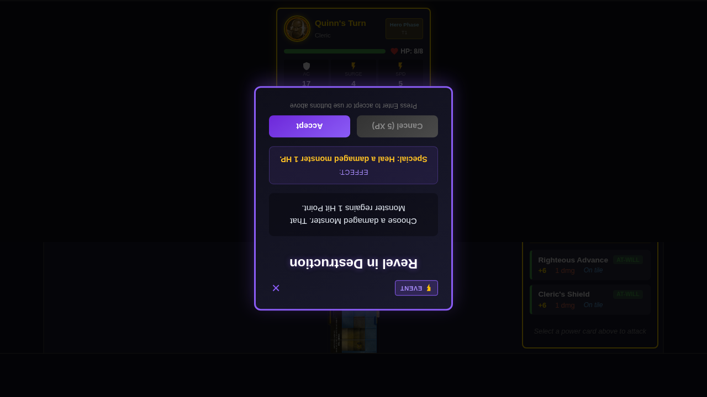
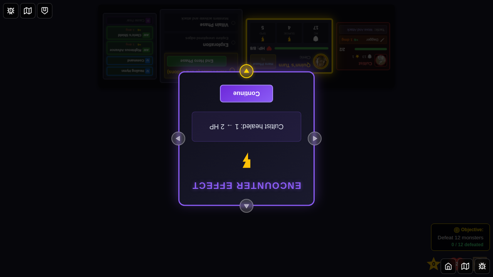
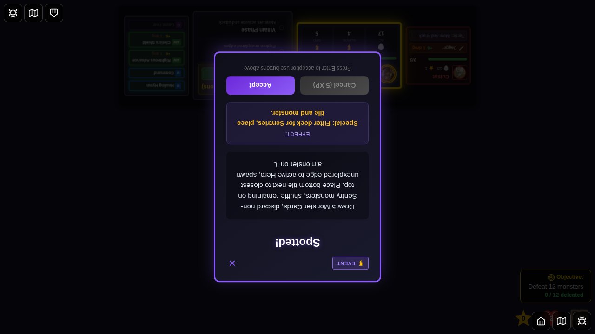
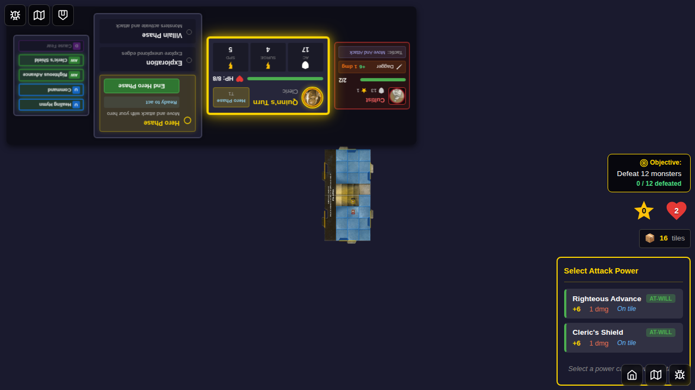

# 036 - Encounter Effect Notifications

## User Story

As a player, when I accept a special encounter card that manipulates game state (like filtering the monster deck or healing monsters), I want to see a clear notification showing exactly what happened, so I can verify the encounter effect was applied correctly.

## Test Scenario

This test verifies that special encounter cards display user-visible notifications with detailed effect information:

1. **Start Game**: Select Quinn and start the game
2. **Setup State**: Configure game state for villain phase with specific monster deck
3. **Hall of the Orcs**: Draw and accept "Hall of the Orcs" encounter
   - Verify encounter card displays
   - Accept encounter to trigger deck manipulation
   - Verify notification shows: "Drew 5 monster cards. X Orcs placed on top, Y discarded."
4. **Revel in Destruction**: Draw and accept "Revel in Destruction" encounter
   - Spawn a damaged monster (Cultist at 1/2 HP)
   - Accept encounter to trigger healing
   - Verify notification shows: "Cultist healed: 1 → 2 HP"
5. **Spotted!**: Draw and accept "Spotted!" encounter (Bug Fix Verification)
   - Setup monster deck with Kobolds (Sentry creatures)
   - Accept encounter to trigger Sentry filtering
   - Verify notification shows: "Drew 5 monster cards. 3 Sentrys placed on top, 2 discarded."

## Special Encounter Cards Tested

1. **Hall of the Orcs** (Deck Manipulation)
   - Filters monster deck for Orc creature type
   - Shows count of cards drawn, kept, and discarded

2. **Revel in Destruction** (Monster Healing)
   - Heals first damaged monster by 1 HP
   - Shows monster name and HP change (before → after)

3. **Spotted!** (Sentry Filtering - Bug Fix) ✅
   - Filters monster deck for Sentry creature type (Kobold Dragonshields)
   - Previously showed "0 Sentrys" due to incorrect categorization
   - Now correctly identifies Kobolds as Sentries and places them on top

## Visual Elements Verified

- **EncounterEffectNotification** component displays correctly
- Purple gradient overlay with effect icon (⚡)
- Clear message text with specific counts and details
- "Continue" button to dismiss notification

## Programmatic Checks

- Encounter card displays with correct name and description
- Effect notification appears after accepting encounter
- Message text contains expected details (card counts, HP values)
- Redux store state reflects actual game state changes
  - Monster deck manipulation (cards filtered and discarded)
  - Monster HP changes (healing applied)
- Notification dismisses and clears state properly

## Screenshots

### 1. Character Select Screen

Initial character selection screen showing Quinn available for selection.

### 2. Game State Ready for Encounter

Game board with Quinn positioned and monster deck configured for testing.

### 3. Hall of Orcs Encounter Card

Hall of Orcs encounter card displayed with description and Accept/Cancel buttons.

### 4. Deck Manipulation Notification ⭐

**Key Screenshot**: Encounter effect notification showing "Drew 5 monster cards. 0 Orcs placed on top, 5 discarded." This demonstrates the user-visible feedback for deck manipulation effects.

### 5. Notification Dismissed

Game continues after dismissing the notification.

### 6. Revel in Destruction Encounter Card

Revel in Destruction encounter card displayed, about to heal a damaged monster.

### 7. Monster Healing Notification ⭐

**Key Screenshot**: Encounter effect notification showing "Cultist healed: 1 → 2 HP". This demonstrates the user-visible feedback for monster healing effects.

### 8. Final State Verification

Game state after monster healing, verifying the effect was applied correctly.

### 9. Spotted! Encounter Card

Spotted! encounter card displayed, about to filter the monster deck for Sentry creatures.

### 10. Sentry Filtering Notification ⭐

**Key Screenshot**: Encounter effect notification showing "Drew 5 monster cards. 3 Sentrys placed on top, 2 discarded." This demonstrates the bug fix where Kobold Dragonshields are now correctly categorized as 'sentry' creatures, allowing the Spotted! encounter card to function properly.

### 11. Spotted! Notification Dismissed

Game state after Spotted! encounter, with 3 Sentry monsters now on top of the deck.

## Related Encounter Cards

This notification system also works for:
- **Lost**: "Bottom tile moved to top of deck (X tiles remaining)"
- **Duergar Outpost**: "Drew 5 monster cards. X Devils placed on top, Y discarded."
- **Kobold Warren**: "Drew 5 monster cards. X Reptiles placed on top, Y discarded."
- **Unnatural Corruption**: "Drew 5 monster cards. X Aberrants placed on top, Y discarded."
- **Spotted!**: "Drew 5 monster cards. X Sentrys placed on top, Y discarded." ✅ **Fixed in this PR**
- **Deadly Poison**: "X poisoned heroes took 1 damage" (when heroes are poisoned)
