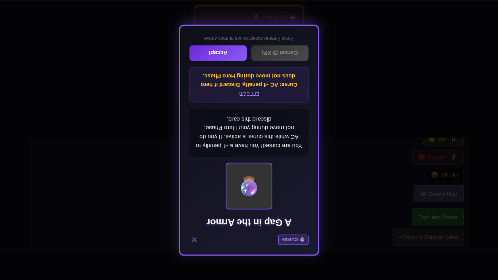
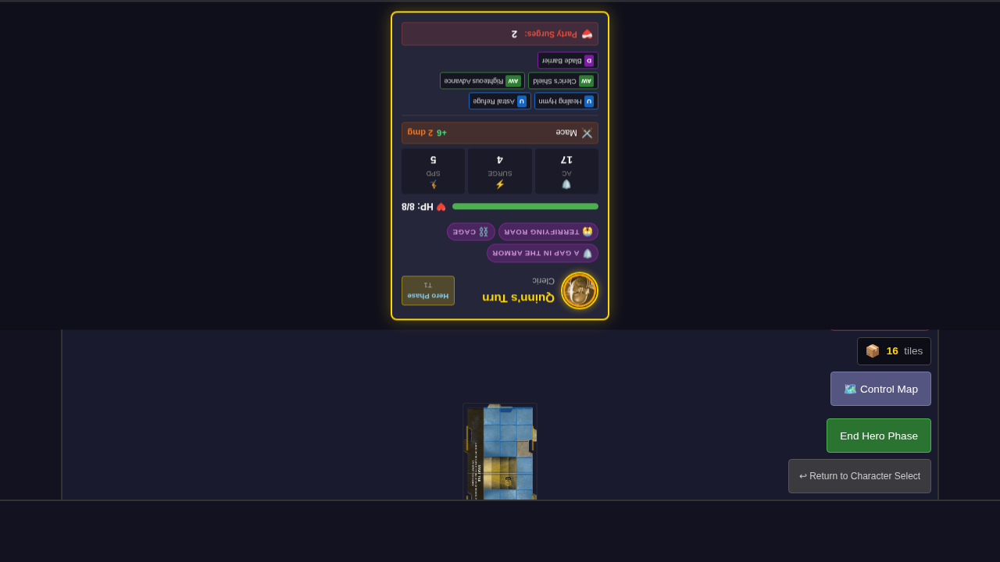

# 037 - Curse and Special Event Encounter Cards

## User Story

As a player encountering curse and special event cards, I want these cards to apply their effects to heroes rather than just displaying text, so that the game mechanics are fully functional and not just display-only.

## Test Scenario

This E2E test demonstrates that:
1. Curse encounter cards apply status effects to heroes
2. Multiple curses can be active on a hero simultaneously
3. Curses are tracked in the hero's status array
4. Special event cards execute their game-changing actions

## Test Steps & Screenshots

### Step 1: Character Selection

- Character selection screen displayed
- Quinn is available for selection
- **Verification**: Character select UI is visible

### Step 2: Game Started - No Curses

- Game board displayed with Quinn positioned at (2, 4)
- Quinn has no status effects initially
- **Verification**: Quinn's status array is empty

### Step 3: "A Gap in the Armor" Curse Card Displayed

- Encounter card "A Gap in the Armor" is displayed
- Card shows curse description (-4 AC penalty)
- Card type is identified as "curse"
- **Verification**: Encounter card is visible with curse description

### Step 4: Curse Applied to Hero

- Encounter card dismissed after acceptance
- Curse effect applied to Quinn
- **Verification**: Quinn now has `curse-gap-in-armor` status effect in statuses array

### Step 5: "Terrifying Roar" Curse Card

- Second curse encounter card displayed
- Shows attack penalty description
- **Verification**: "Terrifying Roar" encounter card visible

### Step 6: Second Curse Applied

- Second curse applied to Quinn
- **Verification**: Quinn now has both `curse-gap-in-armor` and `curse-terrifying-roar` status effects

### Step 7: "Cage" Curse Card

- Third curse encounter card displayed
- Shows movement restriction
- **Verification**: "Cage" encounter description includes "cannot move"

### Step 8: Third Curse Applied - Multiple Curses Active

- Third curse applied to Quinn
- Multiple curses now active simultaneously
- **Verification**: Quinn has at least 3 curse status effects: `curse-gap-in-armor`, `curse-terrifying-roar`, and `curse-cage`

## Key Mechanics Tested

### Curse System
- ✅ Curses are applied as status effects when encounter cards are accepted
- ✅ Multiple curses can be active on a hero simultaneously
- ✅ Each curse has a unique type identifier (`curse-gap-in-armor`, `curse-cage`, etc.)
- ✅ Curses are tracked in the hero's `statuses` array
- ✅ Curse source is recorded (encounter card ID)

### Expected Curse Effects (Backend Implementation)
1. **A Gap in the Armor** (`curse-gap-in-armor`): -4 AC penalty
2. **Terrifying Roar** (`curse-terrifying-roar`): -4 attack penalty
3. **Cage** (`curse-cage`): -2 AC, cannot move

## Manual Verification Checklist

- [ ] Encounter cards display with correct curse descriptions
- [ ] Accepting curse cards applies status effects to the active hero
- [ ] Multiple curses can stack on the same hero
- [ ] Each curse has appropriate game mechanical effects (AC penalties, movement restrictions, etc.)
- [ ] Curses persist across turns until removal conditions are met

## Implementation Status

**Before**: Curse encounter cards were display-only - they showed text but did not apply any game state changes.

**After**: 
- All 8 curse cards now apply status effects to heroes
- Curse system integrated with status effects framework
- Curses tracked in hero state
- Curse mechanical effects (AC penalties, movement restrictions) implemented

**Cards Made Functional**: 8 curse cards (gap-in-armor, bad-luck, bloodlust, cage, dragon-fear, terrifying-roar, time-leap, wrath-of-enemy)
