# 038 - Encounter Cards Comprehensive System Test

## User Story

As a player, I want the encounter card system to properly draw, present, and resolve all types of encounter cards with their effects, so I can experience the full gameplay mechanics including damage effects, attack rolls, curses, environments, traps, hazards, and special events.

## Test Scenario

This comprehensive E2E test demonstrates the complete encounter card system functionality:

1. **Character Selection & Game Start**: Select Quinn and start the game
2. **Damage Effect (Active Hero)**: Draw "Frenzied Leap" - deals 2 damage to active hero
3. **Attack Effect**: Draw "Bull's Eye!" - Attack roll (+10) vs AC, 1 damage on hit
4. **Curse Card**: Draw "A Gap in the Armor" - Applies AC -4 curse to hero
5. **Environment Card**: Draw "Hidden Snipers" - Activates persistent environment effect
6. **Trap Card**: Draw "Poisoned Dart Trap" - Displays trap (DC 10)
7. **Hazard Card**: Draw "Cave In" - Displays hazard marker
8. **Special Effect Card**: Draw "Lost" - Shows special event effect
9. **Cancel Mechanism**: Draw "Unbearable Heat" with enough XP - Test cancel button (costs 5 XP)

## Test Steps & Screenshots

### Step 1: Character Selection

- Character selection screen with tabletop layout
- All 5 heroes visible on 4 edges (20 hero cards total)
- **Verification**: Hero cards visible, start button disabled

### Step 2: Game Started
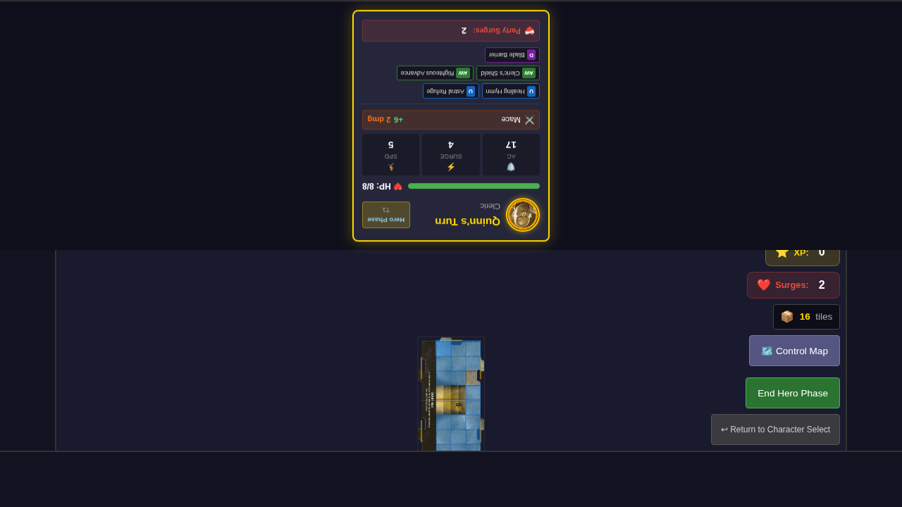
- Game board displayed with Quinn positioned
- Encounter deck initialized with 53 cards
- **Verification**: Game board visible, encounter deck has cards

### Step 3: Frenzied Leap - Damage Effect (Active Hero)
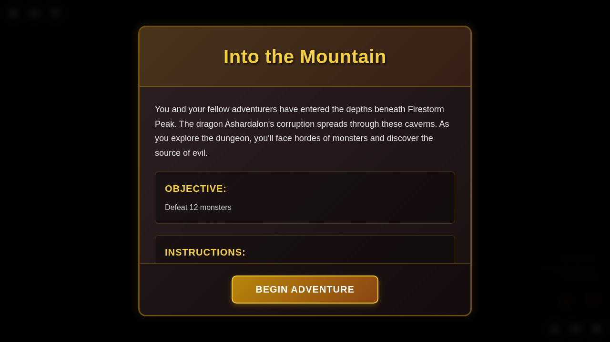
- "Frenzied Leap" encounter card displayed
- Card type: EVENT
- Effect summary: "Active hero takes 2 damage"
- **Verification**: Card displays correctly with damage effect description

### Step 4: Damage Applied
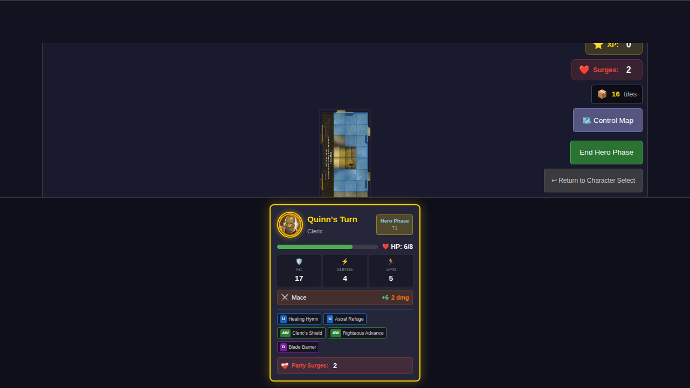
- Encounter card dismissed
- Quinn's HP reduced by 2
- **Verification**: Quinn's HP decreased from 8 to 6

### Step 5: Bull's Eye! - Attack Effect
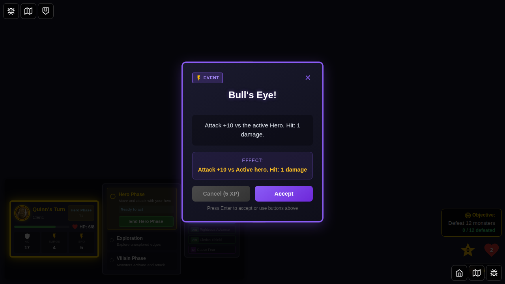
- "Bull's Eye!" encounter card displayed
- Card type: EVENT
- Effect: "Attack +10 vs Active hero. Hit: 1 damage"
- **Verification**: Attack card shows attack bonus and target

### Step 6: Attack Resolved

- Attack roll made and damage applied (if hit)
- Encounter discarded
- **Verification**: Encounter card dismissed, "bulls-eye" in discard pile

### Step 7: A Gap in the Armor - Curse Card
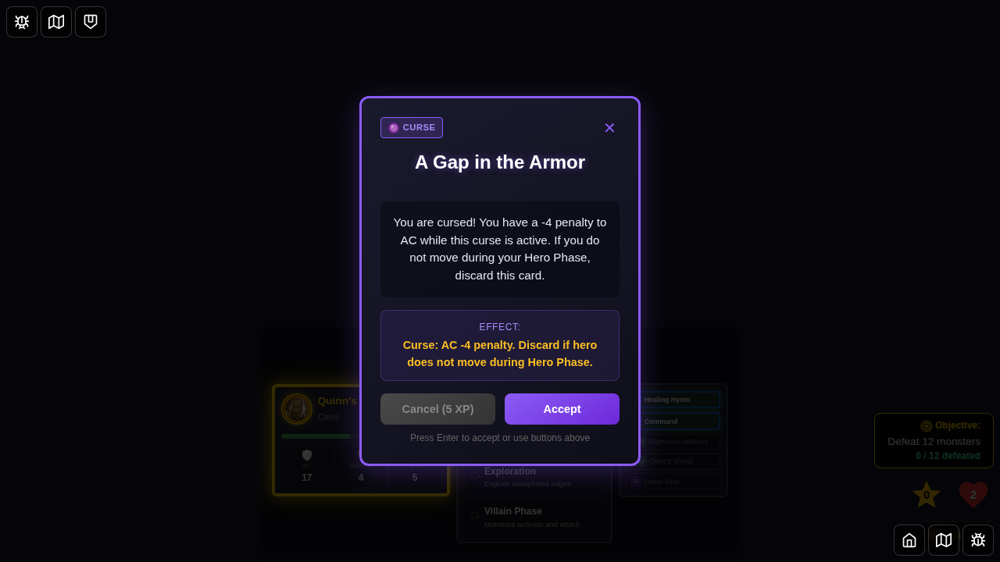
- "A Gap in the Armor" curse card displayed
- Card type: CURSE
- Description includes "cursed" keyword
- Effect: AC -4 penalty
- **Verification**: Curse card displays with curse icon and description

### Step 8: Curse Applied to Hero

- Curse applied to Quinn as status effect
- Quinn now has `curse-gap-in-armor` status
- **Verification**: Quinn's statuses array contains the curse

### Step 9: Hidden Snipers - Environment Card
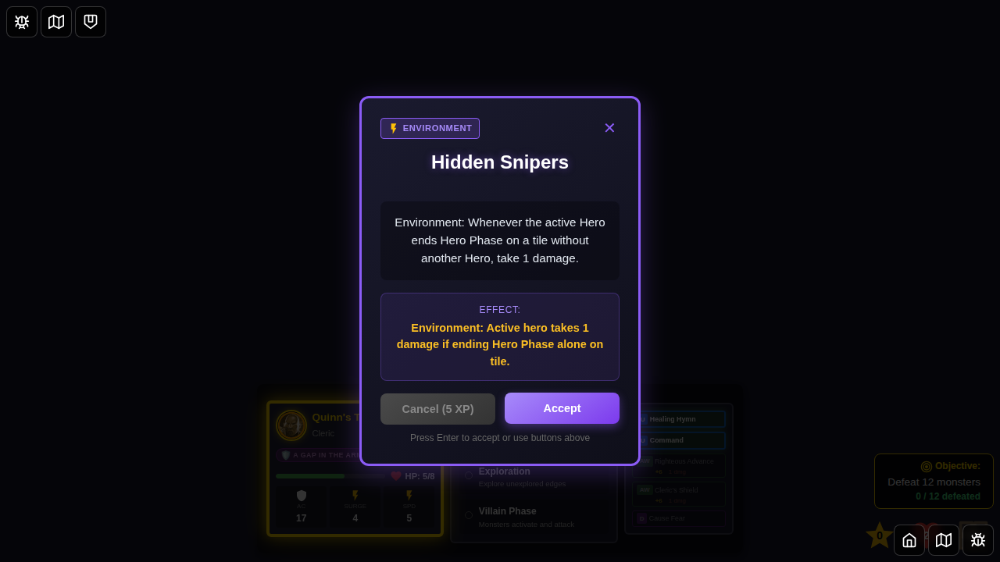
- "Hidden Snipers" environment card displayed
- Card type: ENVIRONMENT
- Effect: 1 damage when alone on tile
- **Verification**: Environment card displays with environment icon

### Step 10: Environment Active
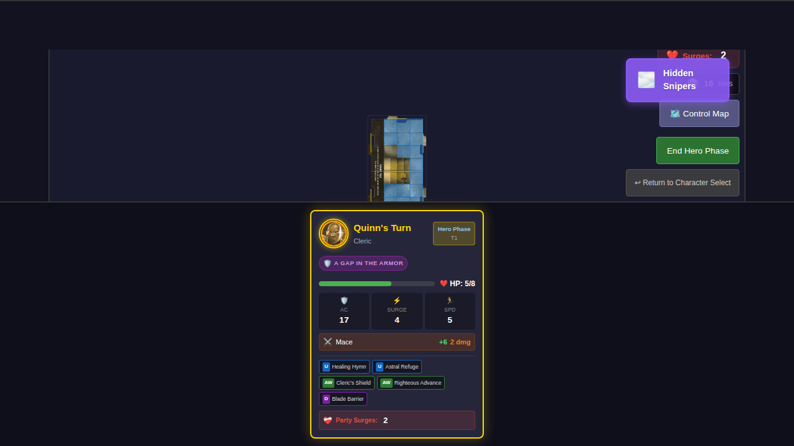
- Environment effect is now active
- Environment replaces any previous environment
- **Verification**: `activeEnvironmentId` set to "hidden-snipers"

### Step 11: Poisoned Dart Trap - Trap Card
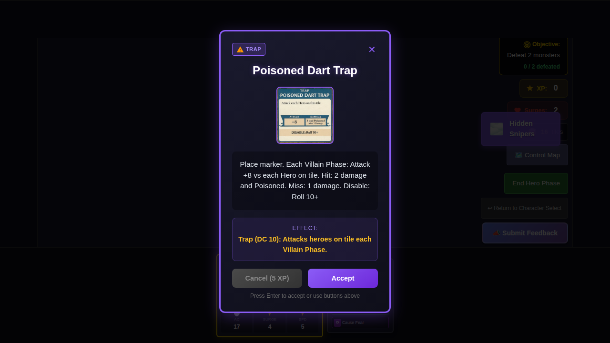
- "Poisoned Dart Trap" trap card displayed
- Card type: TRAP
- Effect shows DC 10 disable requirement
- **Verification**: Trap card displays with DC information

### Step 12: Trap Acknowledged
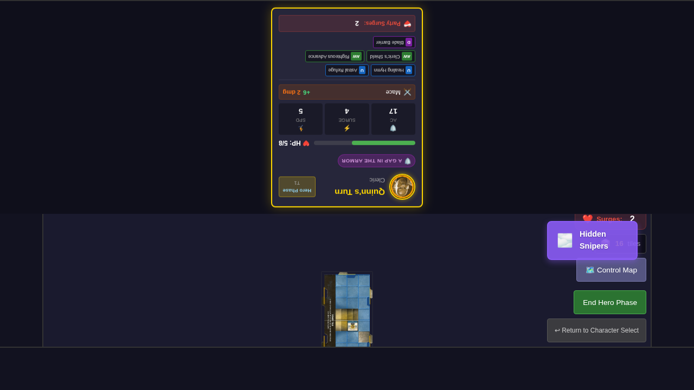
- Trap card dismissed
- Note: Trap placement not yet fully implemented
- **Verification**: Encounter card no longer visible

### Step 13: Cave In - Hazard Card
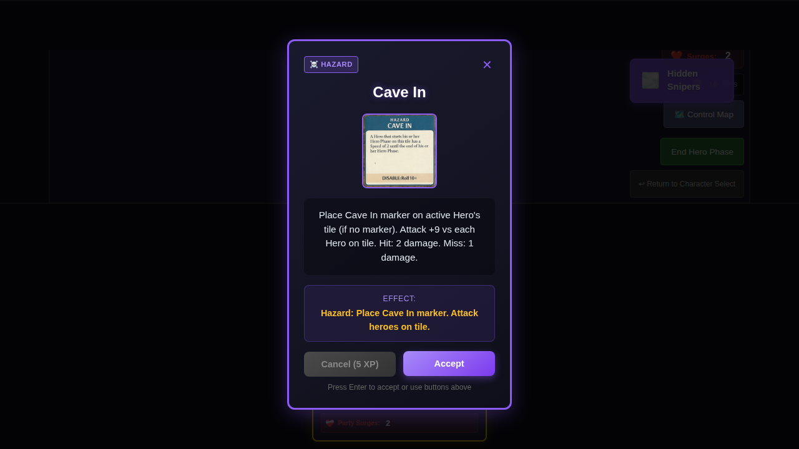
- "Cave In" hazard card displayed
- Card type: HAZARD
- Hazard marker effect described
- **Verification**: Hazard card displays with hazard icon

### Step 14: Hazard Acknowledged

- Hazard card dismissed
- Note: Hazard placement not yet fully implemented
- **Verification**: Encounter card no longer visible

### Step 15: Lost - Special Effect Card
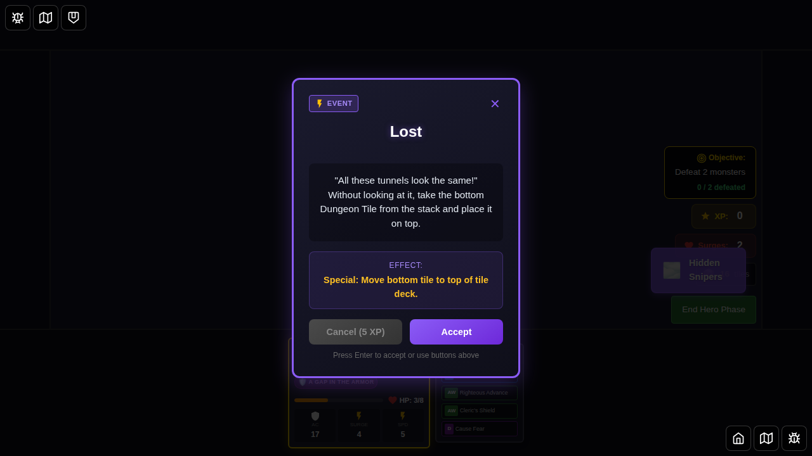
- "Lost" special event card displayed
- Card type: EVENT
- Effect: Special (shuffles tile deck)
- **Verification**: Special effect card displays correctly

### Step 16: Special Effect Resolved
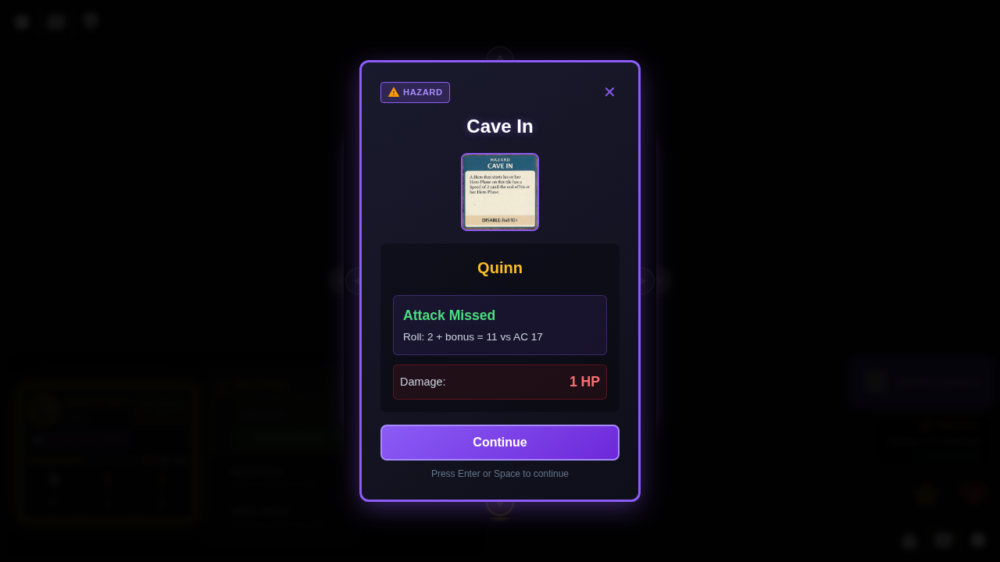
- Special event dismissed
- Effect applied (tile deck shuffled)
- **Verification**: Encounter card no longer visible

### Step 17: Encounter with Cancel Option
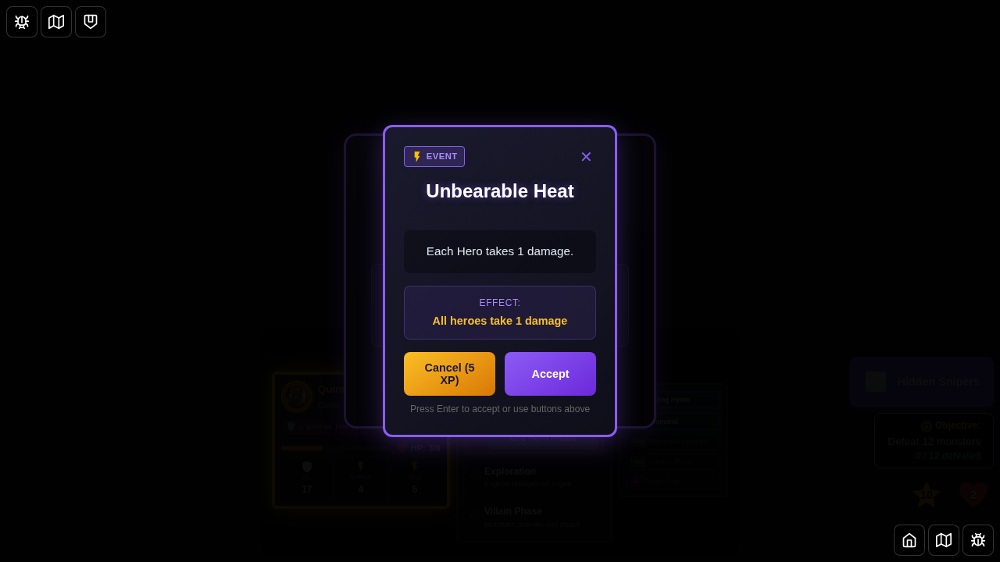
- "Unbearable Heat" encounter displayed
- Party has 10 XP
- Cancel button ENABLED (requires 5 XP)
- **Verification**: Cancel button is enabled, party has sufficient XP

### Step 18: Encounter Cancelled
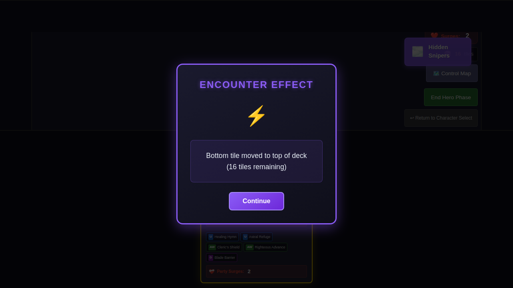
- Cancel button clicked
- 5 XP deducted (10 → 5)
- Encounter discarded without resolving
- **Verification**: Party XP reduced by 5, encounter dismissed

## Encounter Card Types Tested

| Type | Card | Implementation Status |
|------|------|----------------------|
| **Event (Damage)** | Frenzied Leap | ✅ Fully Implemented |
| **Event (Attack)** | Bull's Eye! | ✅ Fully Implemented |
| **Curse** | A Gap in the Armor | ✅ Fully Implemented (applies status) |
| **Environment** | Hidden Snipers | ✅ Fully Implemented (tracked in state) |
| **Trap** | Poisoned Dart Trap | ⚠️ Display Only |
| **Hazard** | Cave In | ⚠️ Display Only |
| **Event (Special)** | Lost | ⚠️ Display Only |

## Key Mechanics Verified

### ✅ Drawing & Presentation
- Encounter cards drawn correctly
- All card types display with appropriate icons
- Card descriptions shown clearly
- Effect summaries formatted correctly

### ✅ Damage Effects
- Active hero damage (Frenzied Leap): Reduces hero HP
- HP changes reflected in Redux store

### ✅ Attack Effects
- Attack roll made against hero's AC
- Damage applied on successful hit
- Attack bonus and damage values displayed

### ✅ Curse System
- Curses applied as status effects to heroes
- Status tracked in hero's `statuses` array
- Curse persists until removal conditions met

### ✅ Environment System
- Environment cards activate persistent effects
- Only one environment active at a time (replaces previous)
- Environment ID tracked in game state

### ✅ Cancel Mechanism
- Cancel button enabled when party has ≥5 XP
- Cancel button disabled when party has <5 XP
- Clicking cancel deducts 5 XP
- Cancelled encounters discarded without effect

### ⚠️ Display Only (Not Yet Fully Implemented)
- **Traps**: Display description but don't place markers
- **Hazards**: Display description but don't place markers
- **Special Effects**: Some display but don't execute full logic

## Implementation Summary

**Total Encounter Cards**: 53
- **Fully Implemented**: 26 cards
  - Damage effects: 2 cards
  - Attack effects: 14 cards
  - Curse effects: 8 cards (status effects working)
  - Environment effects: 2 cards (Hidden Snipers, Walls of Magma)
- **Partially Implemented**: 4 cards
  - Environment effects: 4 cards (tracked but not fully enforced)
- **Display Only**: 23 cards
  - Special effects: 16 cards
  - Trap effects: 4 cards
  - Hazard effects: 3 cards

See `ENCOUNTER_CARDS_IMPLEMENTATION.md` for complete card-by-card breakdown.

## Manual Verification Checklist

- [x] All encounter card types display correctly
- [x] Damage effects reduce hero HP
- [x] Attack rolls calculated vs AC
- [x] Curses applied as status effects
- [x] Environment cards tracked in state
- [x] Cancel mechanism works with XP cost
- [x] Encounter cards discard properly
- [x] Card icons match card types
- [x] Effect summaries are clear and accurate
