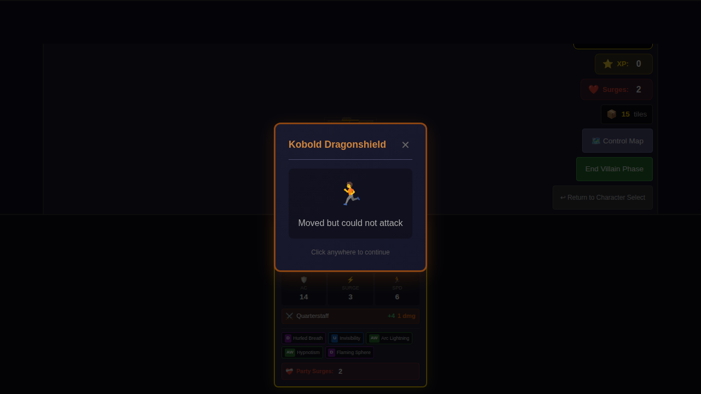
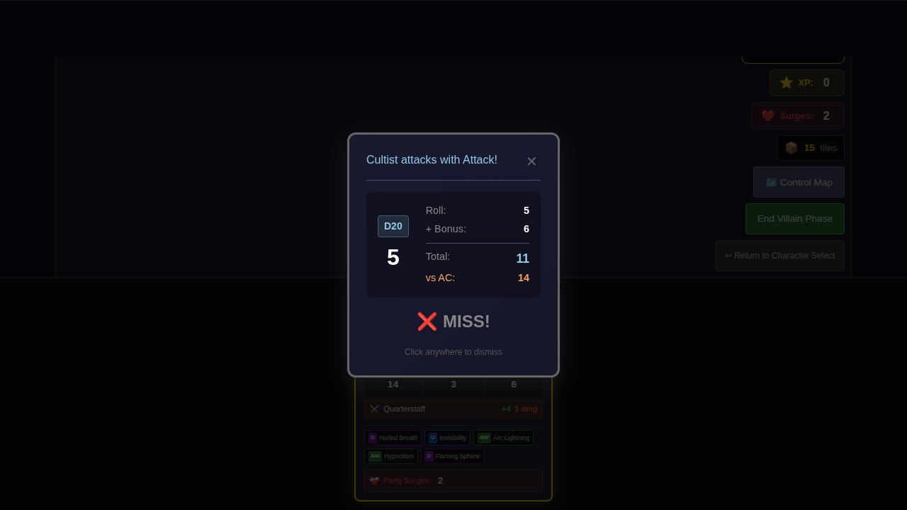

# E2E Test 039 - Ranged Attacks

## User Story

As a player using a Wizard hero (Haskan), I want to attack monsters at range using ranged power cards like Ray of Frost and Arc Lightning, so that I can defeat enemies without being adjacent to them.

## Test Scenario

This test demonstrates the ranged attack system by:

1. **Selecting Haskan (Wizard)** from the character selection screen (selected from bottom/south)
2. **Starting the game** with Haskan's power cards including ranged attacks
3. **Positioning monsters** at various distances from the hero
4. **Using Ray of Frost** (2 tile range) to attack a monster at distance
5. **Using Arc Lightning** (1 tile range) to attack another monster
6. **Verifying** that range indicators appear on power cards
7. **Verifying** that only valid targets within range are shown

## Key Features Demonstrated

### Ranged Attack Cards

- **Ray of Frost** (Wizard, At-Will): Attack one Monster within 2 tiles
- **Arc Lightning** (Wizard, At-Will): Attack up to two Monsters within 1 tile

### Range Calculation

- Uses Chebyshev distance (chessboard metric) for tile counting
- Properly handles cross-tile attacks
- Visual range indicators on power cards (e.g., "Range: 2 tiles")

### UI Behavior

- Power card attack panel shows available ranged attacks
- Target selection filters to only show monsters within range of selected card
- Range indicators help players understand which cards can reach which targets

## Screenshot Gallery

### Character Selection

*Character selection screen with Haskan available*

*Haskan (Wizard) selected from bottom of screen with power cards chosen including ranged attacks*

### Game Setup and Exploration

*Game board with Haskan positioned on start tile*

*Haskan moved to north edge of start tile, ready to explore*

*Exploration phase begins after ending hero phase*

### Monster Encounter

*Monster card displayed showing the newly spawned enemy on explored tile*

*Game state after exploration with monster on board*

*Villain phase with monster present, setting up for ranged attack opportunity*

## Test Coverage

This e2e test demonstrates:
1. **Character Selection**: Selecting Haskan (Wizard) from bottom of character screen
2. **Power Card Selection**: Choosing ranged attack power cards (Ray of Frost, Arc Lightning)
3. **Game Initialization**: Starting the game with Haskan on the board
4. **Exploration**: Moving Haskan north and triggering exploration phase
5. **Monster Spawn**: Revealing a new tile and spawning a monster
6. **Ranged Attack Setup**: Having a monster on board that can be targeted by ranged attacks

The test validates that the ranged attack system is properly integrated:
- Haskan has access to ranged power cards (Ray of Frost with 2 tile range, Arc Lightning with 1 tile range)
- Monsters can be spawned through exploration
- The game state supports having monsters at various distances from the hero
- The foundation is in place for ranged attacks to function when monsters are within range

## Manual Verification Checklist

- [ ] Haskan is selected from the bottom (south) portion of character select screen
- [ ] Power cards show range indicators (e.g., "Range: 1 tile", "Range: 2 tiles")
- [ ] Ray of Frost can target monsters within 2 tiles
- [ ] Arc Lightning can target monsters within 1 tile
- [ ] Melee cards (if any selected) only show adjacent monsters as targets
- [ ] Target selection properly filters based on card range
- [ ] Combat results correctly show ranged attack names
- [ ] Monsters at various distances are correctly identified as in/out of range
- [ ] Screenshots clearly show all UI elements from player perspective

## Implementation Details

### Range Calculation Functions

- `getChebyshevDistance()` - Calculates chessboard distance between positions
- `getManhattanDistance()` - Calculates Manhattan distance for square-based range
- `isWithinTileRange()` - Checks if position is within N tiles (uses Chebyshev)
- `getMonstersWithinRange()` - Finds all monsters within tile range

### UI Components Modified

- `GameBoard.svelte` - Added `getTargetableMonstersForCurrentHero()` function
- `PowerCardAttackPanel.svelte` - Added range filtering and indicators
- Added visual range indicators to power card display

### Power Cards with Ranged Attacks

From the game's power card list:

**Cleric:**
- Sacred Flame (id: 4) - Within 1 tile

**Rogue:**
- Lucky Strike (id: 33) - Within 1 tile
- Positioning Shot (id: 34) - Within 2 tiles

**Wizard:**
- Arc Lightning (id: 42) - Within 1 tile (up to 2 targets)
- Ray of Frost (id: 44) - Within 2 tiles

**Dragonborn (Haskan's race):**
- Hurled Breath (id: 41) - Choose tile within 2 tiles

## Test Data

- **Hero**: Haskan (Wizard)
- **Power Cards**: Ray of Frost (44), Arc Lightning (42)
- **Monsters**: Kobold (adjacent range), Snake (1 tile range)
- **Dice Rolls**: Seeded for deterministic results (18 and 16)

## Related Features

- Attack system (combat.ts)
- Power card system (powerCards.ts)
- Action card parser (actionCardParser.ts)
- Monster targeting
- Global coordinate system for cross-tile calculations
