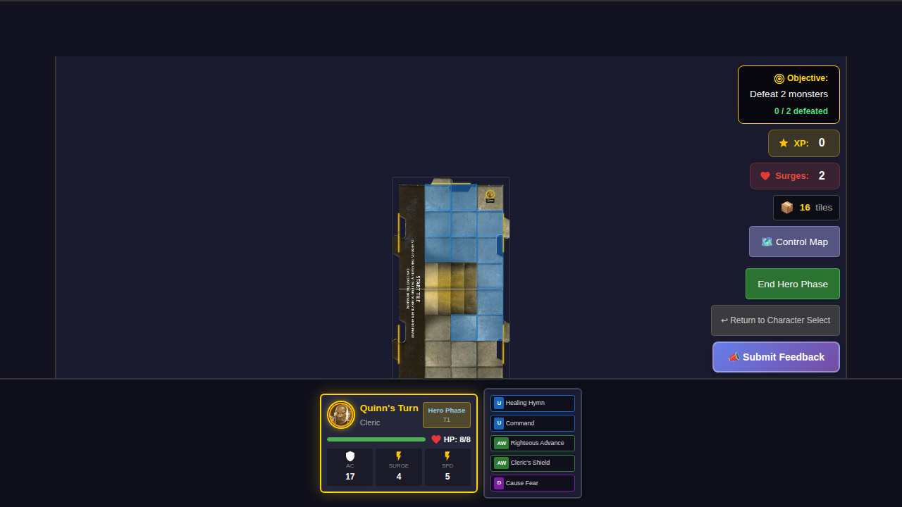
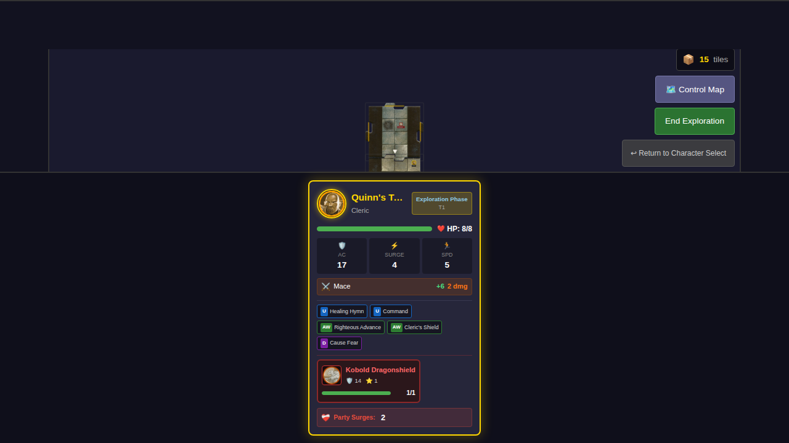
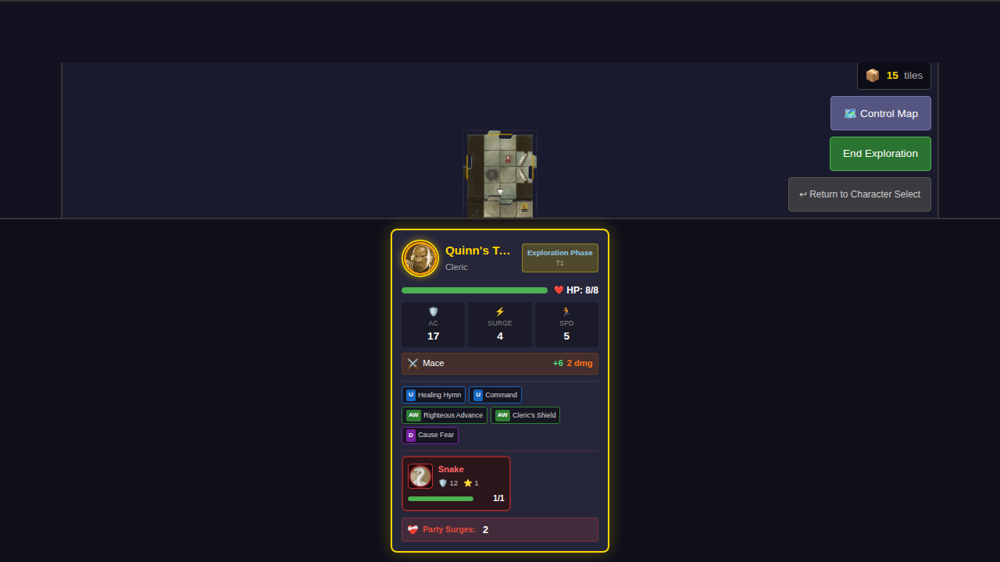

# E2E Test 040 - Monster Card Display

## User Story

As a player, when I draw a monster card during exploration, I want to see the monster card displayed persistently next to my character sheet throughout gameplay, so I can easily track the monsters I control without relying on temporary modal popups.

## Test Scenario

This test demonstrates the persistent monster card display feature, which shows monster cards in a compact format within the player's dashboard. The cards remain visible as long as the monsters are alive, providing persistent visual tracking of controlled monsters.

## Test Steps

1. **Character Selection** - Quinn is selected from the bottom edge and power cards are chosen
2. **Game Start** - The game begins with Quinn in hero phase
3. **Initial State** - Verify no monsters are present in the player card
4. **Exploration** - Quinn ends hero phase, triggering exploration and monster spawn
5. **Monster Display** - Monster card mini appears in player dashboard showing monster stats
6. **Villain Phase** - Card persists during villain phase when monster activates

## Screenshots

### Step 1: Initial Game State (No Monsters)

The game starts with Quinn's player card visible at the bottom. No monster cards are shown yet since no monsters have spawned.

**Verified:**
- Player card displays Quinn's name, stats, and power cards
- No monster card section visible
- Game is in hero phase

### Step 2: Monster Spawned During Exploration

After exploration triggers, a monster spawns and the compact monster card appears in Quinn's player dashboard below the power cards.

**Verified:**
- Monster card mini is visible in player card
- Monster portrait, name, AC, XP, and HP bar are displayed
- Monster is controlled by Quinn (controllerId matches)
- Game is in exploration phase

### Step 3: Monster Card Persists in Exploration Phase

The monster card remains visible in the player dashboard throughout the exploration phase, demonstrating persistent display.

**Verified:**
- Game is in exploration phase
- Monster card mini is still visible with all details (name, HP, stats)
- Monster information persists and remains associated with Quinn

## Key Features Demonstrated

1. **Persistent Display** - Monster cards remain visible throughout gameplay phases
2. **Compact Format** - Mini cards show essential info (portrait, name, AC, XP, HP) without cluttering UI
3. **Player Association** - Cards appear in the dashboard of the player who controls the monster
4. **Phase Independence** - Cards persist across hero, exploration, and villain phases

## Technical Implementation

- **Component**: `MonsterCardMini.svelte` - Compact monster card component
- **Integration**: Added to `PlayerCard.svelte` below treasure items
- **State Management**: Uses existing `controllerId` field from monster state
- **Data Flow**: `GameBoard` filters monsters by hero and passes to `PlayerCard`

## Programmatic Verification

Each screenshot includes programmatic checks that verify:
- DOM elements are present/visible as expected
- Text content matches expected values
- Redux store state is correct
- Monster data is properly associated with the controlling hero
