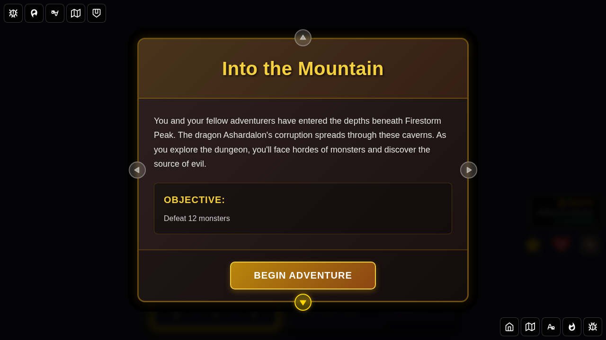
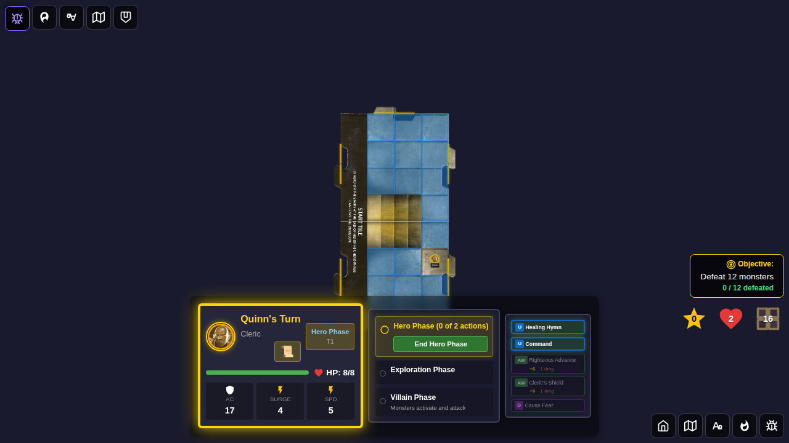

# E2E Test 041 - Submit Feedback Button

## User Story

As a player, I want to be able to submit feedback or report bugs directly from the game interface so that I can easily communicate issues or suggestions to the development team.

## Test Scenarios

This test verifies that:
1. The Submit Feedback button is visible and accessible on the game board
2. The button remains enabled when a modal is displayed (e.g. the scenario introduction)
3. The button can be clicked and triggers the feedback mechanism
4. Clicking the button opens a pre-filled GitHub issue form in a new tab

## Screenshots

### Screenshot 000: Game Board with Feedback Button

**What to verify:**
- The feedback button (bug icon) is visible in the corner controls (both NW and SE corners)
- The corner controls include multiple icon buttons: home, map control, font scale, scorch diagnostics, and feedback
- The feedback button has the correct aria-label "Submit Feedback"
- The button is enabled and clickable
- The game board is fully loaded with the start tile and hero token

**Programmatic checks:**
- Feedback button is visible
- Feedback button has aria-label "Submit Feedback"
- Feedback button is enabled
- Game board is visible
- Home button (part of corner controls) is visible

### Screenshot 001: Feedback Button with Modal Open

**What to verify:**
- The scenario introduction modal is visible
- The feedback button is still visible and enabled despite the modal being displayed
- The corner controls render above the modal overlay (z-index 2200, above all modals)

**Programmatic checks:**
- Scenario introduction modal is visible
- Feedback button is still visible
- Feedback button is still enabled

### Screenshot 002: After Feedback Button Click

**What to verify:**
- The game board remains visible (no navigation away from the game)
- The feedback button is still visible and ready for another click
- The game state has not changed after clicking the feedback button

**Programmatic checks:**
- Game board is still visible
- Feedback button is still visible
- window.open was called with GitHub issues URL
- URL contains the UserGenerated label

## Manual Verification

To manually verify this feature:

1. Start a game by selecting a hero and choosing power cards
2. On the game board, locate the feedback button (bug icon) in the corner controls (bottom-right or top-left corners)
3. Click the button
4. Verify that:
   - A new tab/window opens with the GitHub issue creation page
   - The issue form is pre-filled with:
     - A title including "User Feedback" and timestamp
     - A screenshot of the game board in the issue body
     - System information (browser, game version, screen resolution)
     - The "UserGenerated" label is applied
   - The screenshot clearly shows all game elements including newly-placed tiles (no faint/partial rendering)
   - The game continues running in the original tab (no interruption)

## Test Implementation Notes

- The test uses `window.open` spy to verify the button triggers the feedback mechanism
- Screenshot capture is performed by the `html2canvas` library in the component
- The test waits 2 seconds after button click to allow time for screenshot capture
- The actual GitHub issue form opening is prevented in tests to avoid creating real issues
