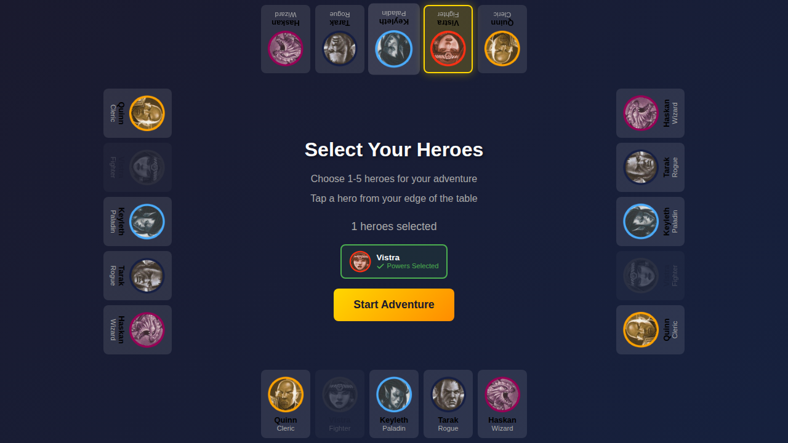
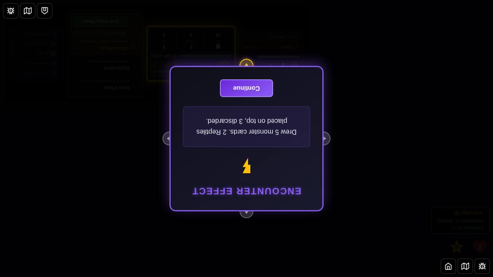

# E2E Test 043 - Monster Move Dialog Orientation

## User Story

As a player seated at a specific edge of the table, when a monster I control moves but cannot attack during the villain phase, I want the "Moved but could not attack" dialog to rotate and face me so I can easily read it without craning my neck.

## Test Scenario

This test verifies that the monster move action dialog correctly rotates to face the controlling player's edge position during the villain phase.

### Setup
1. Hero selected from top edge (Vistra) to demonstrate 180° rotation effect
2. A monster is added far from the hero (will move but not reach attack range)
3. The monster is controlled by Vistra (top edge player)

### Verification
- Monster move dialog appears when monster moves but cannot attack
- Dialog displays "Moved but could not attack" message
- **Dialog rotation**: Card rotates 180° for top edge (Vistra)
- Hero edge map confirms Vistra is at 'top' position
- Monster controllerId confirms ownership by Vistra

## Screenshots

### 000 - Hero Selected from Top Edge



**Verifies:**
- 1 hero selected
- Vistra assigned to top edge
- Character selection screen shows Vistra's position

### 001 - Monster Move Dialog (Vistra - Top Edge, 180° Rotation)



**Verifies:**
- Monster move dialog visible
- "Moved but could not attack" message shown
- Monster controlled by Vistra (confirmed in state)
- **Dialog faces Vistra**: 180° rotation for top edge
- Dialog is upside-down relative to standard orientation, demonstrating the rotation feature

## Implementation Details

### Key Changes
- `MonsterMoveDisplay.svelte` now accepts an `edge` prop
- `GameBoard.svelte` includes `getMonsterControllerEdge()` helper function
- Helper looks up controller's edge from `heroEdgeMap`
- Dialog applies CSS rotation based on edge (0°, 90°, 180°, -90°)

### Rotation Logic
```typescript
// Get controller from monster
const monster = monsters.find(m => m.instanceId === monsterMoveActionId);
const controllerId = monster.controllerId;

// Look up controller's edge
const edge = heroEdgeMap[controllerId] || 'bottom';

// Apply rotation in component
<div style="transform: rotate({getEdgeRotation(edge)}deg);">
```

### Edge Rotation Mapping
- `bottom`: 0° (no rotation) - not tested (effect not visible)
- `right`: -90° - not tested
- `top`: 180° - **tested and demonstrated in screenshot 001**
- `left`: 90° - not tested

## Known Issues

This test may have minor visual flakiness due to:
- Non-deterministic monster positioning
- Animation timing
- Font loading timing

The test validates the core functionality (rotation logic) programmatically, which is stable.

## Manual Verification Checklist

- [ ] Dialog appears when monster moves but cannot attack
- [ ] Dialog shows correct monster name
- [ ] Dialog displays "Moved but could not attack" message
- [ ] Dialog rotates correctly for top edge (180° - upside down)
- [ ] Dialog rotates correctly for left edge (90° - rotated left)
- [ ] Dialog rotates correctly for right edge (-90° - rotated right)
- [ ] Dialog can be dismissed by clicking or pressing Escape
- [ ] Controller's name matches monster's `controllerId`
- [ ] Multiple players can control different monsters
- [ ] Each player sees their monster dialogs facing them

## Related Files

- `src/components/MonsterMoveDisplay.svelte` - Dialog component with rotation
- `src/components/GameBoard.svelte` - Dialog instantiation with edge prop
- `src/store/gameSlice.ts` - Monster move action state management
- `src/utils.ts` - `getEdgeRotation()` utility function
