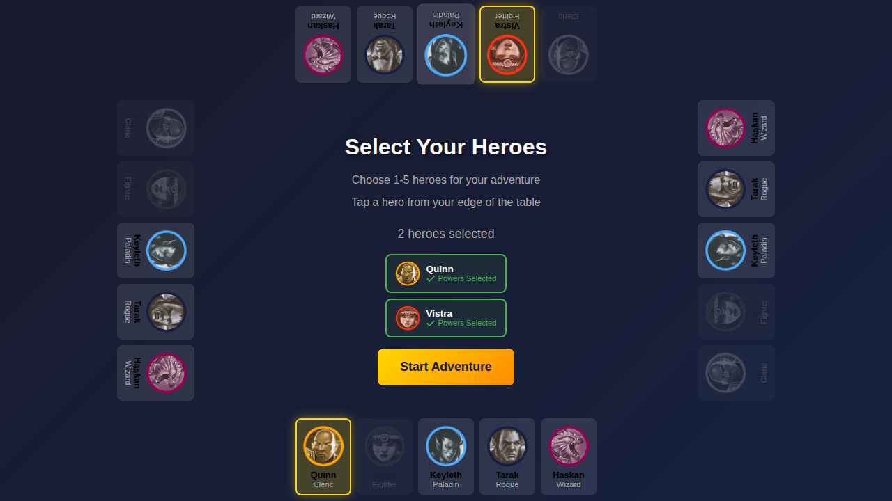
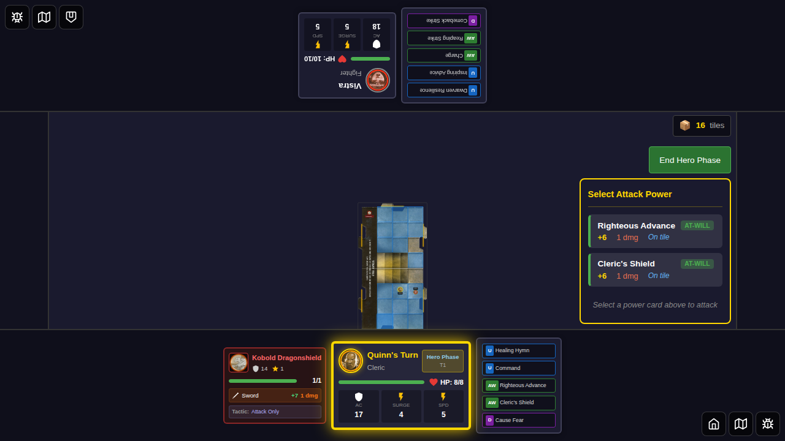
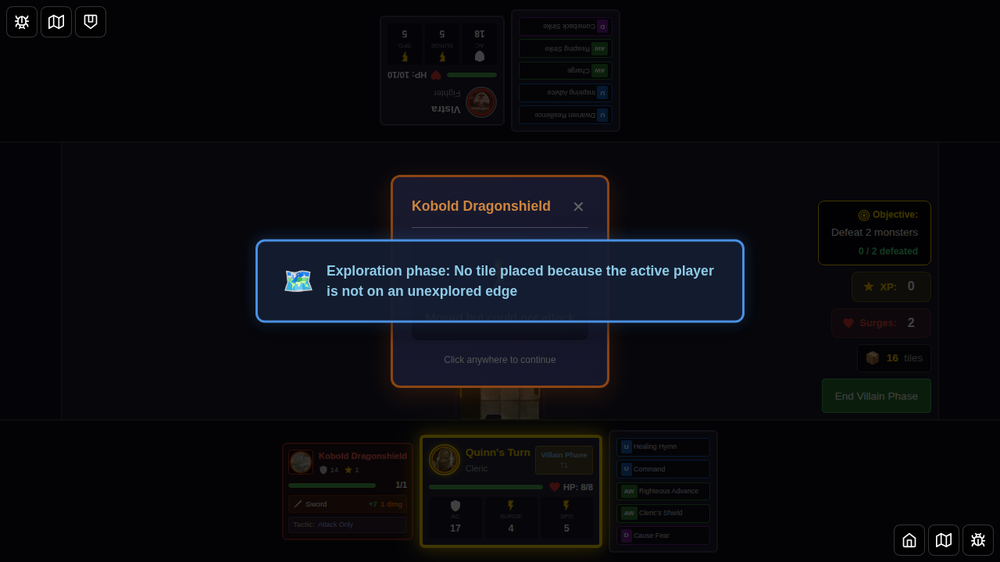

# E2E Test 043 - Monster Move Dialog Orientation

## User Story

As a player seated at a specific edge of the table, when a monster I control moves but cannot attack during the villain phase, I want the "Moved but could not attack" dialog to rotate and face me so I can easily read it without craning my neck.

## Test Scenario

This test verifies that the monster move action dialog correctly rotates to face the controlling player's edge position during the villain phase.

### Setup
1. Two heroes are selected from different edges:
   - Quinn from bottom edge
   - Vistra from top edge
2. A monster is added far from the hero (will move but not reach attack range)
3. The monster is controlled by Quinn (bottom edge player)

### Verification
- Monster move dialog appears when monster moves but cannot attack
- Dialog displays "Moved but could not attack" message
- **Dialog rotation**: Card rotates 0° for bottom edge (Quinn)
- Transform matrix values verify correct rotation

## Screenshots

### 000 - Heroes Selected from Different Edges



**Verifies:**
- 2 heroes selected
- Quinn assigned to bottom edge
- Vistra assigned to top edge

### 001 - Monster Positioned Far from Hero



**Verifies:**
- Monster spawned on board
- Monster controlled by Quinn
- Monster at distant position (0, 0)

### 002 - Monster Move Dialog (Quinn - Bottom Edge)



**Verifies:**
- Monster move dialog visible
- "Moved but could not attack" message shown
- Monster controlled by Quinn (confirmed in state)
- **Dialog faces Quinn**: No rotation (0°) for bottom edge
- Transform CSS matrix validates rotation

## Implementation Details

### Key Changes
- `MonsterMoveDisplay.svelte` now accepts an `edge` prop
- `GameBoard.svelte` includes `getMonsterControllerEdge()` helper function
- Helper looks up controller's edge from `heroEdgeMap`
- Dialog applies CSS rotation based on edge (0°, 90°, 180°, -90°)

### Rotation Logic
```typescript
// Get controller from monster
const monster = monsters.find(m => m.instanceId === monsterMoveActionId);
const controllerId = monster.controllerId;

// Look up controller's edge
const edge = heroEdgeMap[controllerId] || 'bottom';

// Apply rotation in component
<div style="transform: rotate({getEdgeRotation(edge)}deg);">
```

### Edge Rotation Mapping
- `bottom`: 0° (no rotation)
- `right`: -90°
- `top`: 180°
- `left`: 90°

## Manual Verification Checklist

- [ ] Dialog appears when monster moves but cannot attack
- [ ] Dialog shows correct monster name
- [ ] Dialog displays "Moved but could not attack" message
- [ ] Dialog rotates correctly for bottom edge (0°)
- [ ] Dialog can be dismissed by clicking or pressing Escape
- [ ] Controller's name matches monster's `controllerId`
- [ ] Multiple players can control different monsters
- [ ] Each player sees their monster dialogs facing them

## Related Files

- `src/components/MonsterMoveDisplay.svelte` - Dialog component with rotation
- `src/components/GameBoard.svelte` - Dialog instantiation with edge prop
- `src/store/gameSlice.ts` - Monster move action state management
- `src/utils.ts` - `getEdgeRotation()` utility function
