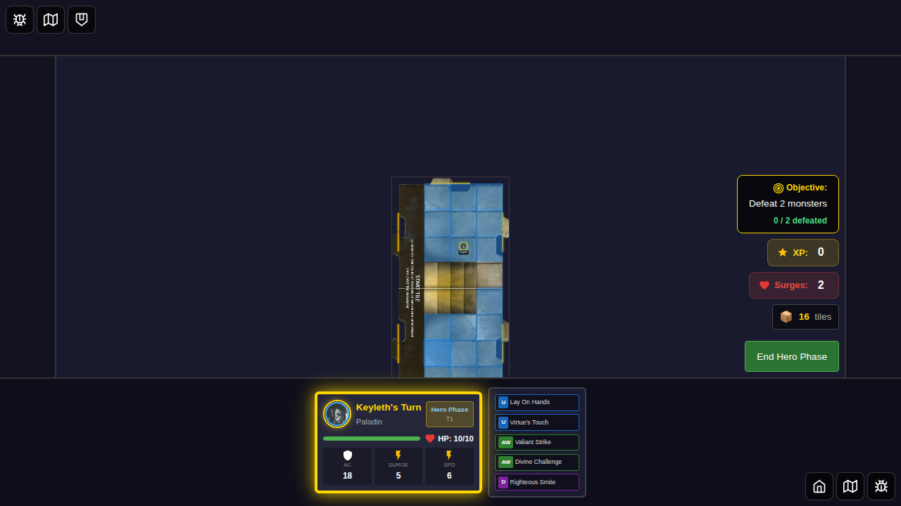
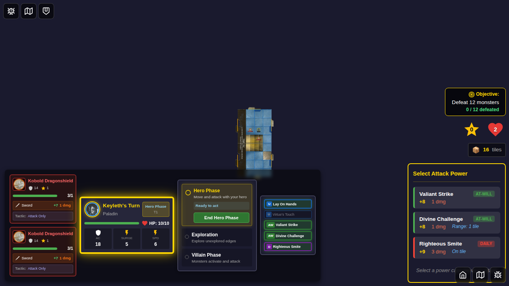
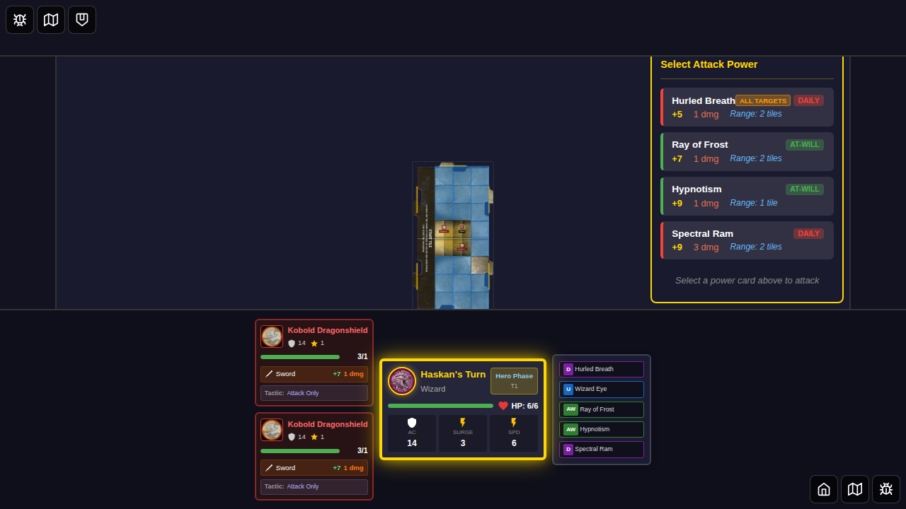
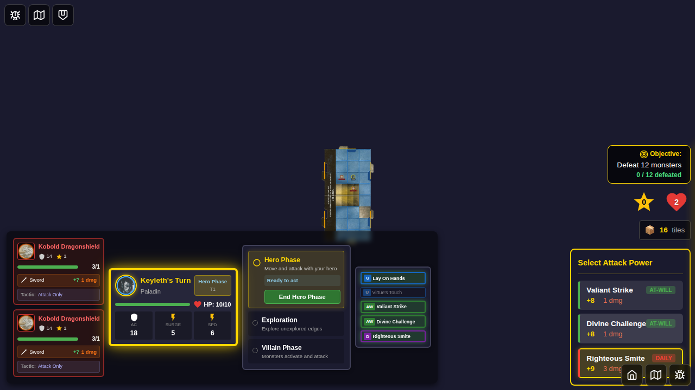
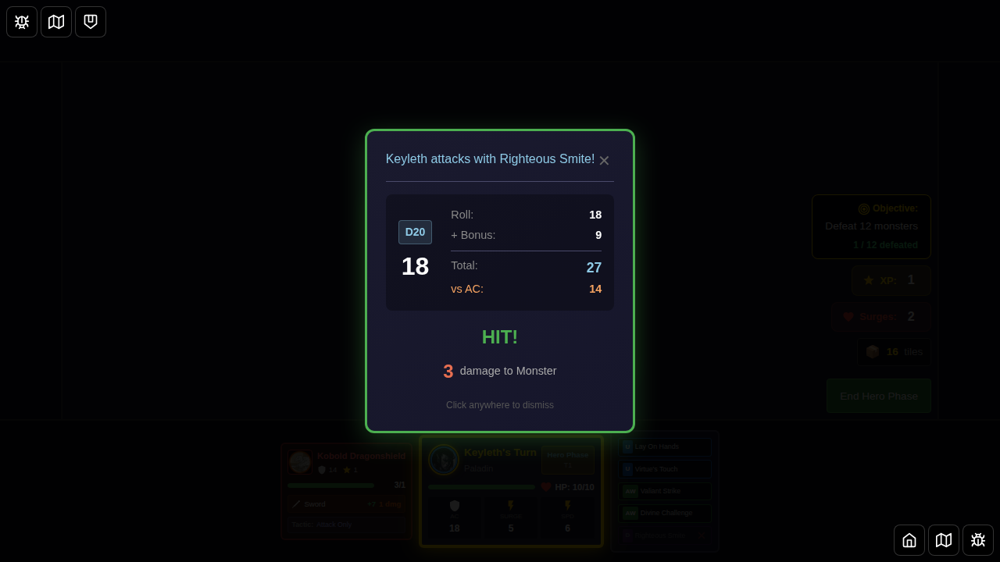
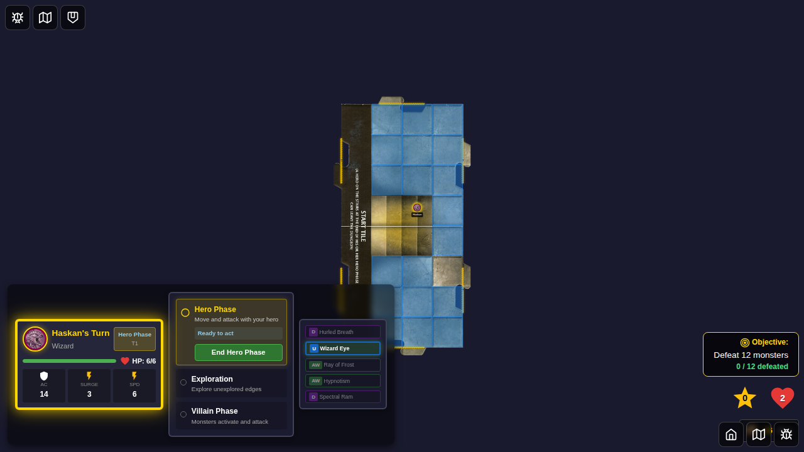
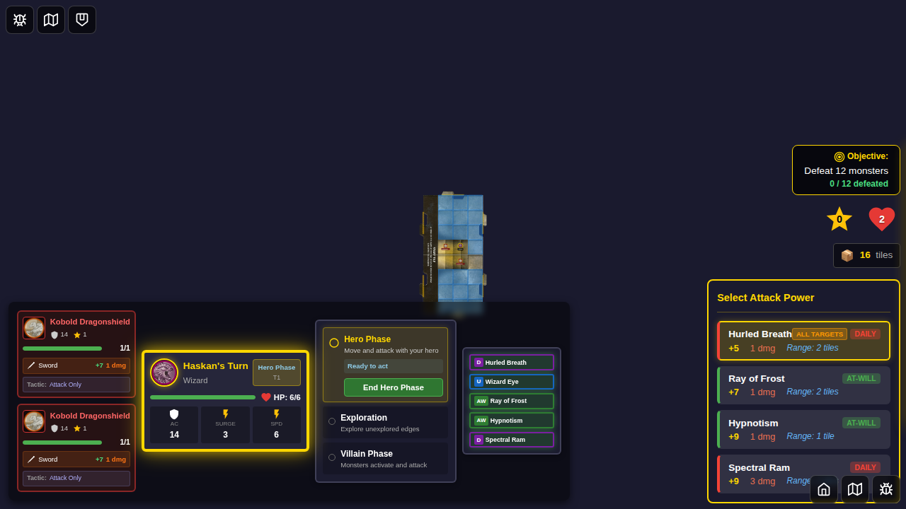
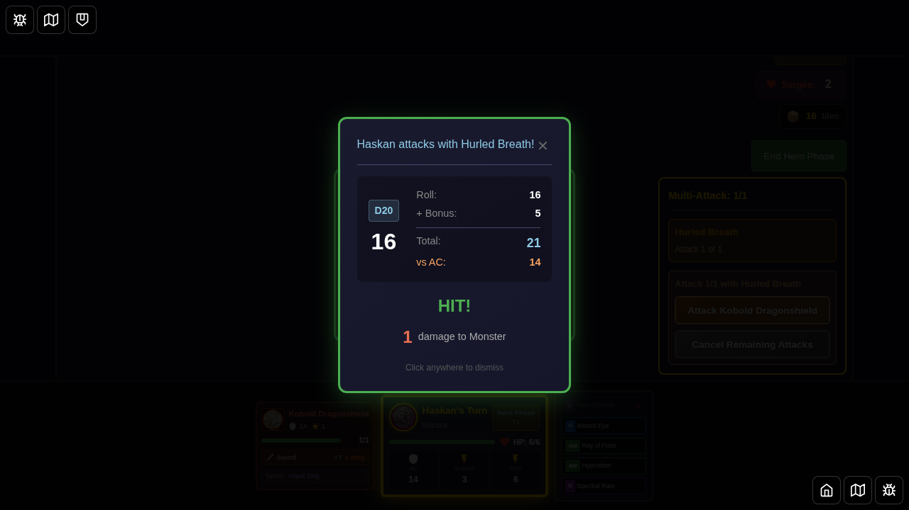
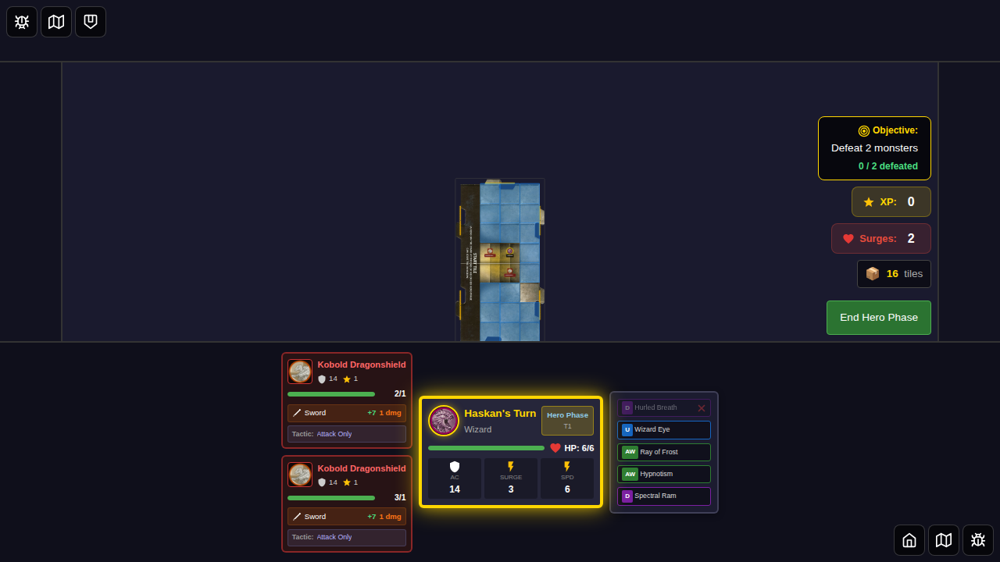

# E2E Test 044: Multi-Target Attacks

This test suite demonstrates multi-target attack capabilities in the game through the UI, specifically testing:
1. **Paladin Daily Power** - A daily power that can attack two adjacent monsters
2. **Hurled Breath (ID 41)** - Haskan's custom ability that attacks all monsters on a chosen tile within 2 tiles

## Test Coverage

### Test 1: Multi-Target Adjacent Attack (Paladin Daily)

**User Story**: As a Paladin player using Keyleth, I can use a daily power to attack two adjacent monsters sequentially.

**Attack Flow**:
1. Select Keyleth (Paladin) and start the game
2. Position hero with two adjacent monsters
3. Click on the daily power card in the attack panel
4. Select first target monster and see attack result
5. Select second target monster and see second attack result
6. Verify daily power is used (flipped)

### Test 2: Hurled Breath (ID 41) - Area Attack on Tile

**User Story**: As Haskan (Dragonborn Wizard), I can use Hurled Breath to target a tile and attack all monsters on that tile.

**Attack Flow**:
1. Select Haskan and start the game
2. Position hero with two monsters on the same tile (within range)
3. Click Hurled Breath card in the attack panel
4. Select the tile/monster group to attack
5. See attack results for each monster
6. Verify Hurled Breath is used (flipped)

## Screenshots

---

## Test 1: Multi-Target Adjacent Attack (Paladin Daily Power)

This section shows the complete attack flow for a Paladin using a daily power to attack two adjacent monsters sequentially.

### Step 1: Game Initialization with Keyleth

The game starts with Keyleth (Paladin) as the selected hero. The hero is positioned on the game board and ready to take actions during the Hero Phase.

### Step 2: Two Monsters Positioned Adjacent to Hero

Two kobold monsters are positioned adjacent to Keyleth, setting up the scenario for a multi-target attack. Both monsters are within melee range.

### Step 3: Power Card Attack Panel Displayed

The power card attack panel appears, showing all available attack options. The daily power card is visible among the at-will attack cards, ready to be selected.

### Step 4: Daily Power Card Selected - Target Selection UI Shown

The daily power card is clicked and selected (highlighted). The target selection UI appears, showing both adjacent monsters as available targets. The player can now choose which monster to attack first.

### Step 5: First Target Attack Result

After selecting the first target, the combat result modal displays showing a successful hit. The attack roll, bonus, and damage are shown. This demonstrates the first attack of the multi-target sequence.

### Step 6: Multi-Target Attack Complete

The multi-target attack sequence is complete. Both monsters have been attacked, and the daily power card has been used (flipped). The game board shows the final state after the attack.

---

## Test 2: Hurled Breath Area Attack (Haskan's Custom Ability)

This section shows the complete attack flow for Haskan using Hurled Breath to attack all monsters on a chosen tile.

### Step 1: Game Initialization with Haskan

The game starts with Haskan (Dragonborn Wizard) as the selected hero. Haskan has the Hurled Breath custom ability which allows area attacks on a tile.

### Step 2: Two Monsters on Same Tile

Two kobold monsters are positioned on the same tile, within 2 tiles of Haskan's position. This sets up the scenario for an area attack using Hurled Breath.

### Step 3: Power Card Attack Panel with Hurled Breath

The power card attack panel appears, showing Hurled Breath (ID 41) as one of the available attack options. Hurled Breath is Haskan's custom ability that attacks all monsters on a chosen tile.

### Step 4: Hurled Breath Selected - Target Selection Shown

Hurled Breath is clicked and selected (highlighted). The target selection UI appears, showing the tile/monster group that can be targeted. Unlike single-target attacks, this will attack all monsters on the selected tile.

### Step 5: First Monster Attack Result

The combat result modal displays showing a successful hit on the first monster in the area. Since Hurled Breath attacks each monster on the tile, this is the first of the attack results.

### Step 6: Area Attack Complete

The area attack is complete. All monsters on the targeted tile have been attacked, and the Hurled Breath custom ability has been used (flipped). The game board shows the final state after the area attack.

---

## Implementation Notes

These tests focus on verifying the game state setup for multi-target attacks:

1. **Arcing Strike** allows attacking "one or two adjacent Monsters" - the test verifies that:
   - Multiple monsters can be positioned adjacent to the hero
   - The game state correctly tracks these monsters
   - Power card ID 25 (Arcing Strike) is available to Paladin heroes

2. **Hurled Breath** allows attacking "each Monster on that tile" within 2 tiles - the test verifies that:
   - Multiple monsters can exist on the same tile
   - The game state correctly tracks monsters on the same tile  
   - Power card ID 41 (Hurled Breath) is Haskan's custom ability

## Power Card Details

### Arcing Strike (ID: 25)
- **Type**: Daily
- **Class**: Paladin
- **Description**: "You swing your weapon in a wide arc."
- **Rule**: "Attack one or two adjacent Monsters."
- **Attack Bonus**: +9
- **Damage**: 3

### Hurled Breath (ID: 41)
- **Type**: Daily (Custom Ability)
- **Class**: Dragonborn
- **Description**: "You hurl your draconic breath, engulfing your foes a short distance away."
- **Rule**: "Choose a tile within 2 tiles of you. Attack each Monster on that tile. This attack does not count as an attack action."
- **Attack Bonus**: +5
- **Damage**: 1

## Manual Verification Checklist

- [x] Keyleth can be selected as a hero
- [x] Haskan can be selected as a hero
- [x] Two monsters can be positioned adjacent to a hero
- [x] Two monsters can be positioned on the same tile
- [x] Game board displays correctly with multiple monsters
- [x] Hero tokens are positioned correctly
- [x] Monster tokens are visible on the board

## Related Files

- Test implementation: `044-multi-target-attacks.spec.ts`
- Power card definitions: `src/store/powerCards.ts`
- Action card parser: `src/store/actionCardParser.ts` (handles multi-target logic)
- Power card attack panel: `src/components/PowerCardAttackPanel.svelte` (displays multi-target indicators)

## Future Enhancements

To fully test the complete multi-target attack flow, future tests should include:
- Actual UI interaction with power card selection
- Target selection UI for multi-target attacks
- Sequential attack resolution for multiple targets
- Damage application to each targeted monster
- XP and treasure rewards for defeating multiple monsters
