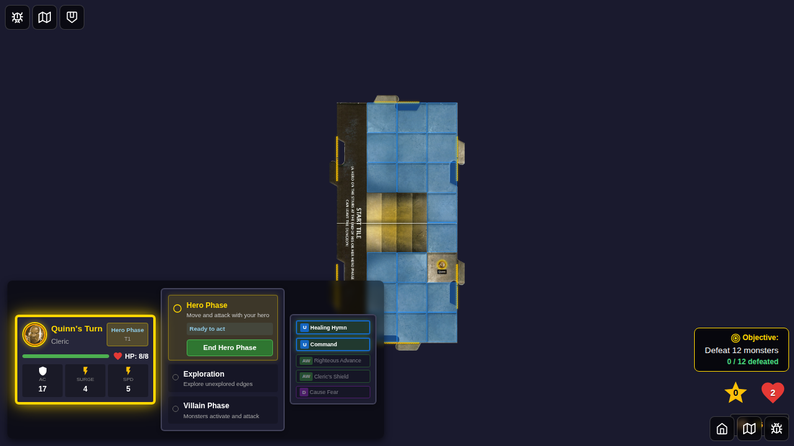
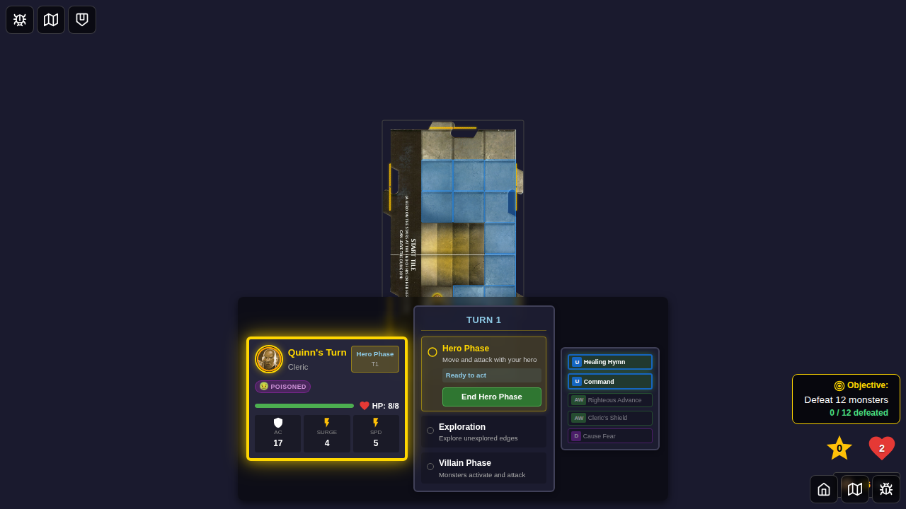
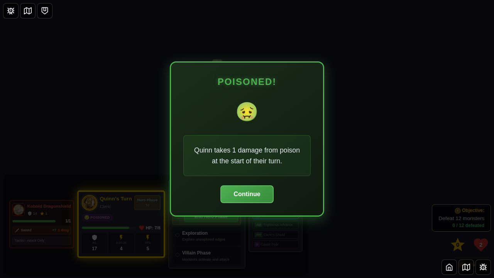
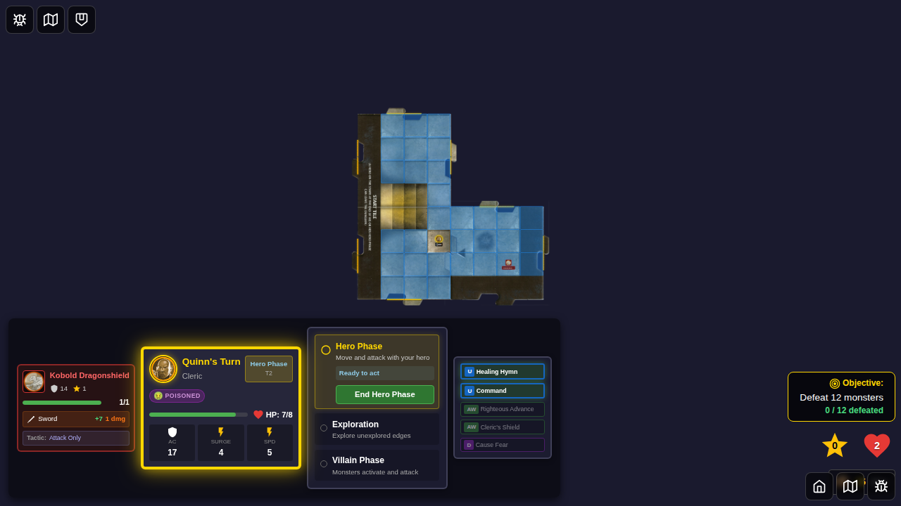
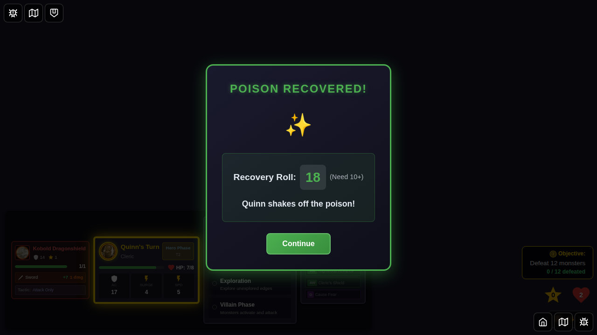
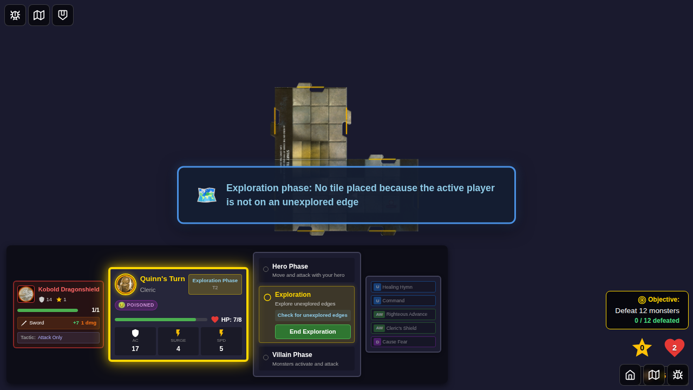

# 045 - Poisoned Status Effect

## User Story

As a player, when my hero is poisoned, they should:
1. Take 1 damage at the start of their turn (with a notification)
2. Have the opportunity to recover at the end of their turn by rolling 10+ on a d20 (with a notification showing the result)

## Test Sequence

### Screenshot 000: Initial State (No Poison)

**What it shows:**
- Hero Quinn selected and game started
- Hero has no status effects
- Player card shows no conditions

**Manual verification:**
- [ ] Hero is on the board and visible
- [ ] No status icons are shown on the player card
- [ ] HP is at maximum

### Screenshot 001: Poisoned Status Applied

**What it shows:**
- Poisoned status has been applied to the hero
- Player card shows the poisoned condition icon (🤢)

**Manual verification:**
- [ ] Poisoned icon (🤢) is visible in the conditions section
- [ ] Icon is clearly displayed and readable
- [ ] Hero's HP is still unchanged at this point

### Screenshot 002: Poisoned Damage Notification

**What it shows:**
- Poisoned damage notification appears at the start of the hero's next turn
- Notification shows "Poisoned!" title
- Message indicates the hero takes 1 damage from poison
- Green-themed notification with poison icon (🤢)

**Manual verification:**
- [ ] Notification overlay covers the screen with semi-transparent background
- [ ] Title "Poisoned!" is clearly visible
- [ ] Message says the hero takes 1 damage from poison
- [ ] Poison icon is animated with a pulsing effect
- [ ] "Continue" button is present and clickable
- [ ] Notification is facing the current player

### Screenshot 003: After Poison Damage

**What it shows:**
- Notification dismissed
- Hero's HP has been reduced by 1
- Hero is still poisoned (icon still visible)

**Manual verification:**
- [ ] Hero's current HP is 1 less than maximum
- [ ] Poisoned status icon is still displayed
- [ ] Game continues normally

### Screenshot 004: Poison Recovery Notification

**What it shows:**
- Poison recovery notification appears after clicking "End Hero Phase"
- Shows the d20 roll result
- Displays whether recovery was successful (10+ = success)
- Title shows either "Poison Recovered!" (success) or "Still Poisoned" (failure)
- Roll result is prominently displayed with "(Need 10+)" text

**Manual verification:**
- [ ] Notification overlay is visible
- [ ] Title indicates recovery status
- [ ] Roll result is clearly displayed with large font
- [ ] "(Need 10+)" text explains the DC
- [ ] Message confirms the outcome
- [ ] Icon changes based on success (✨) or failure (🤢)
- [ ] "Continue" button is present
- [ ] Notification uses appropriate color scheme (green for success, red for failure)
- [ ] Notification is facing the current player

### Screenshot 005: After Recovery Attempt

**What it shows:**
- Recovery notification dismissed
- Game has moved to exploration phase
- If recovery was successful, poisoned status is removed
- If recovery failed, poisoned status remains

**Manual verification:**
- [ ] Game is in exploration phase
- [ ] If roll was 10+: poisoned icon is no longer visible
- [ ] If roll was <10: poisoned icon is still visible
- [ ] Game continues normally

## Test Coverage

This test verifies:
- ✅ Poisoned status can be applied to a hero
- ✅ Poisoned damage (1 HP) is applied at start of turn
- ✅ Poisoned damage notification is displayed and user-facing
- ✅ Poisoned damage notification can be dismissed
- ✅ HP is correctly reduced after poisoned damage
- ✅ Recovery roll is attempted when ending hero phase while poisoned
- ✅ Recovery notification shows roll result and outcome
- ✅ Recovery notification is user-facing
- ✅ Recovery notification can be dismissed
- ✅ Poisoned status is removed on successful roll (10+)
- ✅ Poisoned status remains on failed roll (<10)
- ✅ Game continues to next phase after recovery notification is dismissed

## Implementation Details

The poisoned status effect is implemented with:
- `processStatusEffectsStartOfTurn()` - Applies 1 damage from poisoned at start of turn
- `attemptPoisonRecovery()` - Rolls d20 and removes poisoned on 10+
- `PoisonedDamageNotification` component - Shows damage notification
- `PoisonRecoveryNotification` component - Shows recovery roll result
- Notifications are triggered automatically at appropriate turn phases
- Both notifications require user interaction (click "Continue") to proceed
