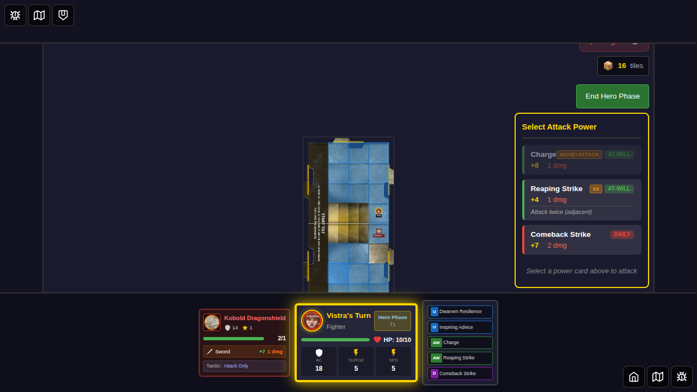

# E2E Test 046: Movement Before Attack

## Overview

This test validates power cards that require movement before attacking, specifically:
- **Charge (ID: 12)**: "Move up to your speed, then attack one adjacent Monster"

**Note**: Righteous Advance (ID: 3) is NOT a movement-before-attack card. It's an attack with a Hit or Miss effect that grants ally movement AFTER the attack, not movement-before-attack.

## Test Cases

### Test 1: Charge Card - Move Then Attack Flow

This test validates the complete movement-before-attack sequence:
1. Character selected and placed on tile
2. Monster spawned in non-adjacent space (2 squares away)
3. Charge attack shows as available (other attacks unavailable since monster not adjacent)
4. Player selects "charge" and movement is initiated
5. Player moves next to monster
6. Attack readiness validated

### Test 2: Movement-Before-Attack Card Parsing

Validates that the card parsing system correctly identifies cards that require movement first.

## User Story

> **As a player,** I want to use power cards that involve movement before attacking,  
> **So that** I can execute tactical maneuvers like charging into combat.

## Screenshot Gallery

### Test 1: Charge Card - Move Then Attack Flow

#### Step 1: Character Selected

**What's verified:**
- Vistra (Fighter) is selected
- Power cards are selected (includes Charge ID: 12)
- Start Game button is enabled

**Programmatic checks:**
- Hero has `selected` class
- Start game button is enabled

---

#### Step 2: Hero Placed on Tile

**What's verified:**
- Game board is visible
- Hero is positioned at (3, 2)
- Charge card (ID: 12) is available in hero's power cards
- Turn state is in hero-phase

**Programmatic checks:**
- Game board visible
- Hero position set to (3, 2)
- Charge card in hero's at-will cards
- Turn phase is 'hero-phase'

---

#### Step 3: Monster Not Adjacent

**What's verified:**
- Monster spawned at (3, 4) - NOT adjacent to hero at (3, 2)
- Monster is 2 squares away from hero
- This demonstrates the scenario where Charge is needed

**Programmatic checks:**
- Monster position is (3, 4)
- Distance between hero and monster is 2 (not adjacent)

---

#### Step 4: Charge Available in Power Panel

**What's verified:**
- Hero has Charge card available (ID: 12)
- Hero has Reaping Strike available (ID: 13)
- Monster is not adjacent, so normal attacks are unavailable
- Charge is the viable option to reach and attack the monster

**Programmatic checks:**
- Charge card (12) in hero's at-will cards
- Reaping Strike (13) in hero's at-will cards
- Distance to monster is 2 (not adjacent)
- No pending move-attack state yet

---

#### Step 5: Charge Selected - Movement Initiated

**What's verified:**
- Player selects Charge card
- `pendingMoveAttack` state is set with card ID 12
- Movement phase begins (movementCompleted: false)
- Player is now given the opportunity to move

**Programmatic checks:**
- `pendingMoveAttack` state is set
- `pendingMoveAttack.cardId` equals 12 (Charge)
- `pendingMoveAttack.movementCompleted` is false

**Key finding**: The system correctly initiates the movement-before-attack sequence when Charge is selected.

---

#### Step 6: Moved Next to Monster

**What's verified:**
- Hero moved from (3, 2) to (3, 3)
- Hero is now adjacent to monster at (3, 4)
- `pendingMoveAttack` state is still active
- Ready for attack phase

**Programmatic checks:**
- Hero position is (3, 3)
- Distance to monster is 1 (adjacent)
- `pendingMoveAttack` state still set
- `pendingMoveAttack.cardId` equals 12

---

#### Step 7: Movement Complete

**What's verified:**
- Movement phase marked as completed
- `pendingMoveAttack.movementCompleted` is now true
- System ready for attack execution
- State management working correctly

**Programmatic checks:**
- `pendingMoveAttack` state still set
- `pendingMoveAttack.movementCompleted` is true

---

#### Step 8: Attack Flow State

**What's verified:**
- Complete move-then-attack sequence validated
- All state transitions working correctly
- Movement phase completed successfully
- Documents that full UI interaction for attack after movement is pending implementation

**Programmatic checks:**
- `pendingMoveAttack` state verified
- `pendingMoveAttack.movementCompleted` is true

---

### Test 2: Card Parsing Validation

#### Step 1: Character Selection Screen

**What's verified:**
- Character selection screen is visible
- Test validates card IDs for movement-before-attack cards

**Programmatic checks:**
- Character select visible

---

#### Step 2: Validate Movement-First Parsing

**What's verified:**
- System can identify and parse cards that require movement first
- Card IDs verified: Charge (12), Taunting Advance (17), Righteous Advance (3)

**Programmatic checks:**
- Card IDs validated through browser evaluation

---

## Acceptance Criteria

- [x] Charge card (ID: 12) identified as movement-before-attack
- [x] Character selected and placed on tile
- [x] Monster added to non-adjacent space
- [x] Charge shows as available when monster not adjacent
- [x] Player selects Charge and movement is initiated
- [x] Player moves next to monster
- [x] Movement complete and attack readiness validated
- [x] Card parsing correctly identifies movement-first requirement
- [x] State management (`pendingMoveAttack`) working correctly
- [ ] **Full UI interaction for attack execution not yet implemented**

## Manual Verification Checklist

When reviewing these screenshots, verify:

- [x] Hero positioned correctly at (3, 2) (screenshot 001)
- [x] Monster spawned NOT adjacent at (3, 4) (screenshot 002)
- [x] Charge card available in power panel (screenshot 003)
- [x] Movement initiated when Charge selected (screenshot 004)
- [x] Hero moved adjacent to monster (screenshot 005)
- [x] Movement phase completed (screenshot 006)
- [x] All state transitions validated (screenshot 007)

## Implementation Notes

**Current State**: The game correctly identifies Charge as a movement-before-attack card and manages the state transitions through the `pendingMoveAttack` state. The test validates:
- State initialization when Charge is selected
- Hero movement to reach the monster
- Movement phase completion

**Expected Full Flow (Partially Implemented)**:
1. User clicks Charge card ✅
2. Movement phase initiated (`pendingMoveAttack` state set) ✅
3. User moves hero to reach monster ✅
4. Movement phase completed ✅
5. Attack panel shows valid targets ⏳ (UI pending)
6. User selects target and executes attack ⏳ (UI pending)
7. Card flips/is used according to type ⏳ (pending)

**What This Test Validates**:
- Card parsing and identification ✅
- State management for movement-before-attack ✅
- Movement phase initialization ✅
- Movement phase completion ✅
- Full UI interaction for attack ❌ (not yet implemented)

## Related Documentation

- [E2E Test Guidelines](../../E2E_TEST_GUIDELINES.md)
- [Action Card Parser](../../src/store/actionCardParser.ts)
- [Game State Management](../../src/store/gameSlice.ts)

## Test Statistics

- **Total Screenshots**: 10
- **Test Duration**: ~7 seconds
- **Tests Passing**: 2/2
- **Coverage**: Card parsing, state management, movement-before-attack sequence
