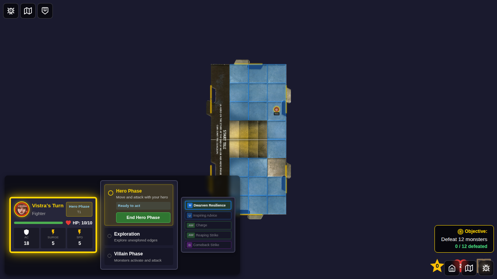
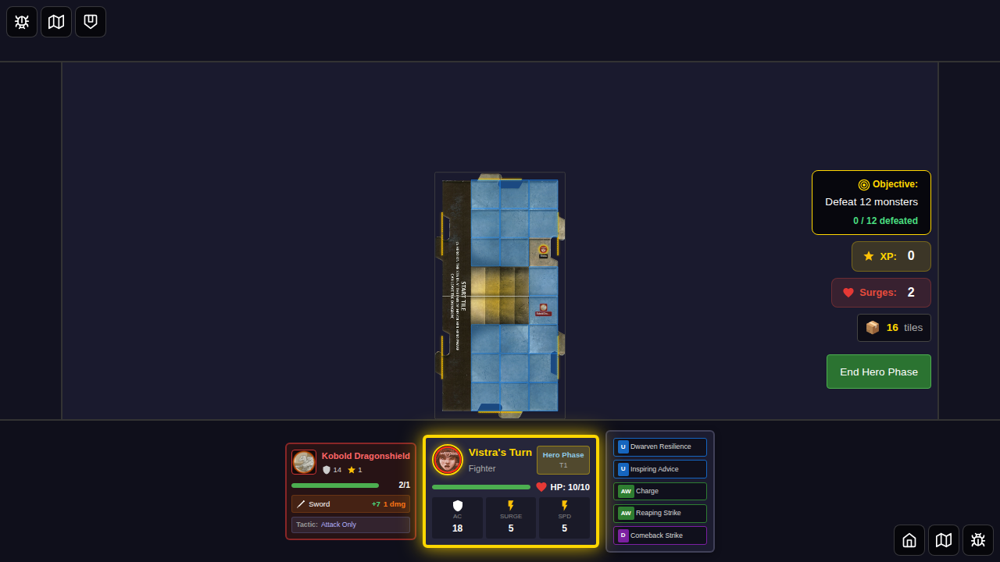
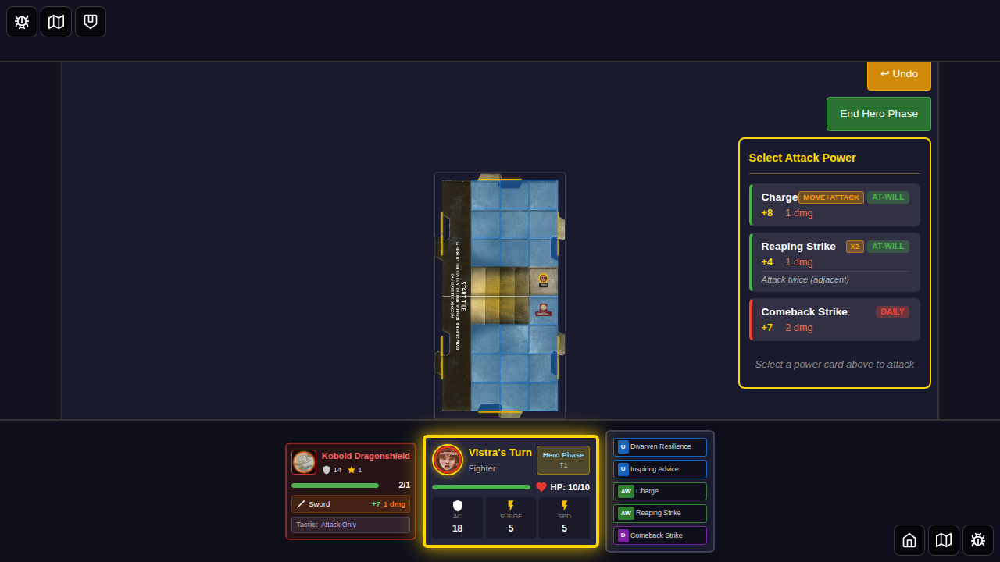
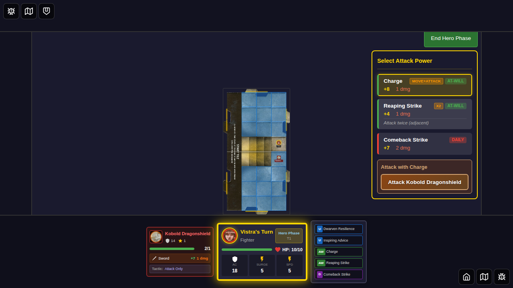

# E2E Test 046: Movement Before Attack

## Overview

This test validates power cards that require movement before attacking, specifically:
- **Charge (ID: 12)**: "Move up to your speed, then attack one adjacent Monster"

**Note**: Righteous Advance (ID: 3) is NOT a movement-before-attack card. It's an attack with a Hit or Miss effect that grants ally movement AFTER the attack, not movement-before-attack.

## Test Cases

### Test 1: Charge Card - Move Then Attack Flow (Using UI Interactions)

This test validates the complete movement-before-attack sequence using UI interactions:
1. Character selected and placed on tile
2. Monster spawned in non-adjacent space (2 squares away)
3. Player clicks on tile to initiate movement (using UI)
4. Movement overlay shows available squares (UI feedback)
5. Player clicks on square adjacent to monster (using UI)
6. Hero moves to new position
7. Attack panel becomes visible after movement
8. Player clicks Charge card to select it (using UI)
9. Player clicks on monster target to attack (using UI)

### Test 2: Movement-Before-Attack Card Parsing

Validates that the card parsing system correctly identifies cards that require movement first.

## User Story

> **As a player,** I want to use power cards that involve movement before attacking,  
> **So that** I can execute tactical maneuvers like charging into combat by using the game's UI to move and attack.

## Screenshot Gallery

### Test 1: Charge Card - Move Then Attack Flow

#### Step 1: Character Selected

**What's verified:**
- Vistra (Fighter) is selected
- Power cards are selected (includes Charge ID: 12)
- Start Game button is enabled

**Programmatic checks:**
- Hero has `selected` class
- Start game button is enabled

---

#### Step 2: Hero Placed on Tile

**What's verified:**
- Game board is visible
- Hero is positioned at (3, 2)
- Charge card (ID: 12) is available in hero's power cards
- Turn state is in hero-phase

**Programmatic checks:**
- Game board visible
- Hero position set to (3, 2)
- Charge card in hero's at-will cards
- Turn phase is 'hero-phase'

---

#### Step 3: Monster Not Adjacent

**What's verified:**
- Monster spawned at (3, 4) - NOT adjacent to hero at (3, 2)
- Monster is 2 squares away from hero
- This demonstrates the scenario where Charge is needed

**Programmatic checks:**
- Monster position is (3, 4)
- Distance between hero and monster is 2 (not adjacent)

---

#### Step 4: Charge Available in Power Panel

**What's verified:**
- Hero has Charge card available (ID: 12)
- Hero has Reaping Strike available (ID: 13)
- Monster is not adjacent, so player needs to move first

**Programmatic checks:**
- Charge card (12) in hero's at-will cards
- Reaping Strike (13) in hero's at-will cards
- Distance to monster is 2 (not adjacent)

---

#### Step 5: Movement UI Shown

**What's verified:**
- Player clicked on start tile (using UI)
- Movement overlay is visible
- Available movement squares are shown
- Player can see where they can move

**Programmatic checks:**
- Movement overlay visible
- Move squares count > 0

**Key finding**: The movement UI is triggered by clicking on the tile, showing all available movement squares.

---

#### Step 6: Moved Next to Monster

**What's verified:**
- Player clicked on square (3, 3) using movement UI
- Hero moved from (3, 2) to (3, 3)
- Hero is now adjacent to monster at (3, 4)
- Movement overlay has closed

**Programmatic checks:**
- Hero position is (3, 3)
- Distance to monster is 1 (adjacent)

---

#### Step 7: Attack Panel After Movement

**What's verified:**
- After movement, attack panel is now visible
- Charge card (ID: 12) is available for selection
- Hero is adjacent to monster, so attacks are now possible

**Programmatic checks:**
- Attack panel visible
- Charge card (12) visible in attack panel

---

#### Step 8: Charge Card Selected

**What's verified:**
- Player clicked on Charge card (using UI)
- Charge card shows as selected
- Ready for target selection

**Programmatic checks:**
- Charge card has `selected` class

---

#### Step 9: Attack Target Available

**What's verified:**
- Target selection UI is shown
- Monster target is available to click
- Player can complete the attack by clicking on the monster

**Programmatic checks:**
- Target selection visible
- Attack target for kobold-far is visible

---

### Test 2: Card Parsing Validation

#### Step 1: Character Selection Screen

**What's verified:**
- Character selection screen is visible
- Test validates card IDs for movement-before-attack cards

**Programmatic checks:**
- Character select visible

---

#### Step 2: Validate Movement-First Parsing

**What's verified:**
- System can identify and parse cards that require movement first
- Card IDs verified: Charge (12), Taunting Advance (17), Righteous Advance (3)

**Programmatic checks:**
- Card IDs validated through browser evaluation

---

## Acceptance Criteria

- [x] Charge card (ID: 12) identified as movement-before-attack
- [x] Character selected and placed on tile
- [x] Monster added to non-adjacent space
- [x] Player uses UI to initiate movement (clicks on tile)
- [x] Movement UI shows available squares
- [x] Player clicks on square to move adjacent to monster (using UI)
- [x] Attack panel appears after movement
- [x] Player clicks Charge card to select it (using UI)
- [x] Player clicks on monster to attack (using UI)
- [x] Card parsing correctly identifies movement-first requirement
- [x] All actions use UI interactions (except monster placement)

## Manual Verification Checklist

When reviewing these screenshots, verify:

- [x] Hero positioned correctly at (3, 2) (screenshot 001)
- [x] Monster spawned NOT adjacent at (3, 4) (screenshot 002)
- [x] Movement UI appears when tile is clicked (screenshot 004)
- [x] Hero moved to (3, 3) using movement UI (screenshot 005)
- [x] Attack panel visible after movement (screenshot 006)
- [x] Charge card selectable via UI click (screenshot 007)
- [x] Target selection available via UI (screenshot 008)

## Implementation Notes

**Current State**: The test uses only UI interactions for the player actions:
- Clicking on the tile to initiate movement ✅
- Clicking on movement squares to move ✅
- Clicking on Charge card to select it ✅
- Clicking on monster target to attack ✅

**UI Interactions Used**:
1. Click on `[data-testid="start-tile"]` to show movement overlay
2. Click on `[data-testid="move-square"]` with position to move hero
3. Click on `[data-testid="attack-card-12"]` to select Charge
4. Click on `[data-testid="attack-target-{instanceId}"]` to attack

**Programmatic Actions (Setup Only)**:
- Initial hero placement (acceptable for test setup, similar to test 006)
- Monster placement (explicitly excepted per requirements)

**What This Test Validates**:
- Card parsing and identification ✅
- UI-driven movement flow ✅
- UI-driven attack selection ✅
- Complete move-then-attack sequence using UI ✅

## Related Documentation

- [E2E Test Guidelines](../../E2E_TEST_GUIDELINES.md)
- [Action Card Parser](../../src/store/actionCardParser.ts)
- [Game State Management](../../src/store/gameSlice.ts)

## Test Statistics

- **Total Screenshots**: 11
- **Test Duration**: ~18 seconds
- **Tests Passing**: 2/2
- **Coverage**: UI-driven movement, card selection, and attack flow
