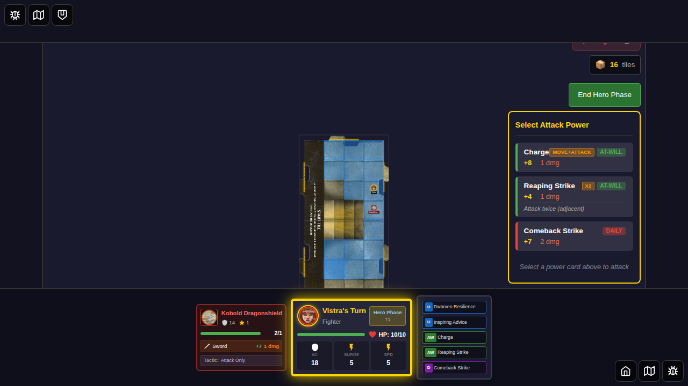
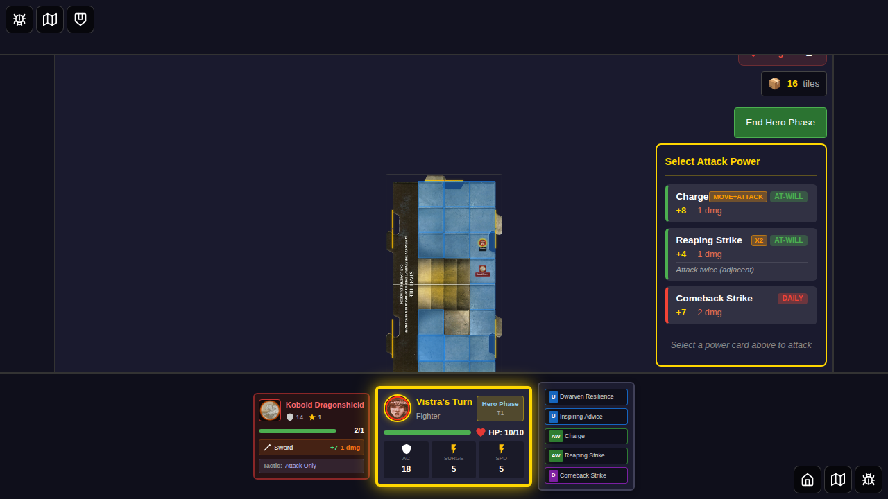
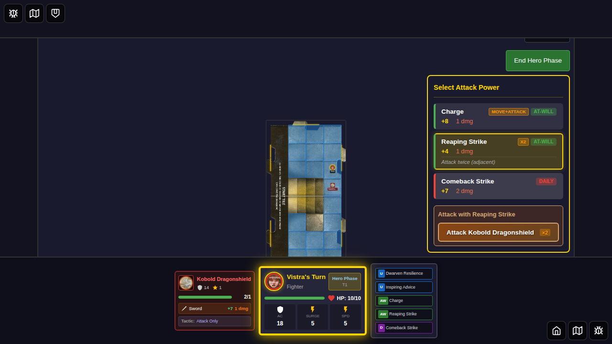
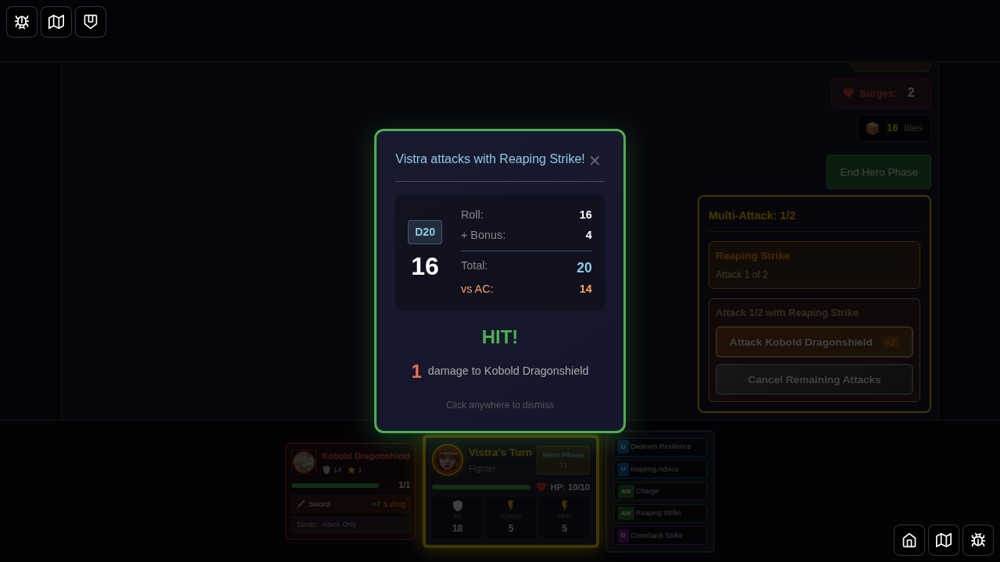
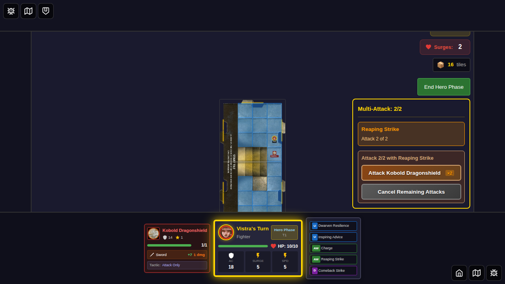
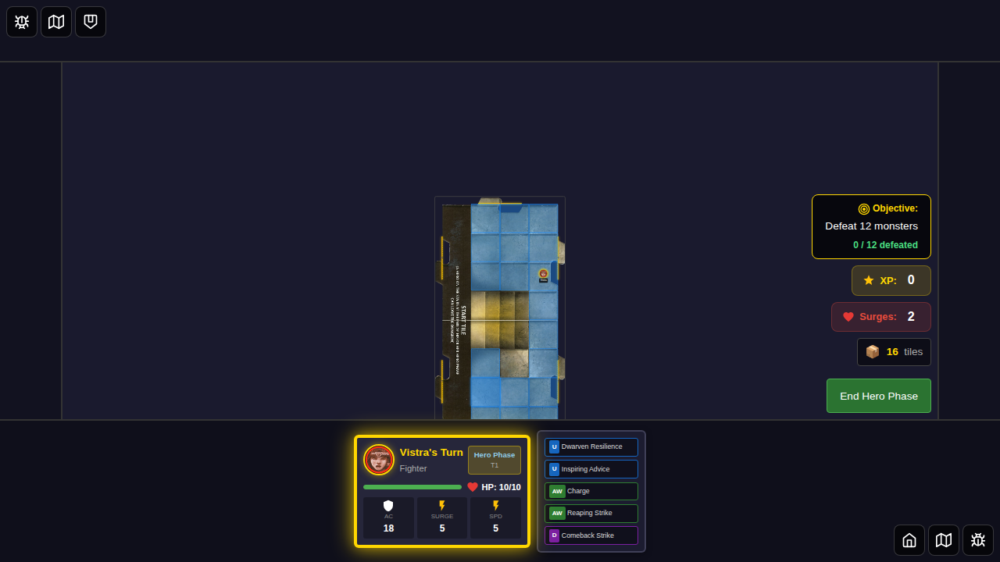

# E2E Test 046: Movement Before Attack

## Overview

This test validates power cards that require movement before attacking, specifically:
- **Charge (ID: 12)**: "Move up to your speed, then attack one adjacent Monster"  
- **Taunting Advance (ID: 17)**: "Move your speed. Then choose a Monster within 2 tiles of you. Place that Monster adjacent to your Hero and attack it."

**Note**: Righteous Advance (ID: 3) is NOT a movement-before-attack card. It's an attack with a Hit or Miss effect that grants ally movement AFTER the attack, not movement-before-attack.

## Test Cases

### Test 1: Charge Card - Validates Movement-Before-Attack Flow

This test validates that:
1. The system correctly identifies Charge as a movement-before-attack card
2. The UI displays appropriate indicators (Move+Attack label)
3. Regular attack cards work normally for comparison
4. The full movement-before-attack interactive flow documentation

### Test 2: Movement-Before-Attack Card Parsing

Validates that the card parsing system correctly identifies cards that require movement first.

### Test 3: Taunting Advance - Daily Card Setup

Documents the complex flow requirements for Taunting Advance (move, place monster, attack).

## User Story

> **As a player,** I want to use power cards that involve movement before attacking,  
> **So that** I can execute tactical maneuvers like charging into combat or taunting enemies.

## Screenshot Gallery

### Test 1: Charge Card Flow

#### Step 1: Hero Selected with Charge

**What's verified:**
- Vistra (Fighter) is selected
- Power cards are selected (includes Charge ID: 12)
- Start Game button is enabled

**Programmatic checks:**
- Hero has `selected` class
- Start game button is enabled

---

#### Step 2: Game Started - Hero Positioned

**What's verified:**
- Game board is visible
- Hero is positioned at (3, 2)
- Charge card (ID: 12) is available and not flipped
- Turn state is in hero-phase

**Programmatic checks:**
- Game board visible
- Hero position set to (3, 2)
- Charge card in hero's at-will cards
- Charge card state: `isFlipped: false`
- Turn phase is 'hero-phase'

---

#### Step 3: Monster Spawned Adjacent

**What's verified:**
- Kobold monster spawned at (3, 3) - adjacent to hero
- Monster is visible on the board
- Attack panel becomes visible due to adjacent monster

**Programmatic checks:**
- Monster position is (3, 3)
- Distance between hero and monster is 1 (adjacent)
- Power card attack panel is visible

---

#### Step 4: Charge Card in Attack Panel

**What's verified:**
- Attack panel displays available power cards
- Charge card (ID: 12) is visible
- Reaping Strike (ID: 13) is also visible
- No pending move-attack state yet

**Programmatic checks:**
- Both Charge (12) and Reaping Strike (13) cards visible
- `pendingMoveAttack` state is null

---

#### Step 5: Charge Card Shows Move+Attack Indicator

**What's verified:**
- Charge card button displays "Move+Attack" label
- This indicates the card requires movement before attacking
- UI correctly identifies special card behavior

**Programmatic checks:**
- Attack panel is visible
- Charge card (12) is visible
- Charge card contains "Move+Attack" text

**Key finding**: The system correctly parses and identifies Charge as a movement-before-attack card and displays appropriate UI indicators.

---

#### Step 6: Reaping Strike Selected (Comparison)

**What's verified:**
- For comparison, select Reaping Strike (regular attack card)
- Target selection immediately appears
- Normal attack flow works as expected

**Programmatic checks:**
- Reaping Strike (13) has `selected` class
- Target selection panel is visible
- Attack target for kobold-adjacent is visible

---

#### Step 7: Reaping Strike Attack Result

**What's verified:**
- Combat result dialog appears
- Dice roll shows 16
- Attack uses Reaping Strike (not Charge)
- Normal attack flow completed successfully

**Programmatic checks:**
- Combat result visible
- Dice roll is 16 (seeded Math.random)
- Attacker info contains "Reaping Strike"
- Attack name stored as "Reaping Strike"

---

#### Step 8: Combat Complete

**What's verified:**
- Combat result dismissed
- Clean game state after combat
- Test validates that movement-before-attack cards are identified but full UI flow not yet implemented

**Programmatic checks:**
- Combat result not visible
- Clean state documented

---

### Test 2: Card Parsing Validation

#### Step 1: Character Selection Screen

**What's verified:**
- Character selection screen is visible
- Test validates card IDs for movement-before-attack cards

**Programmatic checks:**
- Character select visible
- Card IDs verified: Charge (12), Taunting Advance (17), Righteous Advance (3)

---

#### Step 2: Validate Movement-First Parsing

**What's verified:**
- System can identify and parse cards that require movement first
- Card parsing logic works correctly

---

### Test 3: Taunting Advance Setup

#### Step 1: Vistra Selected

**What's verified:**
- Vistra (Fighter) selected for Taunting Advance test
- Default power cards selected

---

#### Step 2: Game Board Ready

**What's verified:**
- Game board loaded
- Hero positioned
- Daily card is Comeback Strike (15), not Taunting Advance (17)

**Note**: Taunting Advance (17) requires special setup in power card selection. Default Vistra configuration uses Comeback Strike (15) as the daily power.

---

#### Step 3: Monster Spawned for Taunting Advance

**What's verified:**
- Monster spawned within 2 tiles but not adjacent
- Position validates range requirements for Taunting Advance
- Complex flow documented: move → choose monster within 2 tiles → place adjacent → attack

**Programmatic checks:**
- Distance ≤ 2 tiles (within Taunting Advance range)
- Distance > 1 (not already adjacent)

---

## Acceptance Criteria

- [x] Charge card (ID: 12) identified as movement-before-attack
- [x] UI displays "Move+Attack" indicator on Charge card
- [x] Regular attack cards (Reaping Strike) work normally
- [x] Card parsing correctly identifies movement-first requirement
- [x] Taunting Advance requirements documented
- [ ] **Full interactive movement-before-attack flow not yet implemented**

## Manual Verification Checklist

When reviewing these screenshots, verify:

- [ ] Charge card displays "Move+Attack" label in attack panel (screenshot 004)
- [ ] Target selection appears immediately for regular attacks (screenshot 005)
- [ ] Combat works normally with regular attack cards (screenshot 006)
- [ ] UI correctly distinguishes between movement-first and regular cards
- [ ] Monster positioning validates tactical requirements

## Implementation Notes

**Current State**: The game correctly identifies Charge and Taunting Advance as movement-before-attack cards and displays appropriate UI indicators ("Move+Attack" label). However, the full interactive flow for executing movement before attack is not yet fully implemented in the UI.

**Expected Full Flow (Not Yet Implemented)**:
1. User clicks Charge card
2. Movement UI activates (user can move up to speed)
3. User completes movement (or skips if already adjacent)
4. Attack panel shows valid targets based on new position
5. User selects target and executes attack
6. Card flips/is used according to type (at-will vs daily)

**What This Test Validates**:
- Card parsing and identification ✅
- UI indicators for special cards ✅
- Regular attack flow for comparison ✅
- Documentation of complex flows ✅
- Full interactive movement-attack flow ❌ (not yet implemented)

## Related Documentation

- [Power Cards Implementation](../../POWER_CARDS_IMPLEMENTATION.md)
- [Action Card Parser](../../src/store/actionCardParser.ts)
- [Power Card Attack Panel Component](../../src/components/PowerCardAttackPanel.svelte)

## Test Statistics

- **Total Screenshots**: 11
- **Test Duration**: ~10 seconds
- **Tests Passing**: 3/3
- **Coverage**: Card parsing, UI indicators, normal attack flow comparison
