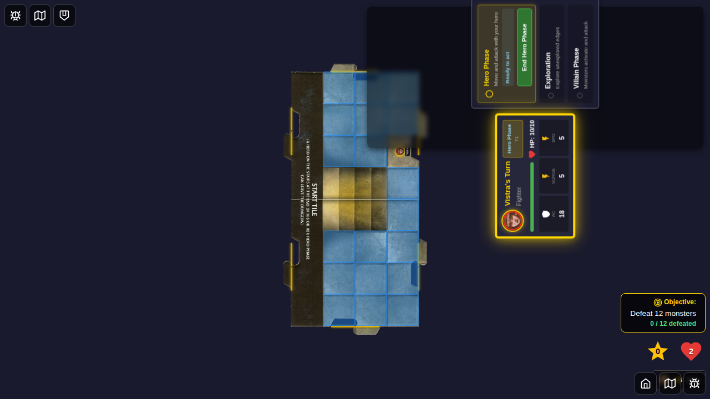
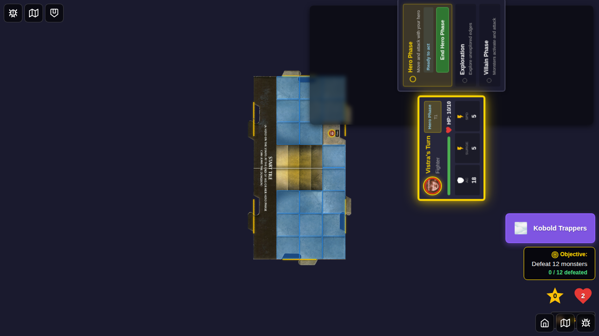
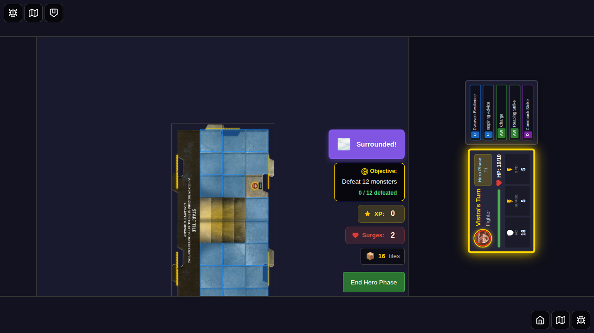

# Test 047: Environment Indicator Positioning

## Purpose

This test verifies that environment card indicators (like "Kobold Trappers" or "Surrounded") are displayed at the top of the game state panel without overlapping other controls.

## User Story

As a player, when an environment card is drawn during the villain phase, I want the environment indicator to be clearly visible in the game state panel without overlapping the Objective, XP, Surges, or End Hero Phase controls, so I can see all important game information simultaneously.

## Test Scenario

This test demonstrates the corrected positioning of environment card indicators:

1. **Character Selection**: Start with character select screen
2. **Game Start**: Select Vistra from right edge and start game
3. **Activate Environment**: Programmatically activate "Kobold Trappers" environment
4. **Verify Positioning**: Confirm indicator appears at top of game state panel above Objective
5. **Replace Environment**: Switch to "Surrounded" environment
6. **Clear Environment**: Remove environment and verify indicator disappears

## Key Validation Points

- Environment indicator displays at the **top** of the game state panel
- Environment indicator appears **above** the Objective display
- No overlap with Objective, XP, Surges, or End Hero Phase controls
- Environment can be replaced (only one active at a time)
- Environment indicator can be cleared

## Test Steps & Screenshots

### Step 1: Character Selection

- Character selection screen
- **Verification**: Character select UI is visible

### Step 2: Game Started (No Environment)

- Game board with Vistra positioned
- No environment indicator visible
- Game state panel showing Objective, XP, Surges, End Hero Phase
- **Verification**: activeEnvironmentId is null, environment indicator not visible

### Step 3: Kobold Trappers Environment Active

- "Kobold Trappers" environment indicator appears in purple badge
- Positioned at **top** of game state panel
- Above Objective display
- All controls remain visible (no overlap)
- **Verification**: 
  - activeEnvironmentId is 'kobold-trappers'
  - Environment indicator visible and contains "Kobold Trappers"
  - Environment indicator Y position < Objective display Y position
  - All game state panel controls visible

### Step 4: Surrounded Environment Replaces Previous

- "Surrounded" environment replaces "Kobold Trappers"
- Environment indicator updated with new text
- Position remains at top of game state panel
- **Verification**: 
  - activeEnvironmentId is 'surrounded'
  - Environment indicator contains "Surrounded"
  - Does not contain "Kobold Trappers"

### Step 5: Environment Cleared

- Environment indicator removed
- Game state panel shows only standard controls
- **Verification**: 
  - activeEnvironmentId is null
  - Environment indicator not visible
  - All controls remain visible

## Implementation Notes

- Test uses programmatic Redux dispatch to activate/deactivate environments
- No manual gameplay steps required (per user request)
- Validates both visual positioning and functional behavior
- Tests the fix for issue where environment indicators overlapped controls

## Related Issues

- User Feedback - December 19, 2025 - Environment cards obscure game
- Original issue: "Kobold Trappers" overlaying game state controls
- Fix: Moved environment indicator from absolute positioning to top of board-controls section
