# E2E Test 048: Attack Then Move (Righteous Advance)

## Overview

This test validates power cards that allow movement AFTER attacking, specifically:
- **Righteous Advance (ID: 3)**: "Attack one adjacent Monster. Hit or Miss: One Hero on your tile moves 2 squares."

**Note**: This is the opposite of Charge (ID: 12) which requires movement BEFORE attacking. The key difference is that the attack happens first, and THEN the ally can move.

## Test Cases

### Test 1: Righteous Advance - Attack Then Move Ally Flow

This test validates the complete attack-then-move sequence:
1. Character selected and placed on tile
2. Monster spawned adjacent to hero
3. Hero attacks with Righteous Advance
4. Attack resolves (hit or miss - both trigger the movement effect)
5. After dismissing attack result, movement UI appears for ally
6. Player moves the ally up to 2 squares
7. Game continues based on whether this was first or second action

### Test 2: Cancel Move After Attack - Skip Movement Portion

This test validates that the movement portion can be skipped:
1. Same setup as Test 1
2. Attack completes successfully
3. Movement UI appears
4. Player clicks "Skip Movement" button
5. The attack is NOT undone (already applied)
6. Movement effect is simply skipped
7. Game continues normally (player can still move if this was their first action)

### Test 3: Multiple Heroes on Tile - Select Which Hero to Move

This test validates hero selection when multiple heroes are on the same tile:
1. Two heroes (Quinn and Vistra) selected and both placed on the same tile
2. Quinn attacks with Righteous Advance
3. Attack completes successfully
4. **Hero selection dialog appears** showing both heroes
5. Player selects Vistra to move
6. Movement UI appears for Vistra
7. Vistra moves 2 squares
8. Quinn stays in original position (not moved)

**Key Feature**: When only one hero is on the tile, this dialog is skipped and that hero is auto-selected.

## User Story

> **As a player using Righteous Advance,**  
> **I want to attack first and then move my ally,**  
> **So that** I can tactically reposition allies after dealing damage.

## Screenshot Gallery

### Test 1: Attack Then Move Flow

#### Step 1: Character Selected

**What's verified:**
- Quinn (Cleric) is selected
- Power cards include Righteous Advance (ID: 3)
- Start Game button is enabled

**Programmatic checks:**
- Hero has `selected` class
- Start game button is enabled

---

#### Step 2: Hero Placed on Tile
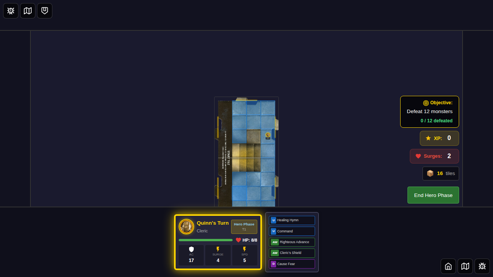

**What's verified:**
- Game board is visible
- Hero is positioned at (3, 2)
- Righteous Advance card (ID: 3) is available in hero's power cards
- Turn state is in hero-phase

**Programmatic checks:**
- Game board visible
- Hero position set to (3, 2)
- Righteous Advance in hero's at-will cards
- Turn phase is 'hero-phase'

---

#### Step 3: Monster Adjacent
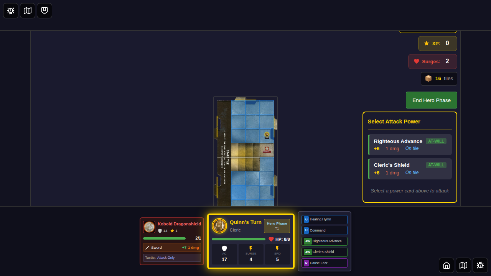

**What's verified:**
- Monster spawned at (3, 3) - adjacent to hero at (3, 2)
- Distance between hero and monster is 1 (adjacent)

**Programmatic checks:**
- Monster position is (3, 3)
- Distance calculation confirms adjacency

---

#### Step 4: Righteous Advance Available in Power Panel
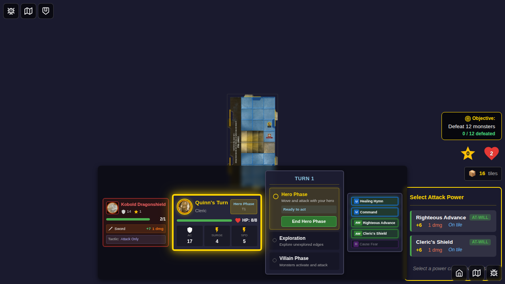

**What's verified:**
- Attack panel is visible
- Righteous Advance card is visible and enabled
- Hero can attack the adjacent monster

**Programmatic checks:**
- Attack panel visible
- Righteous Advance card (ID: 3) visible and not disabled
- Hero has card available

---

#### Step 5: Target Selection Appears
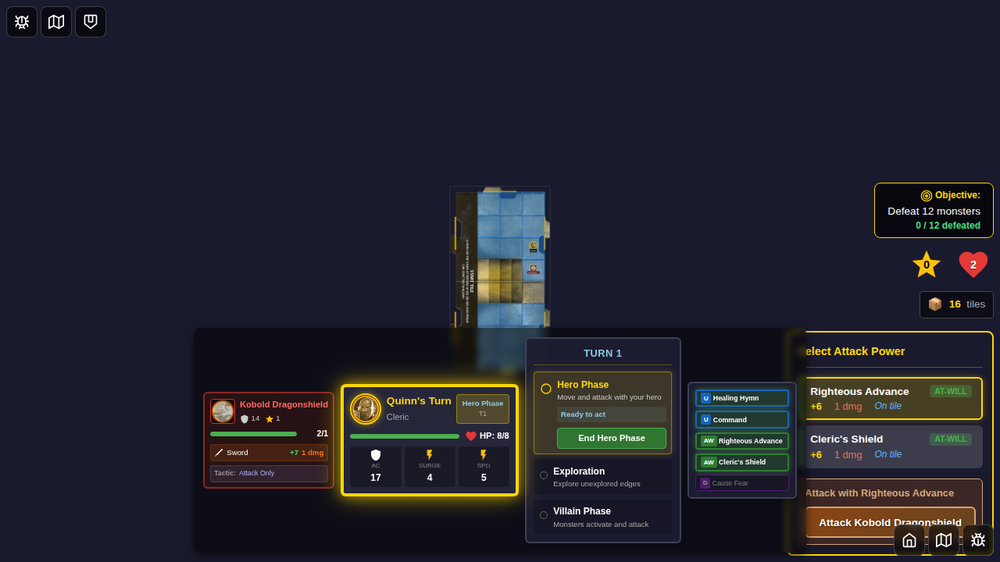

**What's verified:**
- After selecting Righteous Advance, target selection UI appears
- Monster can be targeted

**Programmatic checks:**
- Target selection visible
- Attack button for monster is visible

---

#### Step 6: Attack Result Displayed
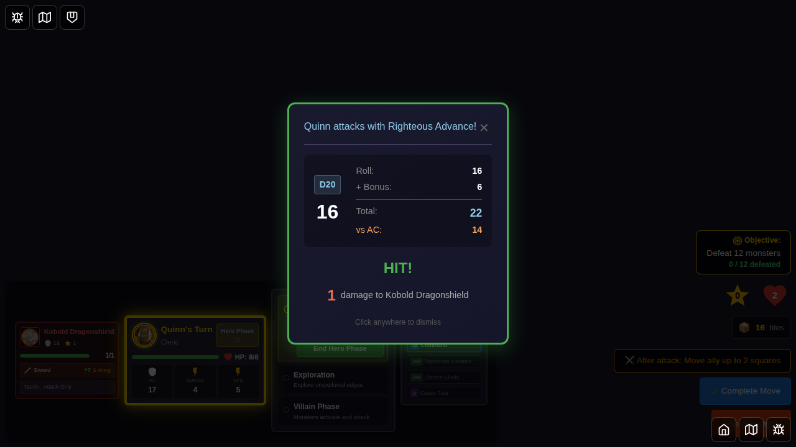

**What's verified:**
- Combat result is displayed
- Attack was with Righteous Advance card
- Hit or Miss status is shown

**Programmatic checks:**
- Combat result visible
- Attacker info contains "Righteous Advance"

---

#### Step 7: Movement UI After Attack
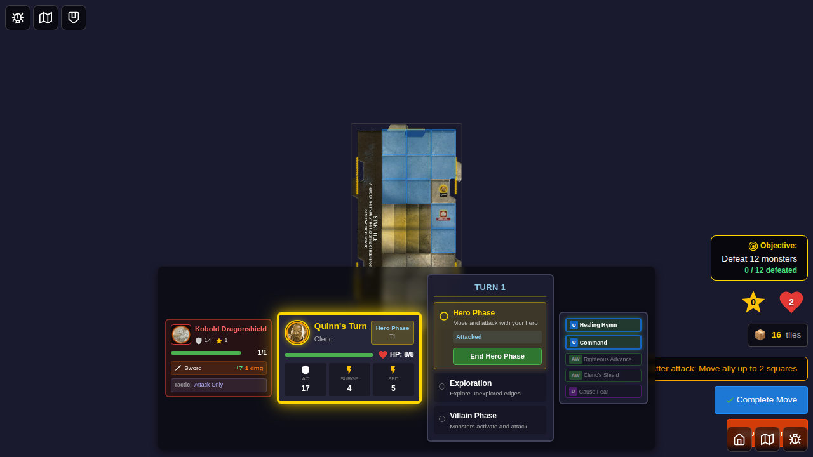

**What's verified:**
- After dismissing attack result, movement overlay appears
- Valid move squares are shown (up to 2 squares)
- pendingMoveAfterAttack state is set with correct values

**Programmatic checks:**
- Movement overlay visible
- Move squares count > 0
- pendingMoveAfterAttack not null
- cardId is 3 (Righteous Advance)
- moveDistance is 2

---

#### Step 8: Ally Moved After Attack
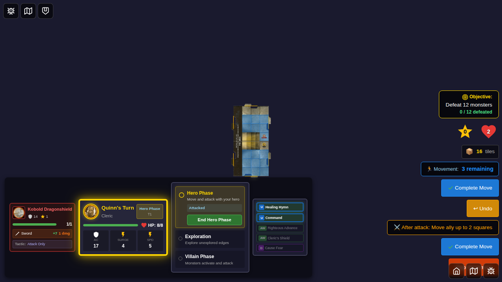

**What's verified:**
- Hero moved from (3, 2) to (3, 4)
- Movement was 2 squares as specified by Righteous Advance
- Movement overlay still visible (can continue moving within 2 squares)

**Programmatic checks:**
- Hero position is (3, 4)
- Movement overlay still visible

---

### Test 2: Cancel Move After Attack

#### Step 1: Cancel Test Setup
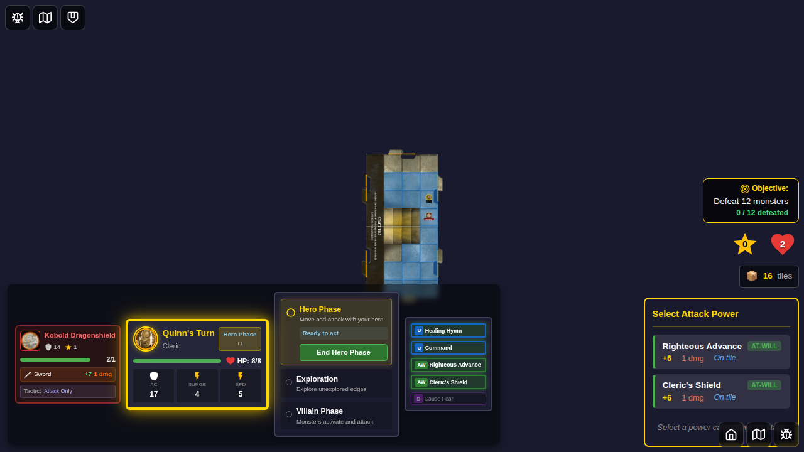

**What's verified:**
- Same setup as main test
- Hero at (3, 2), monster at (3, 3)

**Programmatic checks:**
- Hero and monster positions verified

---

#### Step 2: Movement UI After Attack

**What's verified:**
- Movement UI appears after attack
- pendingMoveAfterAttack state is set

**Programmatic checks:**
- Movement overlay visible
- pendingMoveAfterAttack not null

---

#### Step 3: Cancel Button Visible
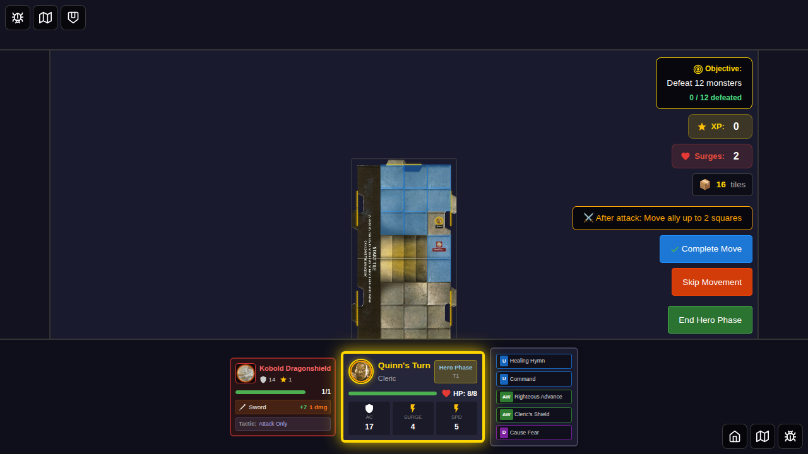

**What's verified:**
- "Skip Movement" button is visible
- Player has option to cancel the movement portion

**Programmatic checks:**
- cancel-move-after-attack button visible

---

#### Step 4: Cancel Complete - No Movement
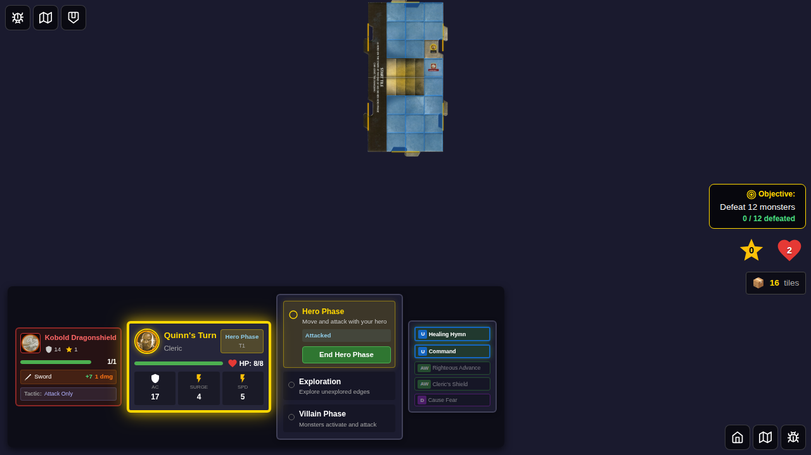

**What's verified:**
- Hero position unchanged at (3, 2) - no movement occurred
- pendingMoveAfterAttack state is cleared
- Attack was NOT undone (this is important!)
- Movement grid may still be visible (player can move normally)

**Programmatic checks:**
- Hero position still (3, 2)
- pendingMoveAfterAttack is null

---

### Test 3: Multiple Heroes on Tile

#### Step 1: Two Heroes Selected
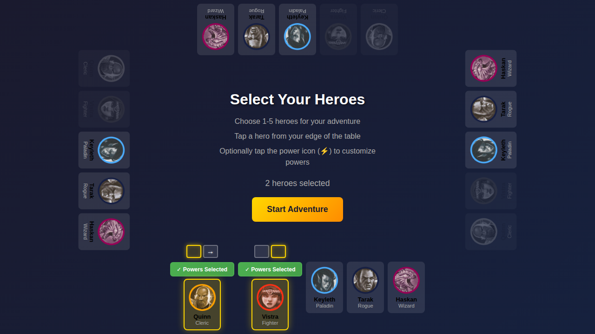

**What's verified:**
- Quinn (Cleric) is selected
- Vistra (Fighter) is also selected
- Both heroes have power cards selected
- Start Game button is enabled

**Programmatic checks:**
- Both Quinn and Vistra have `selected` class
- Start game button is enabled

---

#### Step 2: Both Heroes on Same Tile
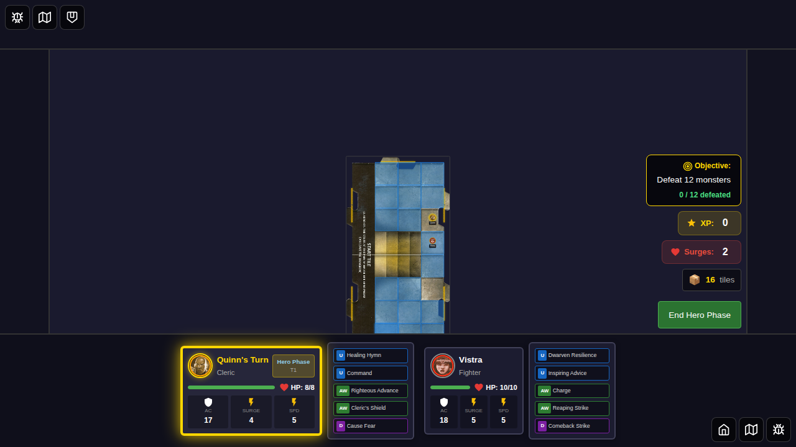

**What's verified:**
- Quinn is at position (3, 2)
- Vistra is at position (3, 3)
- Both heroes are on the start tile
- It's Quinn's turn

**Programmatic checks:**
- Both heroes positioned on start tile
- Current hero index is 0 (Quinn's turn)

---

#### Step 3: Monster Adjacent to Quinn
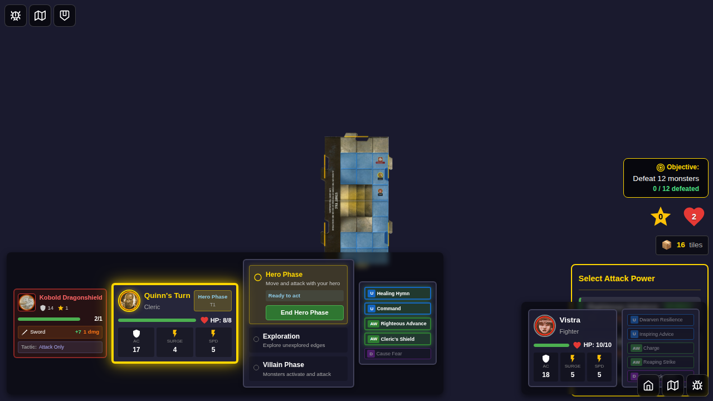

**What's verified:**
- Monster spawned at (3, 1) - adjacent to Quinn
- Monster is ready for combat

**Programmatic checks:**
- Monster position verified at (3, 1)

---

#### Step 4: Attack Result
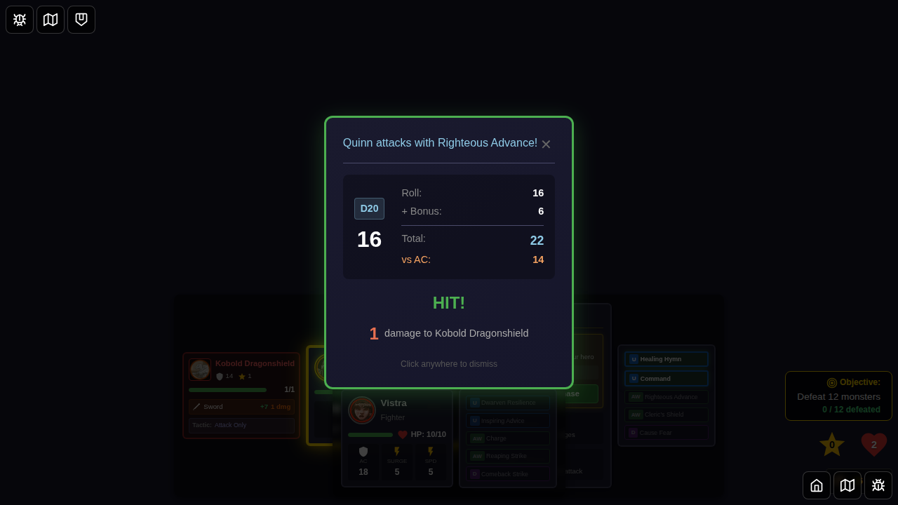

**What's verified:**
- Quinn attacks with Righteous Advance
- Attack result is displayed
- Combat result shows hit/miss status

**Programmatic checks:**
- Combat result visible
- Attack name is "Righteous Advance"

---

#### Step 5: Hero Selection Dialog
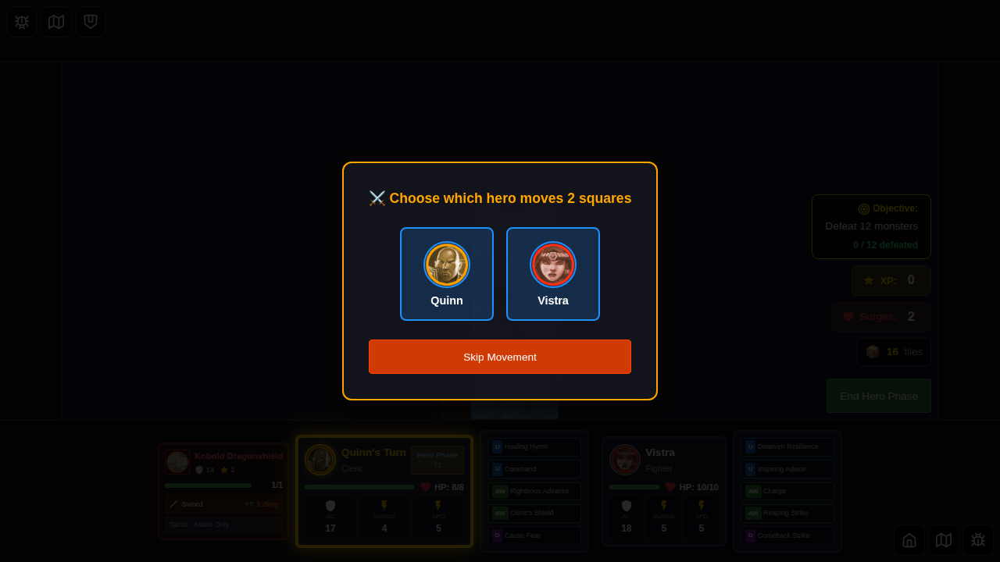

**What's verified:**
- After dismissing attack result, hero selection dialog appears
- Both Quinn and Vistra are shown as options
- Each hero has portrait and name
- "Skip Movement" button is available

**Programmatic checks:**
- Hero selection overlay visible
- Both select-hero buttons present (quinn and vistra)
- pendingMoveAfterAttack has both heroes in availableHeroes array
- selectedHeroId is null (no selection yet)

---

#### Step 6: Vistra Selected - Movement UI Appears
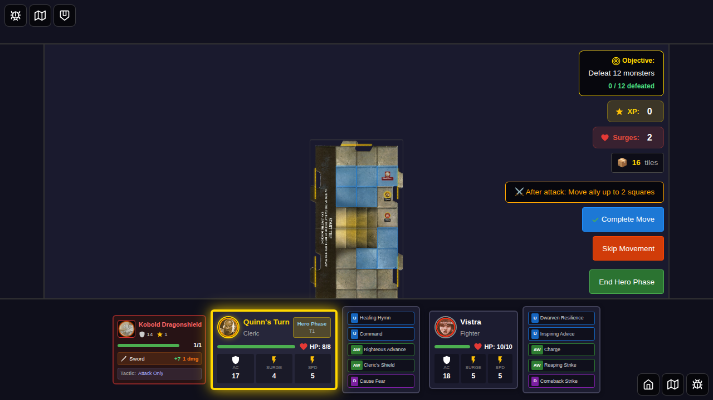

**What's verified:**
- After selecting Vistra, hero selection dialog disappears
- Movement overlay appears for Vistra
- Valid move squares are shown

**Programmatic checks:**
- Movement overlay visible
- Hero selection dialog not visible
- pendingMoveAfterAttack.selectedHeroId is 'vistra'

---

#### Step 7: Vistra Moved After Attack
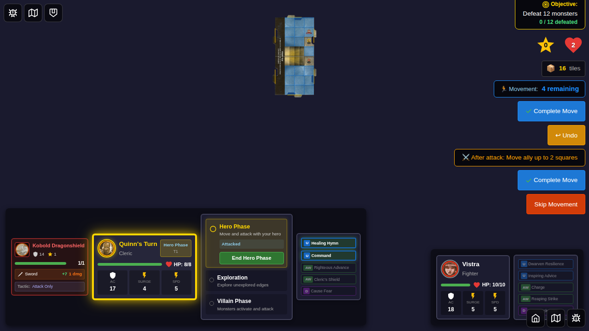

**What's verified:**
- Vistra moved from (3, 3) to (3, 4)
- Quinn stayed at original position (3, 2)
- Movement was applied to the selected hero only

**Programmatic checks:**
- Vistra position is (3, 4)
- Quinn position still (3, 2)

---

## Acceptance Criteria

- [x] Righteous Advance card (ID: 3) identified as attack-then-move
- [x] Character selected and placed on tile
- [x] Monster added adjacent to hero
- [x] Hero attacks with Righteous Advance
- [x] Attack resolves (hit or miss both trigger movement)
- [x] After dismissing attack result, movement UI appears
- [x] Player can move ally up to 2 squares
- [x] Movement can be cancelled without undoing attack
- [x] After cancel, pendingMoveAfterAttack state is cleared
- [x] Player can still move normally after canceling if it was their first action
- [x] **When multiple heroes on tile: Hero selection dialog appears**
- [x] **Hero selection shows all heroes on the same tile with portraits**
- [x] **Selected hero is the one that moves (not current hero)**
- [x] **When only one hero on tile: Auto-selected (no dialog shown)**
- [x] All edge cases handled (hit vs miss, first vs second action, single vs multi hero)

## Manual Verification Checklist

When reviewing these screenshots, verify:

**Test 1: Basic Flow**
- [x] Hero positioned correctly at (3, 2) (screenshot 001)
- [x] Monster spawned adjacent at (3, 3) (screenshot 002)
- [x] Righteous Advance available in attack panel (screenshot 003)
- [x] Target selection appears (screenshot 004)
- [x] Attack result displayed (screenshot 005)
- [x] Movement UI appears AFTER attack (screenshot 006)
- [x] Hero can move up to 2 squares (screenshot 007)

**Test 2: Cancel Flow**
- [x] Cancel button visible (screenshot 002 of cancel test)
- [x] After cancel, no movement occurred (screenshot 003 of cancel test)

**Test 3: Multi-Hero Flow**
- [x] Two heroes selected (screenshot 000 of multi-hero test)
- [x] Both heroes on same tile (screenshot 001 of multi-hero test)
- [x] Hero selection dialog appears (screenshot 004 of multi-hero test)
- [x] Both heroes shown with portraits (screenshot 004 of multi-hero test)
- [x] Selected hero (Vistra) moved (screenshot 006 of multi-hero test)
- [x] Other hero (Quinn) didn't move (screenshot 006 of multi-hero test)

## Implementation Notes

**Key Implementation Details**:

1. **State Tracking**: `pendingMoveAfterAttack` state tracks:
   - `cardId`: The power card that triggered the effect
   - `moveDistance`: How many squares the ally can move
   - `wasFirstAction`: Whether this was the hero's first or second action

2. **Attack Flow**:
   - Attack executes normally with `setAttackResult`
   - If card has "Hit or Miss: ally-move" effect, `pendingMoveAfterAttack` is set
   - When attack result is dismissed, movement UI appears

3. **Movement Flow**:
   - Movement overlay shows valid squares (up to moveDistance)
   - Player can move incrementally within the allowed distance
   - Complete Move button finalizes the movement
   - Skip Movement button cancels without undoing attack

4. **Cancel Behavior**:
   - Canceling does NOT undo the attack (attack already applied)
   - Simply skips the movement portion of the card effect
   - If first action, player can still move/attack normally
   - If second action, turn ends normally

## Related Documentation

- [E2E Test Guidelines](../../E2E_TEST_GUIDELINES.md)
- [Power Cards Implementation](../../POWER_CARDS_IMPLEMENTATION.md)
- [Action Card Parser](../../src/store/actionCardParser.ts)
- [Game State Management](../../src/store/gameSlice.ts)
- [Test 046: Movement Before Attack](../046-movement-before-attack/README.md) (opposite flow)

## Test Statistics

- **Total Screenshots**: 18 (8 for main flow, 4 for cancel flow, 7 for multi-hero flow)
- **Test Duration**: ~13 seconds
- **Tests Passing**: 3/3
- **Coverage**: Complete attack-then-move flow with Righteous Advance including multi-hero selection

## Key Difference: Attack-Then-Move vs Move-Then-Attack

| Feature | Righteous Advance (048) | Charge (046) |
|---------|------------------------|--------------|
| **When Movement Happens** | AFTER attack | BEFORE attack |
| **Trigger** | Hit or Miss effect | Movement-before-attack card |
| **Who Moves** | Ally on same tile (player selects if multiple) | The attacking hero |
| **Distance** | 2 squares (fixed) | Up to hero's speed |
| **Cancel Effect** | Skips movement, keeps attack | Undoes movement, cancels attack |
| **State Tracker** | `pendingMoveAfterAttack` | `pendingMoveAttack` |
| **Hero Selection** | Shows dialog when 2+ heroes on tile | N/A |

The Righteous Advance test validates that "Hit or Miss" effects properly trigger AFTER the attack completes, which is fundamentally different from movement-before-attack cards like Charge. Additionally, it validates the hero selection mechanism when multiple heroes are present on the same tile.
