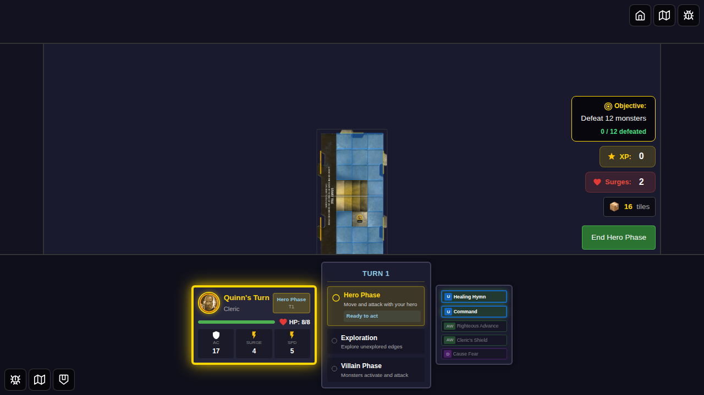
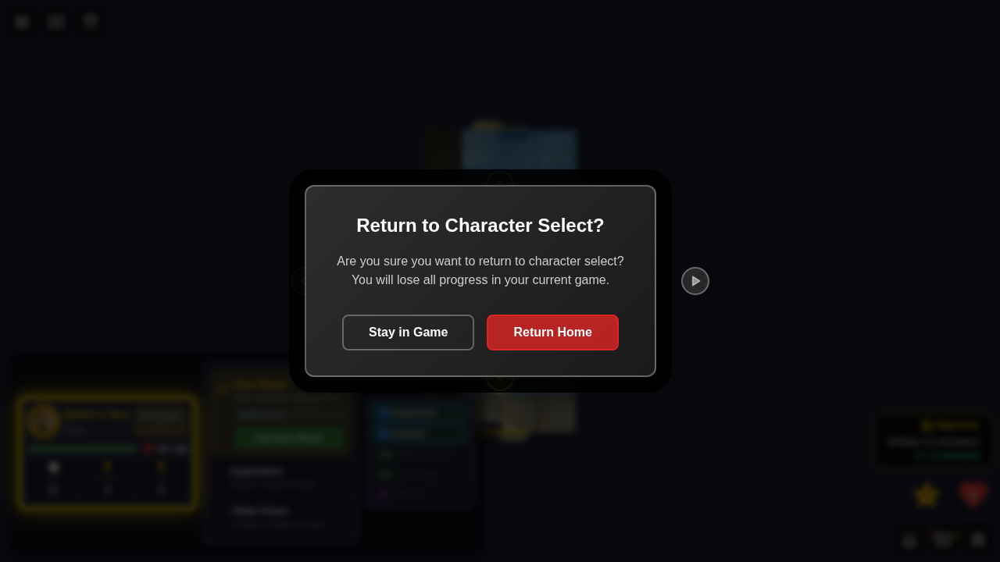
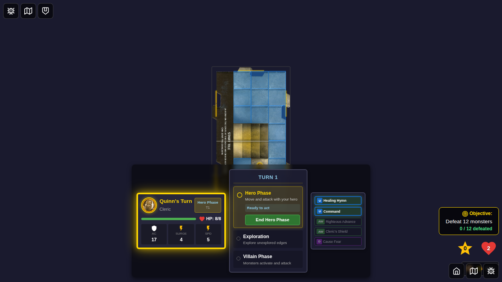
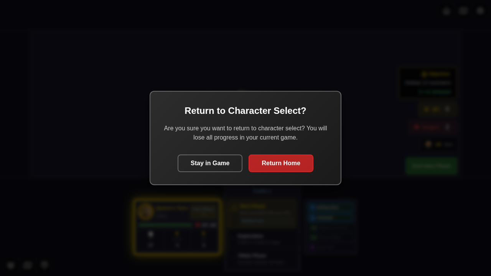
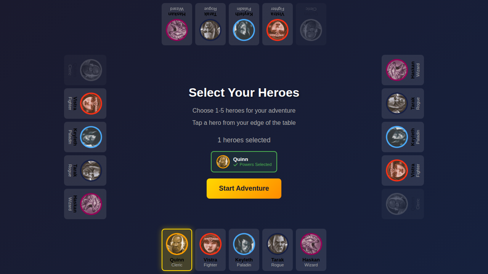
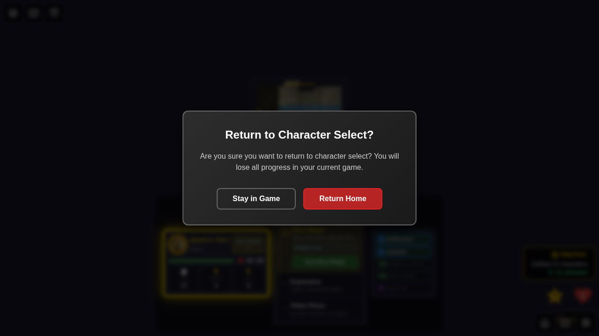

# 049 - Home Button Confirmation Dialog

## Test Description

This test verifies that clicking the Home button during an active game displays a confirmation dialog to prevent accidental loss of game progress.

## User Story

As a player in an active game, when I click the Home button, I want to see a confirmation dialog warning me about losing progress so that I can avoid accidentally exiting the game.

## Test Scenarios

### Scenario 1: Cancel Confirmation and Stay in Game
1. Player starts a game with Quinn
2. Player clicks Home button
3. Confirmation dialog appears with warning message
4. Player clicks "Stay in Game"
5. Dialog closes and player remains in game

### Scenario 2: Confirm and Return to Character Select
1. Player is in an active game
2. Player clicks Home button
3. Confirmation dialog appears
4. Player clicks "Return Home"
5. Game resets and player returns to character select screen

### Scenario 3: Dismiss with Escape Key
1. Player is in an active game
2. Player clicks Home button
3. Player presses Escape key
4. Dialog closes and player remains in game

### Scenario 4: Confirm with Enter Key
1. Player is in an active game
2. Player clicks Home button
3. Player presses Enter key
4. Game resets and player returns to character select screen

## Screenshots

### Test 1: Main Flow (Cancel and Confirm)

#### Step 1: Game Started

- Game board is visible
- Home button is visible in corner controls
- Quinn is on the game board

#### Step 2: Confirmation Dialog Shown

- Confirmation dialog appears with title "Return to Character Select?"
- Warning message about losing progress is displayed
- "Stay in Game" and "Return Home" buttons are visible
- Game board is dimmed in background

#### Step 3: Dialog Cancelled (Stay in Game)

- Dialog is dismissed
- Game board is still visible
- Player remains in the game

#### Step 4: Confirmation Dialog Shown Again

- Dialog appears again when Home button is clicked
- Same warning message is displayed

#### Step 5: Returned to Character Select

- Character select screen is visible
- Game board is no longer visible
- Player can start a new game

### Test 2: Escape Key Dismissal

#### Step 1: Dialog Before Escape

- Confirmation dialog is visible

#### Step 2: Dialog Dismissed with Escape

- Dialog is dismissed after pressing Escape
- Game board is still visible

### Test 3: Enter Key Confirmation

#### Step 1: Dialog Before Enter

- Confirmation dialog is visible

#### Step 2: Confirmed with Enter

- Character select screen is visible after pressing Enter
- Game has been reset

## Acceptance Criteria

✅ Confirmation dialog appears when Home button is clicked during active game
✅ Dialog displays clear "Return to Character Select?" title
✅ Dialog shows warning message about losing game progress
✅ "Stay in Game" button cancels the action and keeps player in game
✅ "Return Home" button confirms and returns to character select
✅ Escape key dismisses the dialog (cancel action)
✅ Enter key confirms the action (return home)
✅ Dialog has proper ARIA labels for accessibility
✅ Game board is dimmed/blurred in background when dialog is shown

## Implementation Details

### Components Created
- `ConfirmationDialog.svelte`: Reusable confirmation dialog component

### Components Modified
- `CornerControls.svelte`: Added confirmation state and handlers for Home button

### Key Features
- Modal overlay with backdrop blur effect
- Auto-focus on dialog for keyboard navigation
- Keyboard support (Escape to cancel, Enter to confirm)
- Accessible with proper ARIA attributes
- Styled to match existing game UI patterns
