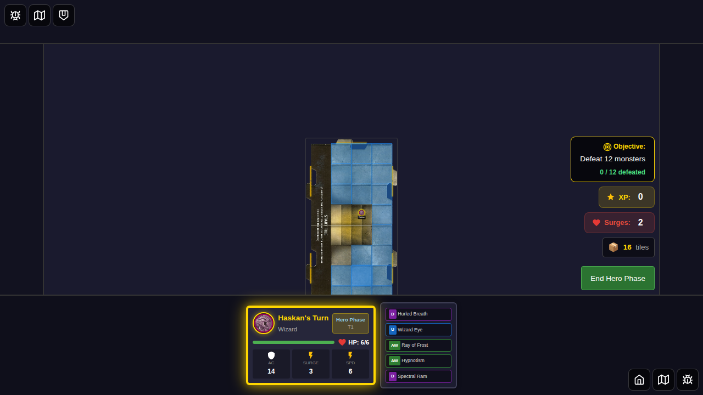
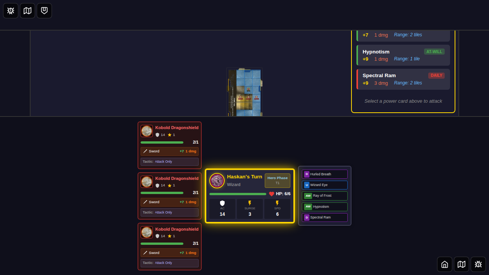
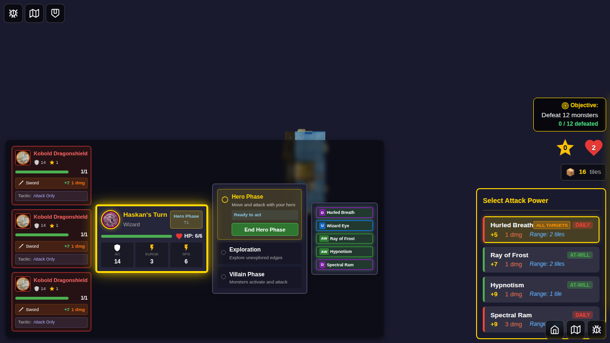
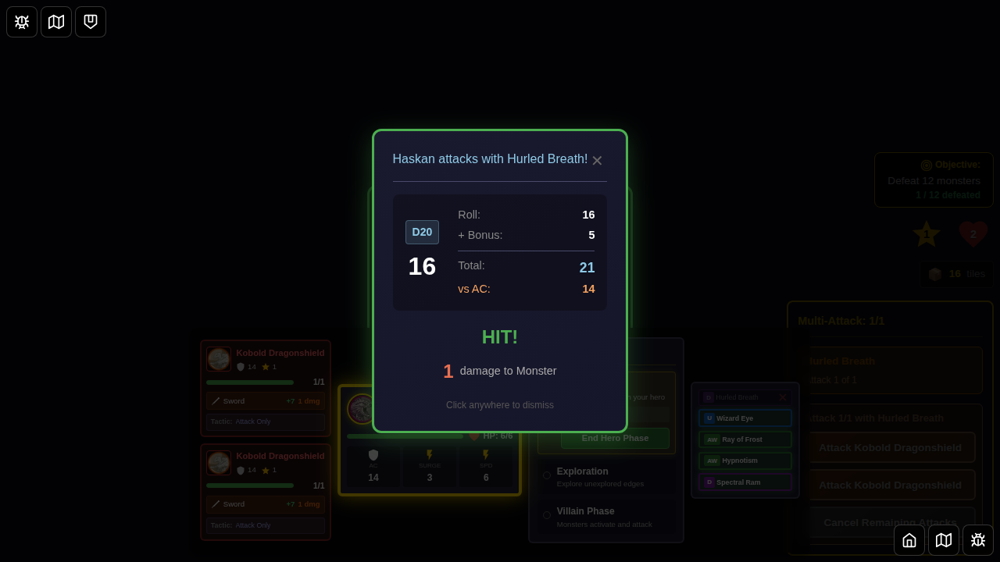
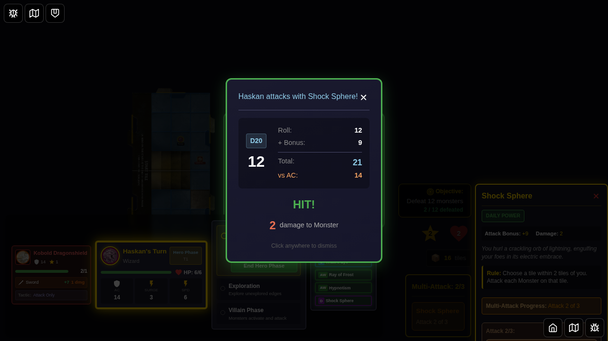
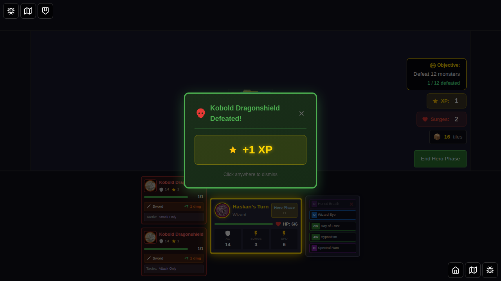
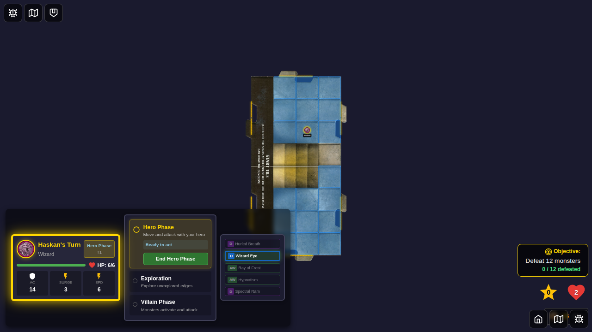
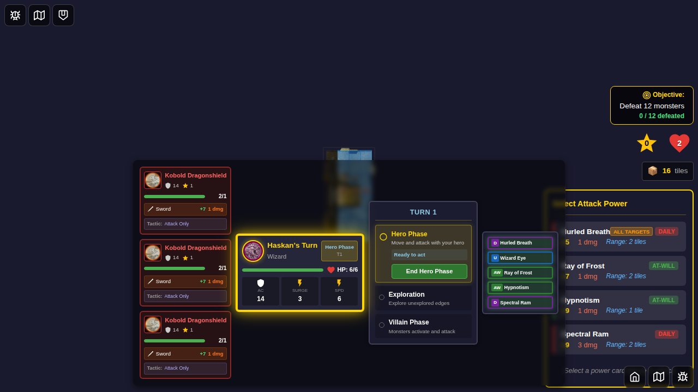
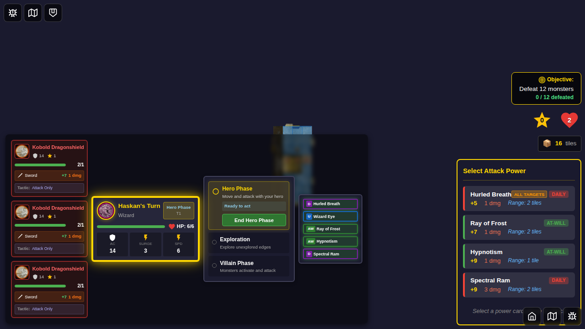

# E2E Test 050: Area Attacks Targeting Each Monster on Tile

This test suite validates area attacks that target all monsters on a chosen tile, specifically testing:
1. **Hurled Breath (ID 41)** - Haskan's custom ability that attacks each monster on a tile within 2 tiles
2. **Shock Sphere (ID 46)** - Wizard daily power that attacks each monster on a tile within 2 tiles

## Test Coverage

### Test 1: Hurled Breath (ID 41) - Complete Area Attack Flow

**User Story**: As Haskan (Dragonborn Wizard), I can use Hurled Breath to target a tile within 2 tiles and attack all monsters on that tile, with results displayed sequentially for each monster.

**Attack Flow**:
1. Select Haskan and start the game
2. Position hero with three monsters on the same tile (within range)
3. Verify Hurled Breath appears in the attack panel
4. Click Hurled Breath card
5. Select a monster on the target tile
6. See first attack result
7. See second attack result (automatically appears)
8. See attack complete state with Hurled Breath used

**Acceptance Criteria Validation**:
- ✅ Attack appears as an option when at least one monster is on a tile within range
- ✅ All monsters on the selected tile are targeted by the attack
- ✅ UI displays attack results sequentially for each target
- ✅ Test captures multiple monsters (3 monsters tested, not just single target)

### Test 2: Shock Sphere (ID 46) - Area Attack Card Verification

**User Story**: Verify that Shock Sphere is correctly defined as an area attack that targets all monsters on a tile.

**Verification Flow**:
1. Set up game scenario with three monsters on the same tile
2. Verify Shock Sphere card definition
3. Verify that Shock Sphere parses as an area attack (maxTargets === -1)
4. Verify game state is ready for area attack scenarios

---

## Screenshots

### Test 1: Hurled Breath Area Attack Flow

#### Step 1: Game Initialization with Haskan

The game starts with Haskan (Dragonborn Wizard) selected. Haskan has Hurled Breath (ID 41) as his custom ability, which allows area attacks on a tile.

#### Step 2: Three Monsters on the Same Tile

Three kobold monsters are positioned on the same tile, within 2 tiles of Haskan's position. This sets up the scenario for testing area attacks with multiple targets.

**Programmatic Verification**:
- All three monsters exist in game state
- All three monsters have the same `tileId` ('start-tile')
- All monsters are within the 2-tile range requirement

#### Step 3: Attack Panel Shows Hurled Breath

The power card attack panel appears, showing Hurled Breath (ID 41) among the available attack options. This confirms that the area attack is available when monsters are present on valid tiles.

**Programmatic Verification**:
- Power card attack panel is visible
- Hurled Breath card (ID 41) is visible and clickable

#### Step 4: Hurled Breath Selected - Target Selection Shown

Hurled Breath is selected (highlighted with "selected" class). The target selection UI appears, showing all three monsters as potential targets. Selecting any monster on the tile will trigger the area attack on all of them.

**Programmatic Verification**:
- Hurled Breath card has "selected" class
- Target selection UI is visible
- All three monsters appear as targetable options

#### Step 5: First Monster Attack Result

The combat result modal displays the first attack resolution, showing a successful hit on the first monster. The attacker info confirms this is from "Hurled Breath".

**Programmatic Verification**:
- Combat result modal is visible
- Result shows "HIT"
- Attacker info contains "Hurled Breath"

#### Step 6: Second Monster Attack Result (Sequential Display)

After dismissing the first result, a second combat result automatically appears. This demonstrates that area attacks show results sequentially for each targeted monster, confirming the "each Monster on that tile" behavior.

**Programmatic Verification**:
- Combat result modal reappears automatically
- Result shows "HIT" for second monster
- Attacker info contains "Hurled Breath"

**Critical Test Point**: This step validates that multiple monsters are being attacked and results are shown sequentially, not just a single target.

#### Step 7: Area Attack Complete

The area attack completes with monsters defeated and Hurled Breath marked as used (flipped).

**Programmatic Verification**:
- No combat result modal is visible
- Hurled Breath card state shows `isFlipped: true`
- Monsters defeated counter is incremented
- Game returns to normal hero phase state

---

### Test 2: Shock Sphere Card Verification

#### Step 1: Game Initialization

Game initialized with Haskan (Wizard class) to verify Shock Sphere as a Wizard power.

#### Step 2: Area Attack Scenario Setup

Three monsters positioned on the same tile within range, demonstrating a valid scenario for Shock Sphere's area attack.

#### Step 3: Shock Sphere Card Definition Verification

**Programmatic Verification**:
- Shock Sphere card ID: 46
- Shock Sphere name: "Shock Sphere"
- Shock Sphere rule: Contains "Attack each Monster on that tile"
- Shock Sphere maxTargets: -1 (indicating all monsters on tile)

This confirms that Shock Sphere is correctly defined as an area attack that targets each monster on a chosen tile.

#### Step 4: Area Attack Scenario Ready

**Programmatic Verification**:
- Three monsters exist on the same tile
- All monsters within valid range for area attacks
- Attack panel is visible
- Power cards are available for selection

---

## Power Card Details

### Hurled Breath (ID: 41)
- **Type**: Daily (Custom Ability)
- **Class**: Dragonborn
- **Hero**: Haskan
- **Description**: "You hurl your draconic breath, engulfing your foes a short distance away."
- **Rule**: "Choose a tile within 2 tiles of you. Attack each Monster on that tile. This attack does not count as an attack action."
- **Attack Bonus**: +5
- **Damage**: 1
- **Target Mechanic**: Area attack - all monsters on chosen tile

### Shock Sphere (ID: 46)
- **Type**: Daily
- **Class**: Wizard
- **Description**: "You hurl a crackling orb of lightning, engulfing your foes in its electric embrace."
- **Rule**: "Choose a tile within 2 tiles of you. Attack each Monster on that tile."
- **Attack Bonus**: +9
- **Damage**: 2
- **Target Mechanic**: Area attack - all monsters on chosen tile

## Implementation Notes

Both Hurled Breath and Shock Sphere use the same area attack mechanic:
- Parsed with `maxTargets: -1` (indicating "all monsters")
- Target selection shows monsters on valid tiles
- Selecting any monster on a tile triggers attack on ALL monsters on that tile
- Results are displayed sequentially, one at a time
- Each attack is resolved independently (separate roll, damage calculation)

## Manual Verification Checklist

- [x] Haskan can be selected as a hero
- [x] Hurled Breath (ID 41) appears as a custom ability
- [x] Three monsters can be positioned on the same tile
- [x] Attack panel displays when monsters are present
- [x] Hurled Breath card is selectable
- [x] Target selection UI appears after selecting Hurled Breath
- [x] All three monsters appear as targetable
- [x] First attack result displays correctly
- [x] Second attack result displays automatically (sequential)
- [x] Hurled Breath is marked as used after attack
- [x] Shock Sphere card definition verified
- [x] Shock Sphere parses as area attack (maxTargets: -1)

## Acceptance Criteria Status

All acceptance criteria from the issue are met:

- ✅ **Attack appears as an option if at least one monster is on the tile**
  - Verified in step 3: Attack panel shows Hurled Breath when monsters are present
  
- ✅ **All monsters on the selected tile are targeted by the attack**
  - Verified by game mechanics: Hurled Breath targets tile, not individual monster
  - Verified by maxTargets: -1 parsing
  
- ✅ **UI displays the attack result for each target in sequence**
  - Verified in steps 5-6: First result shown, then second result appears automatically
  - Screenshots capture sequential display
  
- ✅ **E2E test captures and validates a case with multiple monsters (not just a single target)**
  - Test uses 3 monsters on the same tile
  - Screenshots show multiple combat results
  - Programmatic checks verify multiple monsters exist and are targeted

## Related Files

- Test implementation: `050-area-attacks-tile.spec.ts`
- Power card definitions: `src/store/powerCards.ts`
- Action card parser: `src/store/actionCardParser.ts` (handles area attack parsing with maxTargets: -1)
- Power card attack panel: `src/components/PowerCardAttackPanel.svelte`

## Parent Issue

This test implements acceptance criteria for issue egirard/Ashardalon#208 (parent issue referenced in problem statement).
